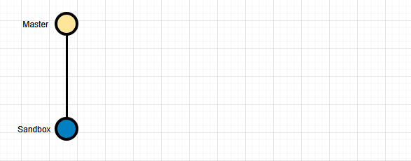
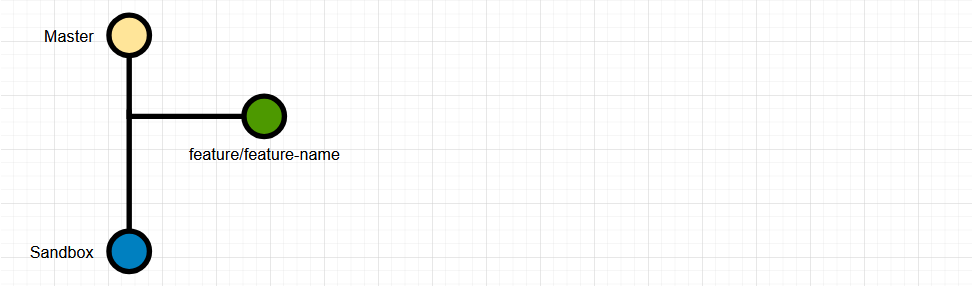
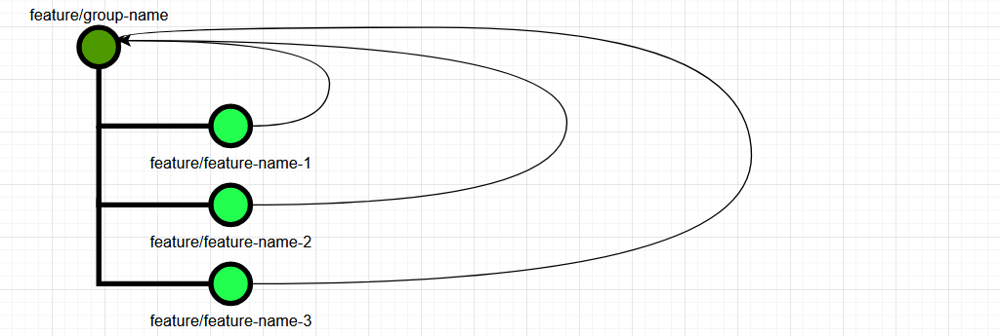
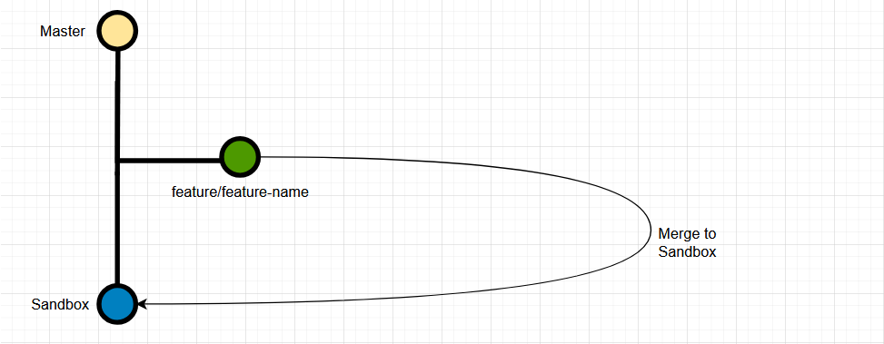
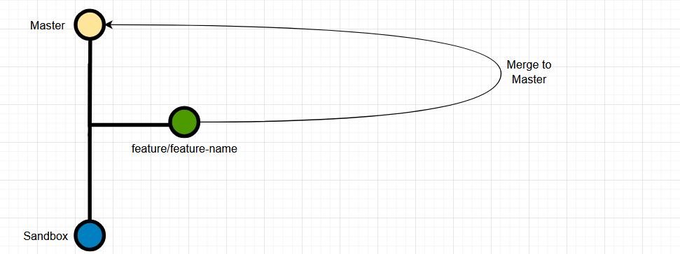
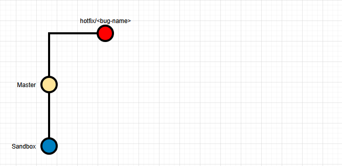
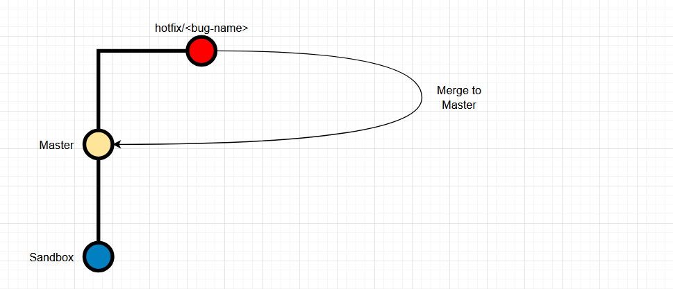

# Git Branching Policy

## Table of Contents

1. [Purpose](#1-purpose)
2. [Scope](#2-scope)
3. [Definitions](#3-definitions)
4. [Branch Structure Policy](#4-branch-structure-policy)
   - [4.1 Mandatory Branches](#41-mandatory-branches)
5. [Root Branch Integrity Policy](#5-root-branch-integrity-policy)
   - [5.1 Master Superset Rule](#51-master-superset-rule)
   - [5.2 Mandatory Synchronization](#52-mandatory-synchronization)
6. [Feature Development Policy](#6-feature-development-policy)
   - [6.1 Feature Branch Creation](#61-feature-branch-creation)
   - [6.2 Feature Branch Maintenance](#62-feature-branch-maintenance)
   - [6.3 Grouping Features](#63-grouping-features)
   - [6.4 Feature Testing](#64-feature-testing)
   - [6.5 Feature Merge into Master](#65-feature-merge-into-master)
   - [6.6 Feature Branch Cleanup](#66-feature-branch-cleanup)
7. [Hotfix Policy](#7-hotfix-policy)
   - [7.1 Hotfix Branch Creation](#71-hotfix-branch-creation)
   - [7.2 Hotfix Merge Requirements](#72-hotfix-merge-requirements)
   - [7.3 Hotfix Cleanup](#73-hotfix-cleanup)
8. [Compliance and Enforcement](#8-compliance-and-enforcement)

---

 

## 1. Purpose

This policy defines mandatory rules for Git branching, merging, and deployment practices for application source code.

Its purpose is to ensure:

- Environment consistency
- Controlled releases
- Safe parallel development
- Predictable production deployments

Compliance with this policy is **mandatory for all developers** contributing to the repository.

 

## 2. Scope

This policy applies to:

- All application source code repositories
- All developers, contractors, and automated systems interacting with Git
- All environments mapped to Git branches, including Production and non-Production environments
- 
 

## 3. Definitions

**3.1 Master Branch**

- The primary branch of the repository.
- Represents the **Production environment**.
- Must always be in a production-ready state.

**3.2 Sandbox Branch**

- A top-level branch other than master.
- Represents a deployable, test (non-production) environment.
 

## 4. Branch Structure Policy

 

### 4.1 Mandatory Branches

- **Master** branch **must exist at all times**.
- The master branch must always exist.
  - Master branch is **THE SOURCE OF TRUTH**.
  - Master branch → latest commit, always represents the **LATEST VERSION** of the production code.
- Each production environment must have a corresponding branch derived from the **master branch**.
- **Sandbox** branch **must exist at all times**. It must be connected to the staging environment and must be used exclusively for *development* and *testing*.

 

## 5. Root Branch Integrity Policy

 

### 5.1 Master Superset Rule

- Every branch **must fully contain all commits present in master**.
- Branches:
  - May contain additional commits.
  - Must never exclude or override functionality present in master.
 

### 5.2 Mandatory Synchronization

- Any change merged into master **must be merged into all branches**.
- Branches must never diverge in a way that violates the Master Superset Rule.

 

## 6. Feature Development Policy

### 6.1 Feature Branch Creation

- All new features **must** be developed in a feature branch.
- Feature branches:
  - Must be created from **master**.
  - Must follow the naming convention: **feature/\<feature-name\>**
- Feature names must be:
  - lowercase
  - kebab-case

 

### 6.2 Feature Branch Maintenance

- Developers **must merge master into the feature branch daily**, or more frequently when necessary.
- All merge conflicts:
  - Must be resolved *in the feature branch*.
  - Must **NEVER IMPACT** master.

> ❗ Removal or degradation of master functionality is forbidden.

 

### 6.3 Grouping Features

If a feature needs to be divided into multiple sub-features that together represent a single feature, a parent **feature branch** must be created from the master branch to serve as a *grouping branch*. All sub-features must be developed and merged into this parent feature branch.

> Merging should be performed exclusively through a **PULL REQUEST**.

 

### 6.4 Feature Testing

- Features must be merged and tested in **staging branch** → **staging environment**.
- When features are grouped, only the parent feature branch should be merged into the staging; individual sub-feature branches must not be merged into the staging.

- If defects are identified:
  - Fixes must be applied in the:
    - Child feature branch first.
    - Group feature branch after (by merging child into group).
  - The feature branch must be re-merged into the staging branch.
- Direct commits to root branches (Master or Staging) for feature fixes are prohibited.

> Merging should be performed exclusively through a **PULL REQUEST**.

 

### 6.5 Feature Merge into Master

**Mandatory Pre-Merge Requirement**

Before a feature branch may be merged into master, the developer **must**:

1. Merge master into the feature branch.
2. Resolve all conflicts in the feature branch.
3. Verify that the feature branch fully reflects the latest master.

The feature branch can only be merged into master once all these steps have been completed.

> Merging should be performed exclusively through a **PULL REQUEST**.

 

### 6.6 Feature Branch Cleanup

- After successful merge into master:
  - The feature branch **must be deleted!**
  - All sub-feature branches (when they exist) **must be deleted!**
 

## 7. Hotfix Policy

 

### 7.1 Hotfix Branch Creation

- Hotfixes are reserved exclusively for production issues.
- Hotfix branches:
  - Must be created from master branch.
  - Must follow the naming convention: **hotfix/\<bug-name\>**
- Names must follow lowercase and kebab-case rule.

 

### 7.2 Hotfix Merge Requirements

Once a hotfix is completed, it must be merged back into the master branch from which it originated.

> Merging should be performed exclusively through a **PULL REQUEST**.

The targeted master branch must be tested to ensure the hotfix resolves the issue. If it does not, the process should be repeated until the problem is fully fixed.

> Merging should be performed exclusively through a **PULL REQUEST**.

 

### 7.3 Hotfix Cleanup

After successful merge into master he hotfix branch **must be deleted**.

 

## 8. Compliance and Enforcement

- All developers are responsible for compliance with this policy.
- Violations may result in:
  - Reverted merges
  - Blocked deployments
  - Mandatory remediation
- Automated checks and branch protections **should be enforced** where possible.
