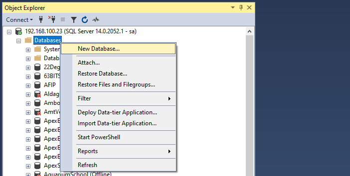
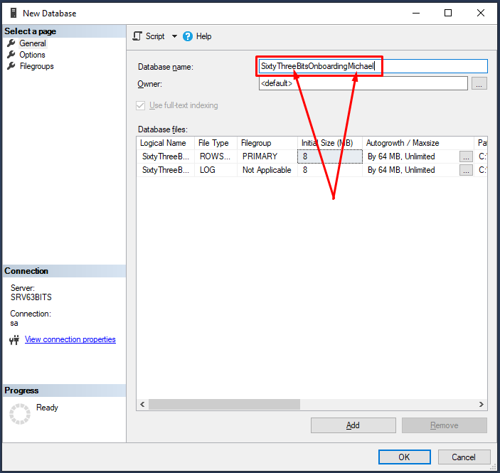
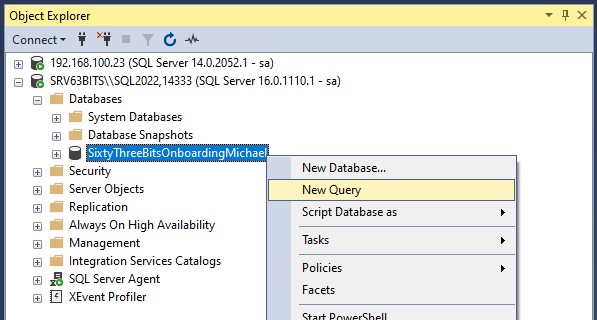
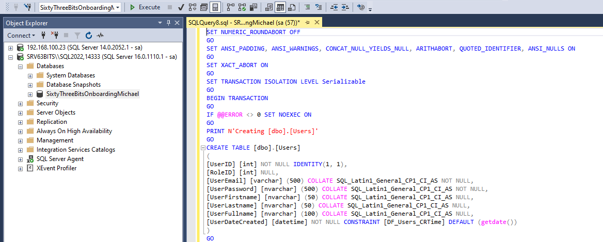
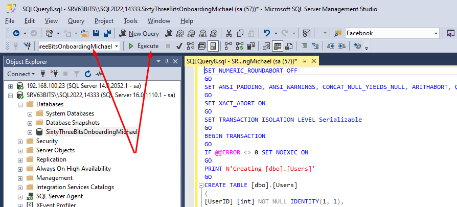

# Create Onboarding Project Database

1. Open **SQL Server Management Studio** and connect to your SQL Server.

   Credentials for SQL Server:

   - IP: **192.168.100.23**
   - Username: **sa**
   - Password: **1qaz!QAZ**

  

2. Create a new database and name it **"SixtyThreeBitsOnboardingYourName"**.

   

   

  

3. Right-click on your new database and choose **New Query**. A new query window will open.

   

  

4. Go to your hard drive and open the **SixtyThreeBitsOnboarding.sql** file. Copy all scripts from this file and paste them into the new query window. It should look something like this:

   

  

5. Make sure you have selected your database for the new query window, then click the **Execute** button:

   

   This script is designed to create a standardized database structure, including tables, stored procedures, and functions.