# Database Development Rules

This document outlines the primary objects used in 63BITS database development, including their relationships, naming conventions, guidelines, SQL script formatting, and common techniques for optimal results.

<br>

## Table of Contents

- [Glossary](#glossary)
- [Database Table Rules](#database-table-rules)
  - [Table Naming Rule](#table-naming-rule)
  - [PK-FK Table Naming Rule](#pk-fk-table-naming-rule)
  - [Column Naming Rule](#column-naming-rule)
  - [ID Column Naming Rule](#id-column-naming-rule)
  - [BIT Column Naming Rule](#bit-column-naming-rule)
  - [Foreign Key Column Naming Rule](#foreign-key-column-naming-rule)
  - [Multiple Foreign Keys Columns Naming Rule](#multiple-foreign-keys-columns-naming-rule)
  - [Naming Multiple Foreign Keys Rule](#naming-multiple-foreign-keys-rule)
  - [Table Trigger Restrictions Rule](#table-trigger-restrictions-rule)
  - [Table Must Rules](#table-must-rules)
- [Stored Procedure and Function Rules](#stored-procedure-and-function-rules)
  - [Stored Procedure and Function Naming Rule](#stored-procedure-and-function-naming-rule)
  - [Parameter and Variable Naming Rule](#parameter-and-variable-naming-rule)
  - [ID Parameter/Variable Naming Rule](#id-parametervariable-naming-rule)
  - [Variable Type Writing Rule](#variable-type-writing-rule)
  - [T-SQL Keyword Writing Rule](#t-sql-keyword-writing-rule)
  - [T-SQL Built-in Function Writing Rule](#t-sql-built-in-function-writing-rule)
  - [Alias Naming Rule](#alias-naming-rule)
  - [SELECT Statement Restriction Rule](#select-statement-restriction-rule)
- [Stored Procedure Development Rules](#stored-procedure-development-rules)
  - [When to Use Stored Procedure](#when-to-use-stored-procedure)
  - [When Not to Use Stored Procedure](#when-not-to-use-stored-procedure)
  - [TRY/CATCH Rule](#trycatch-rule)
  - [Transactions Rule](#transactions-rule)
- [Function Development Rules](#function-development-rules)
  - [When to Use Function](#when-to-use-function)
  - [Multi-Statement Table-Valued Functions Restrictions](#multi-statement-table-valued-functions-restrictions)
- [Formatting Rules](#formatting-rules)
  - [SELECT Statement Formatting Rule](#select-statement-formatting-rule)
  - [SELECT with JOIN and WHERE Statement Formatting Rule](#select-with-join-and-where-statement-formatting-rule)
  - [GROUP BY Statement Formatting Rule](#group-by-statement-formatting-rule)
  - [INSERT Statement Formatting Rule](#insert-statement-formatting-rule)
  - [UPDATE Statement Formatting Rule](#update-statement-formatting-rule)
  - [DELETE Statement Formatting Rule](#delete-statement-formatting-rule)
  - [IF Statement Formatting Rule](#if-statement-formatting-rule)
  - [WITH Statement (CTEs) Formatting Rule](#with-statement-ctes-formatting-rule)
  - [MERGE Statement Formatting Rule](#merge-statement-formatting-rule)
- [IUD Stored Procedure](#iud-stored-procedure)
  - [Purpose of the IUD Procedure](#purpose-of-the-iud-procedure)
  - [Naming Rule](#naming-rule)
  - [Parameters Overview](#parameters-overview)
  - [TRY/CATCH Block](#trycatch-block)
  - [Variable Declarations](#variable-declarations)
  - [Capturing Newly Inserted IDs](#capturing-newly-inserted-ids)
  - [INSERT Logic](#insert-logic)
  - [UPDATE Logic](#update-logic)
  - [NULL UPDATE Challenge](#null-update-challenge)
  - [DELETE Logic](#delete-logic)
  - [Key Takeaways for Developers](#key-takeaways-for-developers)
- [List Inline Table-Valued Function](#list-inline-table-valued-function)
  - [Purpose of the List Function](#purpose-of-the-list-function)
  - [Naming Rule](#naming-rule-1)
  - [Function Execution Script Rule](#function-execution-script-rule)
- [GetSingle Scalar-Valued Function](#getsingle-scalar-valued-function)
  - [Purpose of the GetSingle Function](#purpose-of-the-getsingle-function)
  - [Naming Rule](#naming-rule-2)
  - [Return Result Rule](#return-result-rule)
  - [Function Execution Script Rule](#function-execution-script-rule-1)

---

<br>

## Glossary

Before you begin, take some time to familiarize yourself with the terminology below.

- **PascalCase** — <http://wiki.c2.com/?PascalCase>
- **camelCase** — <https://en.wikipedia.org/wiki/camel_Case>
- **Primary Key (PK)** — <https://www.sqlservertutorial.net/sql-server-basics/sql-server-primary-key/>
- **Foreign Key (FK)** — <https://www.sqlservertutorial.net/sql-server-basics/sql-server-foreign-key/>
- **Alias** — <https://www.sqlservertutorial.net/sql-server-basics/sql-server-alias/>
- **Transactions** — <https://www.sqlservertutorial.net/sql-server-basics/sql-server-transaction/>
- **WITH Statement / Common Table Expression (CTE)** — <https://www.sqlservertutorial.net/sql-server-basics/sql-server-cte/>
- **MERGE Statement** — <https://www.sqlservertutorial.net/sql-server-basics/sql-server-merge/>
- **Stored Procedures** — <https://www.sqlservertutorial.net/sql-server-stored-procedures/>
- **Table Valued Functions** — <https://www.sqlservertutorial.net/sql-server-user-defined-functions/sql-server-table-valued-functions/>
- **Scalar Valued Functions** — <https://www.sqlservertutorial.net/sql-server-user-defined-functions/sql-server-scalar-functions/>
- **Triggers** — <https://www.sqlservertutorial.net/sql-server-triggers/sql-server-ddl-trigger/>

---

<br>

## Database Table Rules

This section establishes the standards for creating and maintaining database tables, including naming conventions, structural design rules, dependency management, and best practices for ensuring clarity, consistency, and long-term maintainability.

<br>

### Table Naming Rule

Tables in 63BITS databases must be named in **PascalCase** with the **plural** form — capitalizing the first letter of each word, no spaces or underscores. The plural form reflects that each table holds a collection of records.

For example, a table storing product data should be named **Products**, not ~~Product~~. A table storing product images should be named **ProductsImages**, not ~~ProductImage~~ or ~~ProductImages~~.

<br>

### PK-FK Table Naming Rule

When a table has a FK dependency on a PK table, its name must begin with the PK table's name. This makes relationships immediately visible in the database structure.

For example, since a product image cannot exist without its parent product, the image table is dependent on the product table. The correct names are **Products** for the parent and **ProductsImages** for the dependent.

<br>

### Column Naming Rule

Column names must use PascalCase, clearly indicate the column's purpose, and always be **singular** — beginning with the singular form of the table name. Each column represents one property of one record, which is why the singular form is mandatory.

For example:

- Columns in the **Products** table: **ProductID**, **ProductName**, **ProductPrice**
- Columns in the **ProductsImages** table: **ProductImageID**, **ProductImageFilename**

<br>

### ID Column Naming Rule

Column names that represent an identifier must end with **ID**, where both "I" and "D" are uppercase.

<br>

### BIT Column Naming Rule

Columns whose data type is `bit` must contain the **"Is"** keyword after the table name prefix.

- **Incorrect:** ~~ProductPublished~~
- **Correct:** ProductIsPublished

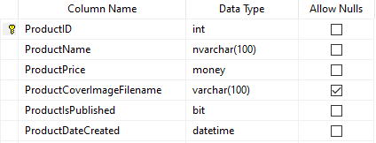

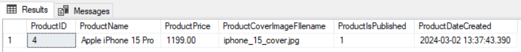

<br>

### Foreign Key Column Naming Rule

A column representing a foreign key from another table should retain its original name.

For example: consider a scenario where products are associated with categories, and all categories are stored in the **Categories** table. The **Products** table should include a foreign key column that references <u>CategoryID</u>, the primary key in the **Categories** table. The foreign key column in the **Products** table must be named <u>CategoryID</u>, not ~~ProductCategoryID~~.

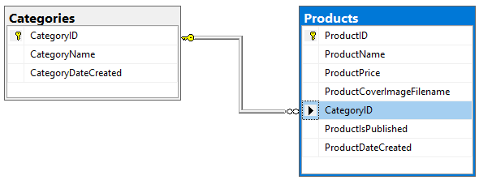

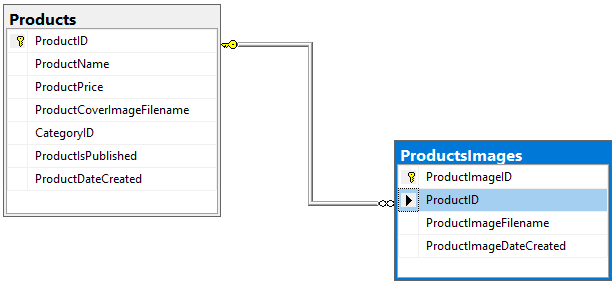

<br>

### Multiple Foreign Keys Columns Naming Rule

When multiple foreign key columns from the same table reference one primary key column, their names should:

1. Begin with the primary key column name.
2. End with a clear phrase describing the column's purpose.

For example: **Apple iPhone 15 Pro** and **Apple iPhone 15 Pro Max** are related products. The table for storing information that these two products are related must be named **ProductsRelated** and contain two foreign key columns linked to the **ProductID** of the **Products** table. Since columns cannot share the same name, construct them as follows:

*Start the column name with **ProductID**, followed by a short, descriptive suffix.*

For example: ***ProductIDTarget*** and ***ProductIDRelated***.

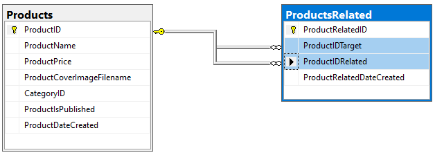

<br>

### Naming Multiple Foreign Keys Rule

When a table includes several foreign key columns that all reference the same primary key column from another table, the default names given by SQL Server do not accurately reflect how those columns relate to one another.

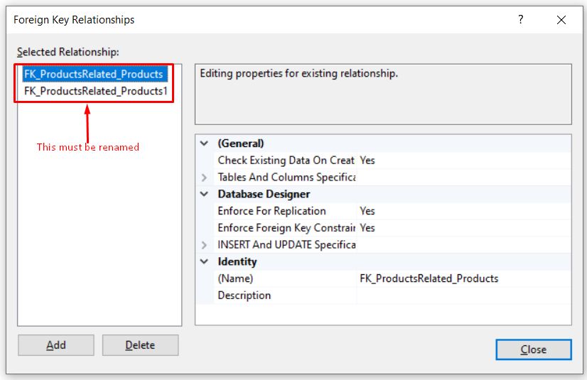

Renaming these keys is **mandatory**! Use **Products** and **ProductsRelated** as an example and follow these naming instructions:

- Start with: **FK**
- Add underscore: **_**
- Add foreign key table name: **ProductsRelated**
- Add underscore: **_**
- Add primary key table name: **Products**
- Add foreign key column name: **ProductIDTarget**

The final result is ***FK_ProductsRelated_Products_ProductIDTarget***.

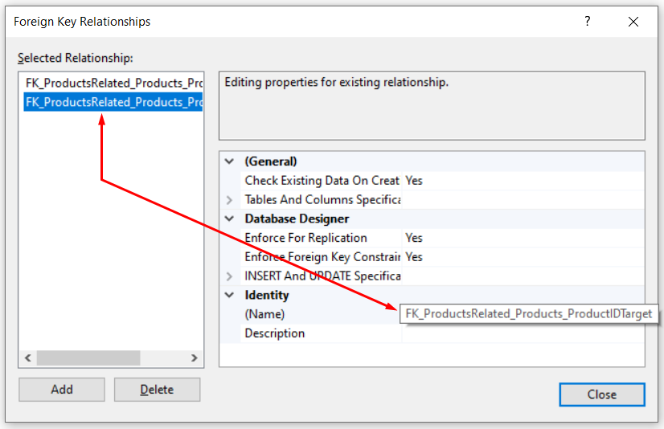

<br>

### Table Trigger Restrictions Rule

Creating table triggers is **strictly prohibited** unless explicitly approved by the team lead.

<br>

### Table Must Rules

<br>

#### Table Must Have a Primary Key

Core tables must have primary keys. The primary key must have its **Identity Specification** property set to **Yes** and **Identity Seed** property set to **1**.

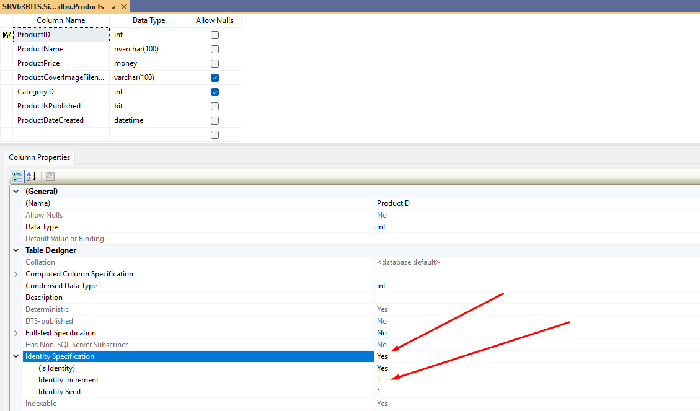

<br>

#### Table Must Have a DateCreated Column

Every table must have a column representing the date a record was created.

For example, the **Products** table must have a **ProductDateCreated** column:

- `DateCreated` column type must be `datetime`.
- `DateCreated` column must **NOT ALLOW NULL**.
- `DateCreated` column default value must be `GETDATE()`.

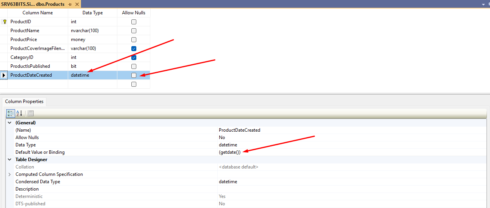

---

<br>

## Stored Procedure and Function Rules

This section defines common standards and best naming practices for both stored procedures and functions.

<br>

### Stored Procedure and Function Naming Rule

Stored procedures and functions must be named in **PascalCase** — capitalizing the first letter of each word, no spaces or underscores. The name must always begin with the <u>table</u> it operates on, followed by a short, clear description of what it does.

For example:

- Stored Procedure — **ProductsDelete**
- Table Valued Function — **ProductsList**
- Scalar Valued Function — **ProductsGetSingleByID**

Since SSMS lists stored procedures and functions alphabetically, starting every name with the table name naturally groups related routines together — improving readability, navigation, and visual organization.

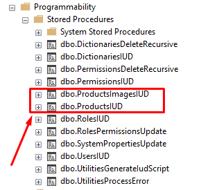

<br>

### Parameter and Variable Naming Rule

Parameters and variables declared inside stored procedures and functions must use **camelCase** — lowercase first letter, each subsequent word capitalized, no spaces or underscores.

For example:

- Parameter: `@productID int`
- Variable: `DECLARE @productID int`

<br>

### ID Parameter/Variable Naming Rule

A parameter or variable that represents an identifier must end with **ID**, where both "I" and "D" are uppercase.

<br>

### Variable Type Writing Rule

Variable types must always be named in **lower case**.

For example: `int`, `varchar(50)`, `datetime` …

<br>

### T-SQL Keyword Writing Rule

T-SQL keywords must always be written in **UPPER** case.

For example: `SELECT`, `INNER JOIN`, `LEFT JOIN`, `RIGHT JOIN`, `INSERT`, `UPDATE`, `DELETE`, `MERGE`, `USING`, `DECLARE`, `WITH`, `CURSOR`, `IF`, `ELSE`, `BEGIN`, `END`, `TRANSACTION` …

<br>

### T-SQL Built-in Function Writing Rule

T-SQL built-in functions must always be written in **UPPER** case.

For example: `GETDATE()`, `REPLACE('original foo bar', 'bar', 'foo')`, `POWER(2,2)`

<br>

### Alias Naming Rule

Every table in a SQL query must be assigned an alias, formed by capitalizing the initial letter of each word in the table name.

For example:

- **Products** → **P**
- **ProductsImages** → **PI**

```sql
SELECT
    P.ProductID,
    P.ProductName
FROM Products P
```

```sql
SELECT
    PI.ProductImageID,
    PI.ProductImageFilename
FROM ProductsImages PI
```

When the same table appears more than once in a query, append a number to the alias (`P1`, `P2`) to distinguish each occurrence.

```sql
SELECT
    PR.ProductIDTarget,
    PR.ProductIDRelated,
    P1.ProductName ProductNameTarget,
    P2.ProductName ProductNameRelated
FROM ProductsRelated PR
INNER JOIN Products P1 ON P1.ProductID = PR.ProductIDTarget
INNER JOIN Products P2 ON P2.ProductID = PR.ProductIDRelated
```

When the same column is selected from multiple aliases, append a clear, descriptive suffix to each to indicate its source or purpose — as shown above with **ProductNameTarget** and **ProductNameRelated**:

```sql
SELECT
    ...
    P1.ProductName ProductNameTarget,
    P2.ProductName ProductNameRelated
    ...
```

For more information about aliases, see: <https://www.sqlservertutorial.net/sql-server-basics/sql-server-alias/>

<br>

### SELECT Statement Restriction Rule

The use of `SELECT *` is **strictly prohibited**. All queries must explicitly specify column names to ensure clarity, maintainability, and performance. The `*` asterisk may only be used temporarily for testing or within `COUNT(*)`.

---

<br>

## Stored Procedure Development Rules

This section defines the standards and best practices for designing, implementing, and maintaining stored procedures, including naming conventions, parameter usage, transaction handling, error management, and rules governing when stored procedures should or should not be used.

<br>

### When to Use Stored Procedure

Use stored procedures to perform INSERT, UPDATE, and DELETE operations on database tables, or to perform other database-specific operations.

<br>

### When Not to Use Stored Procedure

Do not use stored procedures to query and return table data directly to the application. Data retrieval should be handled through views, table-valued functions, or scalar-valued functions.

<br>

### TRY/CATCH Rule

All stored procedures must be wrapped in a TRY/CATCH block to ensure consistent error handling.

<br>

#### CATCH Block Structure

The CATCH block must always follow the structure shown below:

```sql
BEGIN CATCH
    DECLARE
        @errorMessage nvarchar(max) = ERROR_MESSAGE(),
        @errorProcedure nvarchar(max) = ERROR_PROCEDURE(),
        @errorSeverity int = ERROR_SEVERITY(),
        @errorState int = ERROR_STATE(),
        @errorLine int = ERROR_LINE()

    EXEC UtilitiesProcessError @ErrorMessage, @ErrorProcedure, @ErrorSeverity, @ErrorState, @ErrorLine
END CATCH
```

`UtilitiesProcessError` is explained in more detail later in this document.

<br>

### Transactions Rule

A T-SQL `TRANSACTION` must be used when a stored procedure modifies data in **more than one table** (any combination of multiple INSERT, UPDATE, or DELETE statements).

**Transaction Naming Rule**

Transaction names must be an abbreviation of the stored procedure name followed by the suffix **Tran**. The abbreviation is formed by taking the initial letter of each word in the stored procedure name.

For example, the transaction inside **ProductsDelete** is named **PDTran**, where **P** stands for Products, **D** for Delete, and **Tran** is the suffix.

The example below demonstrates how a transaction is inserted into the stored procedure:

```sql
CREATE PROCEDURE [dbo].[ProductsDelete]
(
    @productID int
)
AS
BEGIN
    BEGIN TRANSACTION PDTran
    SAVE TRANSACTION PDTran

    BEGIN TRY
        ...
    END TRY
    BEGIN CATCH
        ROLLBACK TRANSACTION PDTran

        DECLARE
            @errorMessage nvarchar(max) = ERROR_MESSAGE(),
            @errorProcedure nvarchar(max) = ERROR_PROCEDURE(),
            @errorSeverity int = ERROR_SEVERITY(),
            @errorState int = ERROR_STATE(),
            @errorLine int = ERROR_LINE()

        EXEC UtilitiesProcessError @errorMessage, @errorProcedure, @errorSeverity, @errorState, @errorLine
    END CATCH

    COMMIT TRANSACTION PDTran
END
```

---

<br>

## Function Development Rules

This section defines the standards and best practices for designing, implementing, and maintaining both table-valued and scalar-valued functions, including naming conventions, parameter usage, and rules governing when functions should or should not be used.

<br>

### When to Use Function

Functions must be used exclusively for querying and retrieving table data that is returned to the application.

<br>

### Multi-Statement Table-Valued Functions Restrictions

The use of Multi-Statement Table-Valued Functions is **strictly prohibited** due to their negative impact on performance and optimization. Exceptions may only be made with prior approval from the team lead.

---

<br>

## Formatting Rules

This section defines the required formatting standards for SQL queries, including indentation, tab usage, line breaks, and other stylistic conventions.

<br>

### SELECT Statement Formatting Rule

The following rules must be applied when formatting a T-SQL `SELECT` statement:

- The `SELECT` keyword starts on a new line.
- Each selected column is placed on its own line, indented one level (TAB) below `SELECT`.
- The `FROM` clause follows on the next line, with the table name and its alias on the same line.

```sql
SELECT
    P.ProductID,
    P.ProductName,
    P.ProductPrice,
    P.ProductIsPublished,
    P.ProductDateCreated
FROM Products P
```

<br>

### SELECT with JOIN and WHERE Statement Formatting Rule

All standard `SELECT` formatting rules apply, with the following additions:

- Each `JOIN` clause is placed on its own line, with the `ON` condition on the same line.
- The `WHERE` clause starts on a new line, directly under the `JOIN` section.
- Each logical operator (`AND`, `OR`) is placed on its own line.
- Opening and closing parentheses for grouped conditions are placed on separate lines.

```sql
SELECT
    PR.ProductIDTarget,
    PR.ProductIDRelated,
    P1.ProductName ProductNameTarget,
    P2.ProductName ProductNameRelated
FROM ProductsRelated PR
INNER JOIN Products P1 ON P1.ProductID = PR.ProductIDTarget
INNER JOIN Products P2 ON P2.ProductID = PR.ProductIDRelated
WHERE P1.ProductID = @productID
AND
(
    P1.ProductIsPublished = 1
    OR
    @shouldShowUnpublishedProduct = 1
)
```

<br>

### GROUP BY Statement Formatting Rule

All standard `SELECT` formatting rules apply, with the following additions:

- The `GROUP BY` clause is placed on its own line, aligned with `SELECT`, `FROM`, and `WHERE`.
- Each grouping column is placed on its own line, indented one level (TAB) below `GROUP BY`.

```sql
SELECT
    P.CategoryID,
    COUNT(P.ProductID) ProductsCount
FROM Products P
GROUP BY
    P.CategoryID
```

<br>

### INSERT Statement Formatting Rule

The following rules must be applied when formatting a T-SQL `INSERT` statement:

- `INSERT INTO` and the table name are on the same line.
- The column list and `VALUES` block are each wrapped in parentheses placed on separate lines.
- Each column and each value is placed on its own line, indented one level (TAB).

```sql
INSERT INTO Products
(
    ProductName,
    ProductPrice,
    ProductCoverImageFIlename,
    CategoryID,
    ProductIsPublished
)
VALUES
(
    @productName,
    @productPrice,
    @productCoverImageFIlename,
    @categoryID,
    @productIsPublished
)
```

<br>

### UPDATE Statement Formatting Rule

The following rules must be applied when formatting a T-SQL `UPDATE` statement:

- `UPDATE TableName SET` is written on a single line.
- Each column assignment is placed on its own line, indented one level (TAB).
- A trailing comma follows each assignment except the last.
- The `WHERE` clause starts on a new line, following the same `AND`/`OR` formatting rules as `SELECT` statements when complex logic is involved.

```sql
UPDATE Products SET
    ProductName = @productName,
    ProductPrice = @productPrice,
    ProductCoverImageFIlename = @productCoverImageFIlename,
    CategoryID = @categoryID,
    ProductIsPublished = @productIsPublished
WHERE ProductID = @productID
```

<br>

### DELETE Statement Formatting Rule

The following rules must be applied when formatting a T-SQL `DELETE` statement:

- `DELETE` and the table alias are on the same line.
- The `FROM` clause follows on the next line, specifying the table name and alias.
- The `WHERE` clause starts on a new line, following the same `AND`/`OR` formatting rules as `SELECT` statements when complex logic is involved.

```sql
DELETE P
FROM Products P
WHERE P.ProductID = @productID
```

<br>

### IF Statement Formatting Rule

The following rules must be applied when formatting a T-SQL `IF` statement:

- The `IF` condition is written on a single line, evaluating exactly one BIT variable: `IF(@bitVariable = 1)`.
- Multiple logical expressions must **never** be placed directly inside the `IF` condition.
- `BEGIN` and `END` are always included, each on its own line, even when the block contains only one statement.
- All statements inside the block are indented one level (TAB).
- For complex conditions, declare a BIT variable, pre-calculate the full logical condition, and assign the result to it — keeping the `IF` condition simple and readable.

```sql
DECLARE @bitVariable bit

SET @bitVariable = ...

IF(@bitVariable = 1)
BEGIN
    SET @myVariable = 25
END
```

<br>

### WITH Statement (CTEs) Formatting Rule

The following rules must be applied when formatting a T-SQL `WITH` statement:

- The `WITH` keyword is followed by the CTE name on the same line: `WITH productsRelatedCte AS`
- CTE names must follow camelCase and clearly describe the CTE's purpose.
- Opening and closing parentheses are placed on their own lines, wrapping the `SELECT` block.
- The `SELECT` block inside the parentheses is indented one level (TAB).
- All standard `SELECT` formatting rules apply inside the CTE, including column indentation, `JOIN`, `WHERE`, `GROUP BY`, and logical operator placement.

```sql
WITH productsRelatedCte AS
(
    SELECT
        P.ProductID,
        P.ProductName,
        COUNT(PR.ProductRelatedID) ProductsRelatedCount
    FROM ProductsRelated PR
    INNER JOIN Products P ON P.ProductID = PR.ProductIDTarget
    GROUP BY
        P.ProductID,
        P.ProductName
)
SELECT
    P.ProductID,
    P.ProductName,
    P.ProductsRelatedCount
FROM productsRelatedCte P
WHERE P.ProductsRelatedCount > 3
```

<br>

### MERGE Statement Formatting Rule

The following rules must be applied when formatting a T-SQL `MERGE` statement:

- `MERGE` and the target table name are on the same line, with alias **T** (T = Target).
- `USING` follows on the next line, aligned with `MERGE`.
- The source `SELECT` is wrapped in parentheses, each on its own line, indented one level (TAB), and assigned alias **S** (S = Source).
- All standard `SELECT` formatting rules apply inside the source `SELECT`.
- The `ON` condition follows on its own line, aligned with `MERGE` and `USING`.
- `WHEN MATCHED THEN` and `WHEN NOT MATCHED THEN` are each on their own line, at the top indentation level.
- All statements following each `WHEN` clause are indented one level (TAB).
- `UPDATE` and `INSERT` blocks follow their respective formatting rules.

```sql
MERGE Products AS T
USING
(
    SELECT
        @productName ProductName,
        @productPrice ProductPrice,
        @categoryID CategoryID
) AS S
ON T.ProductName = S.ProductName
WHEN MATCHED THEN
    UPDATE SET
        T.ProductPrice = S.ProductPrice,
        T.CategoryID = S.CategoryID
WHEN NOT MATCHED THEN
    INSERT
    (
        ProductName,
        ProductPrice,
        CategoryID
    )
    VALUES
    (
        S.ProductName,
        S.ProductPrice,
        S.CategoryID
    );
```

For more information about the `MERGE` statement, see: <https://www.sqlservertutorial.net/sql-server-basics/sql-server-merge/>

---

<br>

## IUD Stored Procedure

An **IUD stored procedure** is a stored procedure designed to perform INSERT, UPDATE, or DELETE operations on a **single record** of a **single table**.

Instead of creating three separate procedures (one for INSERT, one for UPDATE, one for DELETE), the IUD procedure centralizes all three operations in one reusable, consistent entry point.

For example, for a **Products** table, instead of creating **InsertProduct**, **UpdateProduct**, and **DeleteProduct**, a single procedure **ProductsIUD** must be created.

IUD stored procedures support flexible updates, allowing modification of any combination of columns in a single row. The [UPDATE Logic](#update-logic) example below demonstrates this capability.

<br>

### Purpose of the IUD Procedure

This stored procedure:

1. Performs exactly one of the actions: INSERT, UPDATE, or DELETE.
2. Accepts a JSON payload containing column values.
3. Uses an OUTPUT parameter to return the inserted ID or pass back the processed ID.
4. Wraps the entire operation in a TRY/CATCH block for proper error handling.

```sql
CREATE PROCEDURE [dbo].[ProductsIUD]
(
    @databaseAction tinyint, -- INSERT(0),UPDATE(1),DELETE(2)
    @productID int OUTPUT,
    @productJson nvarchar(max)
)
AS
BEGIN
    BEGIN TRY
        DECLARE
            @productName nvarchar(100),
            @productPrice money,
            @productCoverImageFilename varchar(100),
            @categoryID int,
            @productIsPublished bit

        DECLARE @retVal TABLE
        (
            ProductID int
        );

        SELECT
            @productName = ProductName,
            @productPrice = ProductPrice,
            @productCoverImageFilename = ProductCoverImageFilename,
            @categoryID = CategoryID,
            @productIsPublished = ProductIsPublished
        FROM OPENJSON(@productJson)
        WITH
        (
            ProductName nvarchar(100) '$.ProductName',
            ProductPrice money '$.ProductPrice',
            ProductCoverImageFilename varchar(100) '$.ProductCoverImageFilename',
            CategoryID int '$.CategoryID',
            ProductIsPublished bit '$.ProductIsPublished'
        )

        IF @databaseAction = 0 -- INSERT
        BEGIN
            INSERT INTO Products
            (
                ProductName,
                ProductPrice,
                ProductCoverImageFilename,
                CategoryID,
                ProductIsPublished
            )
            OUTPUT INSERTED.ProductID INTO @retVal
            VALUES
            (
                @productName,
                @productPrice,
                @productCoverImageFilename,
                @categoryID,
                @productIsPublished
            )

            SELECT TOP(1) @productID = ProductID FROM @retVal
        END
        ELSE IF @databaseAction = 1 -- UPDATE
        BEGIN
            UPDATE Products SET
                ProductName = ISNULL(@productName,ProductName),
                ProductPrice = ISNULL(@productPrice,ProductPrice),
                ProductCoverImageFilename = ISNULL(@productCoverImageFilename,ProductCoverImageFilename),
                CategoryID = ISNULL(@categoryID,CategoryID),
                ProductIsPublished = ISNULL(@productIsPublished,ProductIsPublished)
            WHERE ProductID = @productID
        END
        ELSE IF @databaseAction = 2 -- DELETE
        BEGIN
            DELETE P
            FROM Products AS P
            WHERE P.ProductID = @productID
        END
    END TRY
    BEGIN CATCH
        DECLARE
            @ErrorMessage nvarchar(max) = ERROR_MESSAGE(),
            @ErrorProcedure nvarchar(max) = ERROR_PROCEDURE(),
            @ErrorSeverity int = ERROR_SEVERITY(),
            @ErrorState int = ERROR_STATE(),
            @ErrorLine int = ERROR_LINE()

        EXEC UtilitiesProcessError @ErrorMessage, @ErrorProcedure, @ErrorSeverity, @ErrorState, @ErrorLine
    END CATCH
END
```

<br>

### Naming Rule

The IUD procedure name must:

1. Start with the primary table name from which data is being retrieved.
2. Continue with the suffix **"IUD"**.

<br>

### Parameters Overview

**`@databaseAction tinyint`**

Indicates which operation the procedure will perform:

- `0` — INSERT
- `1` — UPDATE
- `2` — DELETE

**`@productID int OUTPUT`**

- On INSERT, this parameter returns the newly created `ProductID`.
- On UPDATE or DELETE, it returns the same `@productID` that was processed.

**`@productJson nvarchar(MAX)`**

Contains a JSON representation of the product data. JSON property names **must match the column names** in the **Products** table because they are directly mapped using `OPENJSON`.

JSON may contain a partial set of values, updating only the columns that are specifically provided in the JSON payload.

<br>

### TRY/CATCH Block

The entire procedure is wrapped in a TRY/CATCH block.

If an error occurs, it is forwarded to another stored procedure, **UtilitiesProcessError** (which is always provided for 63BITS databases), along with:

- Message
- Procedure
- Severity
- State
- Line number

The **UtilitiesProcessError** stored procedure provides consistent and well-structured error reporting, making errors easier to read and understand.

<br>

### Variable Declarations

A set of local variables is declared to store values extracted from `@productJson`.

These variable names mirror the table's column names, ensuring consistency. These variables serve two purposes:

- Mapping JSON → Variables
- Supplying values for INSERT or UPDATE operations

<br>

### Capturing Newly Inserted IDs

A table variable (`@retVal`) is used to capture the OUTPUT of the INSERT operation:

```sql
OUTPUT INSERTED.ProductID INTO @retVal
```

Later, the `ProductID` is assigned to the `@productID` OUTPUT parameter.

<br>

### INSERT Logic

When `@databaseAction = 0`:

- Values are inserted into the `Products` table.
- The newly generated `ProductID` is captured via the table variable.
- The OUTPUT parameter is populated.

<br>

### UPDATE Logic

When `@databaseAction = 1`:

- The record identified by `@productID` is updated.
- The `ISNULL()` function allows partial updates:
  - If a field in JSON is NULL, the existing value is preserved.
  - Only provided values overwrite existing data.

```sql
ProductPrice = ISNULL(@productPrice, ProductPrice)
```

The `ProductPrice` value will be updated only if a price value is provided via JSON. When price is not provided via JSON, the `ProductPrice` column value will remain the same.

<br>

### NULL UPDATE Challenge

**Problem**

Suppose a user wants to remove the product cover image for an existing product by setting the **ProductCoverImageFilename** column value to NULL. The following statement will never set NULL on a column that already has a value:

```sql
ProductCoverImageFilename = ISNULL(@productCoverImageFilename, ProductCoverImageFilename)
```

If the caller explicitly sends NULL as a value (intending to clear the field), the `ISNULL()` function treats it as "no change," preserving the existing value.

As a result:

- There is no way to explicitly set a column to NULL using this pattern.
- NULL is treated as "do not update," rather than "clear the value."

**Solution**

To explicitly request that a column be updated to NULL, we introduce **reserved values** (also known as <u>sentinel values</u>) for each data type:

| Data Type | Reserved Value for NULL |
|---|---|
| Numeric types | `-1` |
| String types | `''` (empty string) |
| Date/Datetime | `1900-01-01` |

These values signal the IUD stored procedure to update the corresponding column to NULL.

To improve maintainability and avoid hardcoding these constants across procedures, all 63BITS databases already have scalar-valued functions that return the reserved sentinel values:

- `dbo.ConstantsNullValueForNumeric()`
- `dbo.ConstantsNullValueForDate()`
- `dbo.ConstantsNullValueForString()`

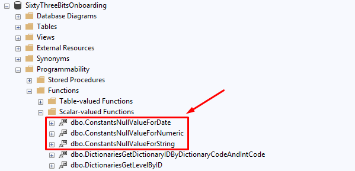

The final solution for the problem is as follows:

```sql
UPDATE Products SET
    ...
    ProductCoverImageFilename = IIF(@productCoverImageFilename = dbo.ConstantsNullValueForString(), NULL, ISNULL(@productCoverImageFilename,ProductCoverImageFilename)),
    ...
WHERE ProductID = @productID
```

> Use this approach wisely — apply this technique only when it is necessary.

<br>

### DELETE Logic

When `@databaseAction = 2`:

- The row with the supplied `@productID` is deleted.

<br>

### Key Takeaways for Developers

- One procedure handles all three operations (INSERT, UPDATE, and DELETE).
- JSON input keeps the parameters clean and scalable.
- TRY/CATCH ensures consistent error reporting.
- Column-aligned variable names ensure predictable mapping and maintainability.
- `ISNULL` logic enables partial updates without requiring full object data.
- The NULL update challenge is solved with predefined reserved values.
- The OUTPUT parameter always returns the affected `ProductID`.

---

<br>

## List Inline Table-Valued Function

<br>

### Purpose of the List Function

A **List Inline Table-Valued Function** should be created when a query needs to retrieve data from one or more tables and return a **set of rows** (a collection of records). This type of function encapsulates reusable query logic and can be called from the application to improve readability and maintainability.

For example, to query all records from the `Products` table, a **ProductsList** inline table-valued function must be created:

```sql
SET ANSI_NULLS ON
GO
SET QUOTED_IDENTIFIER ON
GO

/*
SELECT * FROM ProductsList()
*/

CREATE FUNCTION ProductsList
(
)
RETURNS TABLE
AS
RETURN
(
    SELECT
        P.ProductID,
        P.ProductName,
        P.ProductPrice,
        P.ProductCoverImageFilename,
        P.CategoryID,
        P.ProductIsPublished,
        P.ProductDateCreated
    FROM Products P
)
```

To query records from the `Products` table according to whether the product is published or not, a **ProductsListByIsPublished** inline table-valued function, with a **`@productIsPublished`** parameter, must be created:

```sql
SET ANSI_NULLS ON
GO
SET QUOTED_IDENTIFIER ON
GO

/*
DECLARE
    @productIsPublished bit = 1

SELECT * FROM ProductsListByIsPublished(@productIsPublished)
*/

ALTER FUNCTION ProductsListByIsPublished
(
    @productIsPublished bit
)
RETURNS TABLE
AS
RETURN
(
    SELECT
        P.ProductID,
        P.ProductName,
        P.ProductPrice,
        P.ProductCoverImageFIlename,
        P.CategoryID,
        P.ProductIsPublished,
        P.ProductDateCreated
    FROM Products AS P
    WHERE @productIsPublished IS NULL
    OR P.ProductIsPublished = @productIsPublished
)
```

<br>

### Naming Rule

The function name must:

1. Start with the primary table name from which data is being retrieved.
2. Continue with the suffix **"List"**.
3. Optionally finish with a short and clear description of the filtering criteria or logic used to generate the list (only when necessary).
4. The filtering description in the function name **must not repeat the table name**, because it is already included at the beginning:
   - **Incorrect:** ~~ProductsListByProductIsPublished~~
   - **Correct:** ProductsListByIsPublished
5. Parameter names, for filtering columns via equality compare, must repeat column names in **camelCase**: `WHERE P.ProductIsPublished = @productIsPublished`

<br>

### Function Execution Script Rule

All functions must include a comment that demonstrates an example of how the function should be executed. The parameter values used in the example must clearly represent a real and specific use case of the function's intended behavior.

```sql
/*
DECLARE
    @productIsPublished bit = 1

SELECT * FROM ProductsListByIsPublished(@productIsPublished)
*/
```

This must be placed right above the function declaration: `ALTER FUNCTION ProductsListByIsPublished`

---

<br>

## GetSingle Scalar-Valued Function

<br>

### Purpose of the GetSingle Function

A **GetSingle Scalar-Valued Function** should be created when a query needs to return **only one row** from a table, by its ID or another parameter.

For example, to query only one record from the `Products` table by `ProductID`, a **ProductsGetSingleByID** scalar-valued function must be created:

```sql
SET ANSI_NULLS ON
GO
SET QUOTED_IDENTIFIER ON
GO

/*
DECLARE
    @productID int = 4

SELECT dbo.ProductsGetSingleByID(@productID)
*/

CREATE FUNCTION ProductsGetSingleByID
(
    @productID int
)
RETURNS nvarchar(max)
AS
BEGIN
    RETURN
    (
        SELECT
            P.ProductID,
            P.ProductName,
            P.ProductPrice,
            P.ProductCoverImageFIlename,
            P.ProductIsPublished,
            P.ProductDateCreated,
            P.CategoryID,
            C.CategoryName,
            (
                SELECT
                    PrI.ProductImageID,
                    PrI.ProductImageFilename
                FROM ProductsImages AS PrI
                WHERE PrI.ProductID = @productID
                FOR JSON PATH
            ) ProductImages
        FROM Products AS P
        LEFT JOIN Categories C ON C.CategoryID = P.CategoryID
        WHERE P.ProductID = @productID
        FOR JSON PATH, WITHOUT_ARRAY_WRAPPER
    )
END
GO
```

<br>

### Naming Rule

The function name must:

1. Start with the primary table name from which data is being retrieved.
2. Continue with:
   a. The **GetSingle** suffix when the function returns JSON representing a single record from the table.
   b. Skip GetSingle when the return value is not JSON and does not represent a single record.
3. Optionally finish with a short and clear description of the filtering criteria or logic used in the function.
4. The filtering description in the function name **must not repeat the table name**, because it is already included at the beginning:
   - **Incorrect:** ~~ProductsGetSingleByProductID~~
   - **Correct:** ProductsGetSingleByID
   - **Incorrect:** ~~ProductsIsProductNameUnique~~
   - **Correct:** ProductsIsNameUnique
5. Parameter names, for filtering columns via equality compare, must repeat column names in **camelCase**: `WHERE P.ProductID = @productID`
6. A scalar function returning a bit value must contain the **"Is"** or **"Has"** keyword after the table name prefix — for example: **ProductsIsNameUnique** or **ProductsHasPrice**.

<br>

### Return Result Rule

The return result for the GetSingle function <u>must always be a **JSON** string</u>, represented as `varchar(max)` or `nvarchar(max)` depending on whether the JSON string includes any **unicode** characters.

**Why JSON?**

There are three reasons for that:

1. JSON provides the flexibility of hierarchical results.
2. Multiple queries or sub-queries can be combined into one and generate a unified JSON result.
3. JSON can easily be deserialized into a C# class.

The example above clearly demonstrates how a single product, with a collection of its images, can be retrieved from the database within a single query.

The result of the query above will look like:

```json
{
  "ProductID": 4,
  "ProductName": "Apple iPhone 15 Pro",
  "ProductPrice": 1199.0000,
  "ProductCoverImageFilename": "iphone_15_cover.jpg",
  "ProductIsPublished": true,
  "ProductDateCreated": "2024-03-02T13:37:43.390",
  "CategoryID": 1,
  "CategoryName": "Mobile Phones",
  "ProductImages": [
    {
      "ProductImageID": 1,
      "ProductImageFilename": "apple_iPhone_15_Pro_front.jpg"
    },
    {
      "ProductImageID": 2,
      "ProductImageFilename": "apple_iPhone_15_Pro_back.jpg"
    },
    {
      "ProductImageID": 3,
      "ProductImageFilename": "apple_iPhone_15_Pro_package.jpg"
    }
  ]
}
```

Which can easily be deserialized into the following C# record:

```csharp
public record ProductDTO
{
    #region Properties
    public int? ProductID { get; init; }
    public string ProductName { get; init; }
    public decimal? ProductPrice { get; init; }
    public string ProductCoverImageFilename { get; init; }
    public bool ProductIsPublished { get; init; }
    public DateTime? ProductDateCreated { get; init; }
    public int? CategoryID { get; init; }
    public string CategoryName { get; init; }
    public IReadOnlyList<ProductImageDTO> ProductImages { get; init; }
    #endregion

    #region Nested Classes
    public record ProductImageDTO
    {
        #region Properties
        public int? ProductImageID { get; init; }
        public string ProductImageFilename { get; init; }
        #endregion
    }
    #endregion
}
```

<br>

### Function Execution Script Rule

All functions must include a comment that demonstrates an example of how the function should be executed. The parameter values used in the example must clearly represent a real and specific use case of the function's intended behavior.

```sql
/*
DECLARE
    @productID int = 4

SELECT dbo.ProductsGetSingleByID(@productID)
*/
```

This must be placed right above the function declaration: `ALTER FUNCTION ProductsGetSingleByID`