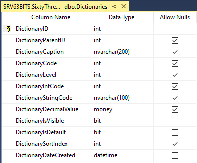
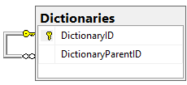
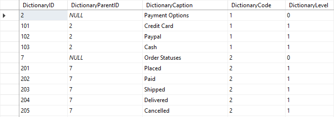
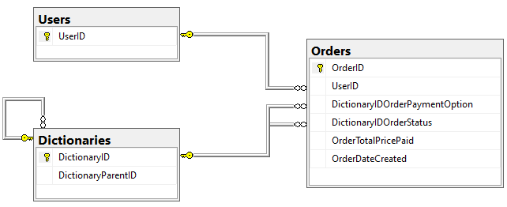
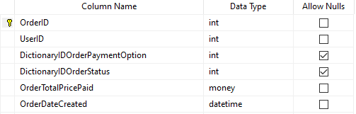

# Dictionaries Table

The **Dictionaries table** is a database design pattern created by the 63BITS team to store all simple collections of predefined options in a single table, rather than creating separate tables for each set of choices. This approach significantly reduces database complexity.

Most projects require dropdown menus where users select from predefined options. Rather than creating individual tables for each set of choices, the Dictionaries table provides a unified, hierarchical structure.

**Examples:**

An e-commerce checkout page might offer payment methods:

- Credit Card
- PayPal
- Cash

An order can have various statuses throughout its lifecycle:

- Placed
- Paid
- Shipped
- Delivered
- Cancelled

The Dictionaries table groups all these types of data efficiently in one place, making it both scalable and maintainable.



---

<br>

## How It Works: Hierarchical Structure

The table uses a parent-child hierarchy to organize data:

- **DictionaryID** — A primary key that uniquely identifies each record
- **DictionaryParentID** — A foreign key that references other records in the same table, establishing the parent-child relationship



This self-referencing structure creates a hierarchy while maintaining referential integrity through a foreign key constraint.

**Example data structure:**

- **Payment Options** — DictionaryID = 2 (parent record)
  - Credit Card — DictionaryID = 101, DictionaryParentID = 2
  - PayPal — DictionaryID = 102, DictionaryParentID = 2
  - Cash — DictionaryID = 103, DictionaryParentID = 2
- **Order Statuses** — DictionaryID = 7 (parent record)
  - Placed — DictionaryID = 201, DictionaryParentID = 7
  - Paid — DictionaryID = 202, DictionaryParentID = 7
  - Shipped — DictionaryID = 203, DictionaryParentID = 7
  - Delivered — DictionaryID = 204, DictionaryParentID = 7
  - Cancelled — DictionaryID = 205, DictionaryParentID = 7



Parent records (where DictionaryParentID = NULL and DictionaryLevel = 0) serve as grouping containers only. They are not displayed to end users and do not participate in query results.

Child records (where DictionaryParentID = 2 or 7, and DictionaryLevel = 1) are the actual values presented in dropdown menus.

---

<br>

## Key Columns

**DictionaryCode** — Groups related records together. All records within the same group (parent and children) must have an identical DictionaryCode value. Developers assign these codes manually starting with 1, 2, 3, etc. for each new group.

**DictionaryLevel** — Indicates the hierarchy depth. Root-level parent records have DictionaryLevel = 0; their children have DictionaryLevel = 1, and so on. A database trigger automatically assigns this value.

**DictionaryIntCode** — Optional custom integer value for each record.

**DictionaryStringCode** — Optional custom string value for each record.

**DictionaryDecimalValue** — Optional custom decimal value for each record.

**DictionarySortIndex** — Optional field that specifies the display order of records in a list.

**DictionaryIsDefault** — When set to 1, marks a record as the default selection. For example, you can set "USA" as the default country in a dropdown while other countries are sorted alphabetically.

**DictionaryIsVisible** — Controls whether a record should be visible to end users.

> ⚠️ **Important:** Always ensure that **DictionaryCode** and **DictionarySortIndex** values are aligned and consistent across related records. This keeps the Dictionaries table organized and maintainable.

---

<br>

## Querying the Table

To build a dropdown menu for payment options, the `DictionariesListByLevelAndCodeAndIsVisible` table-valued function must be used:

```sql
DECLARE
    @dictionaryLevel int = 1,
    @dictionaryCode int = 1,
    @dictionaryIsVisible bit = 1

SELECT
    D.DictionaryID,
    D.DictionaryCaption,
    D.DictionaryParentID,
    D.DictionaryLevel,
    D.DictionaryStringCode,
    D.DictionaryIntCode,
    D.DictionaryDecimalValue,
    D.DictionaryCode,
    D.DictionaryIsDefault,
    D.DictionaryIsVisible,
    D.DictionarySortIndex,
    D.DictionaryDateCreated
FROM dbo.DictionariesListByLevelAndCodeAndIsVisible(@dictionaryLevel, @dictionaryCode, @dictionaryIsVisible) D
```

This SQL query retrieves all records at level 1 within the specified group (DictionaryCode = 1).

---

<br>

## Using Dictionaries with Related Tables

For an e-commerce platform with orders, the Orders table should include foreign keys to the Dictionaries table for payment methods and order statuses:

- **UserID** — References the user who placed the order
- **PaymentMethodID** — References the payment option (from Dictionaries)
- **OrderStatusID** — References the order status (from Dictionaries)

This design allows you to maintain a centralized, audit-friendly dictionary of all lookup values while keeping your database schema clean and efficient.




