# Todo Exercise

This exercise will help you implement the coding standards from the Database Development document. To reinforce your learning:

- Type code manually rather than copying and pasting from the document.
- Use SQL Server Management Studio's Design Mode to create new tables, stored procedures, and functions.

<br>

## Table of Contents

- [Tables](#tables)
- [Stored Procedure](#stored-procedure)
- [Inline Table Values Function](#inline-table-values-function)
- [Scalar Valued Function](#scalar-valued-function)

---

<br>

## Tables

Create 3 tables according to screenshots below:

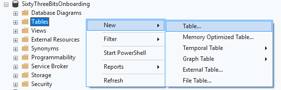

<br><br>

**Products**

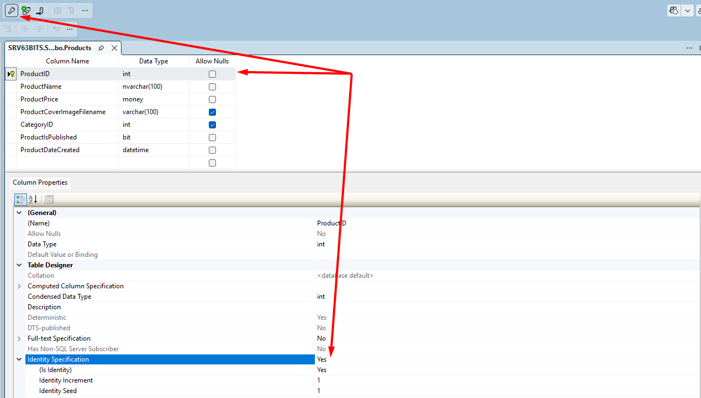

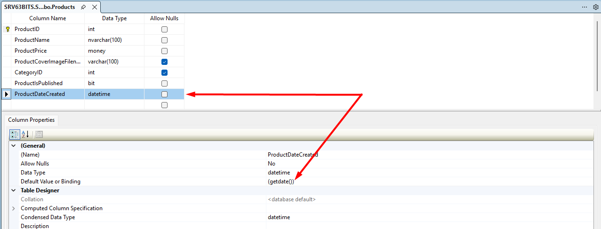

<br><br>

**ProductsImages**

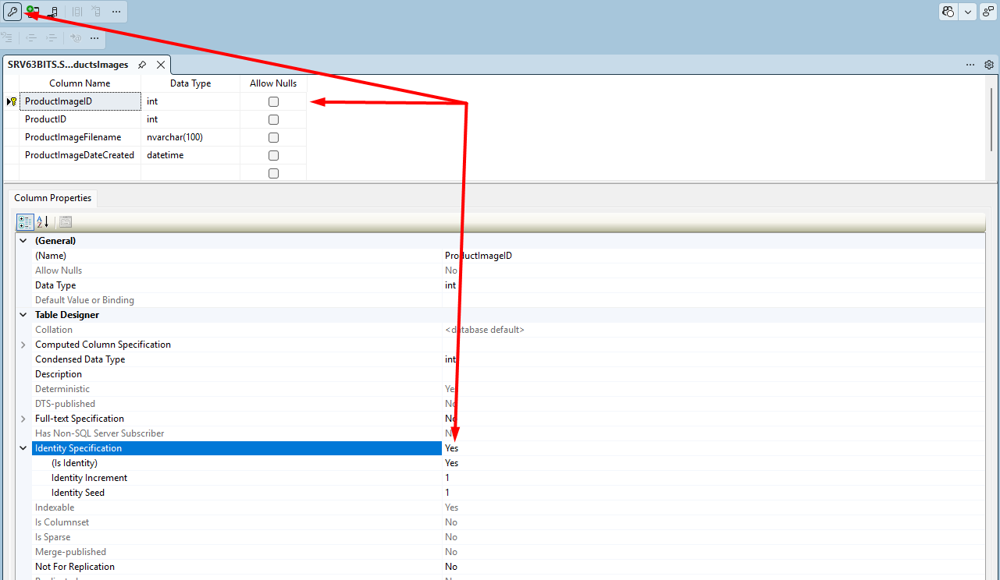

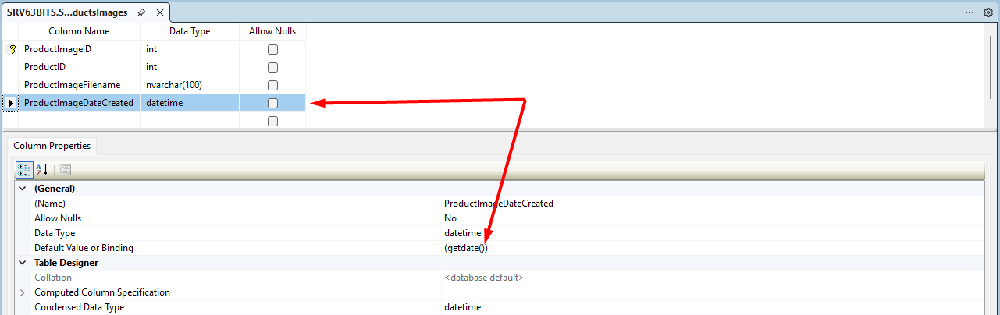

<br>

Create PK – FK relationship between two tables, set UPDATE CASCADE and DELETE CASCADE.

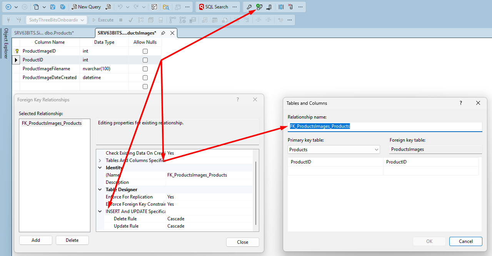

<br><br>

**Categories**

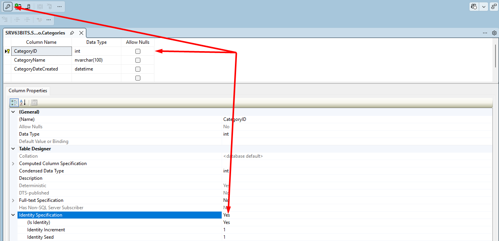

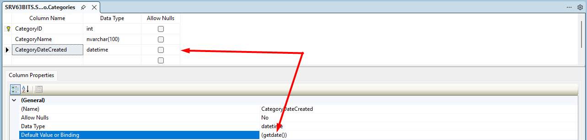

<br><br>

Create PK – FK relationship between two Products and Categories, set **UPDATE No Action** and **DELETE No Action**, because we don't want to remove products when category is deleted.

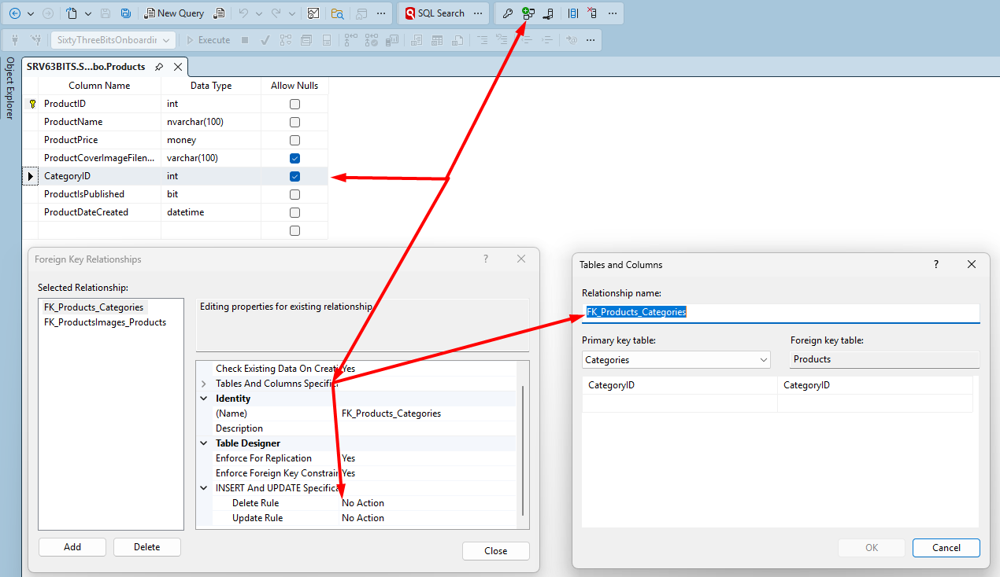

---

<br>

## Stored Procedure

Create stored procedure to handle INSERT, UPDATE and DELETE operations operation for one product. Use all materials learned and don't forget to apply naming and formatting rules.

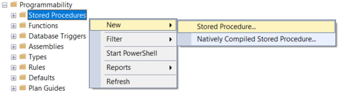

SQL Server management studio will automatically generate a template. Manually implement stored procedure according to screenshot below, <u>do not copy and paste code from previous document</u>:

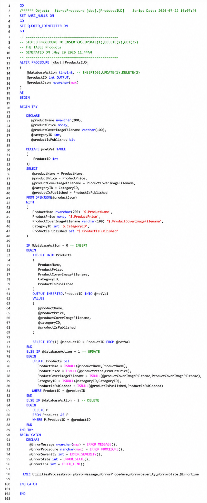

After you finish writing stored procedure, test it, make sure all three INSERT, UPDATE and DELETE operations work as they are supposed to.

Going forward, you do not need to manually write IUD stored procedures for each table. All 63BITS databases include a built-in utility stored procedure **UtilitiesGenerateIudScript** that automatically generates the IUD script for any table.

<br>

**How to use:**

Simply execute the procedure and pass the target table name as a parameter. The system will generate a ready-to-use IUD stored procedure script for you.

```sql
EXEC UtilitiesGenerateIudScript 'Products'
```

Don't forget to review and make sure that IUD script generated by **UtilitiesGenerateIudScript** is properly reflecting your needs.

Ensure that all outlined rules for [Stored Procedures](./02_Database_Development_Rules.md#stored-procedure-development-rules) are carefully considered.

---

<br>

## Inline Table Values Function

Create table valued function to query all records from your products table. Use all materials you learned and don't forget to apply naming and formatting rules.

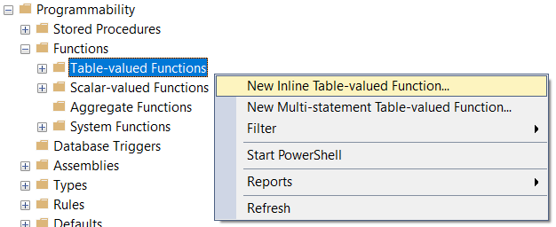

Implement stored procedure according to screenshot below, <u>do not copy and paste code from previous document</u>:

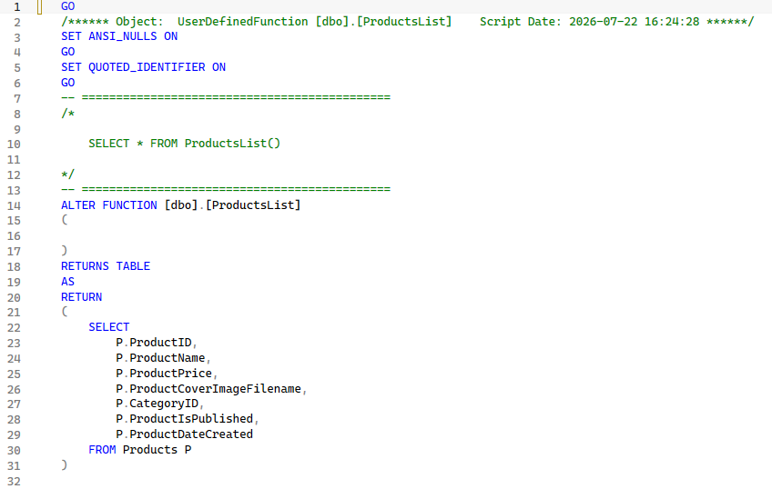

Ensure that all outlined rules for [Table Valued Functions](./02_Database_Development_Rules.md#list-inline-table-valued-function) are carefully considered.

---

<br>

## Scalar Valued Function

Create Scalar-valued Function, to retrieve single product by it's ID. Review "**GetSingle Scalar-Valued Function**" section carefully one more time. An example provided in that section, queries one product by ID with all product images and return result as a JSON.

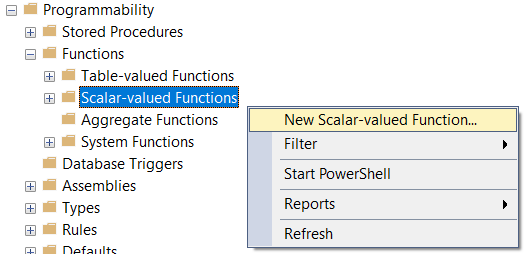

Insert data into corresponding tables manually, so you can clearly see the JSON result of your function call.

Implement stored procedure according to screenshot below, <u>do not copy and paste code from previous document</u>:

P.S. Pay attention to the LEFT JOIN Categories part of the example script, it is used because product might not have Category assigned to it.

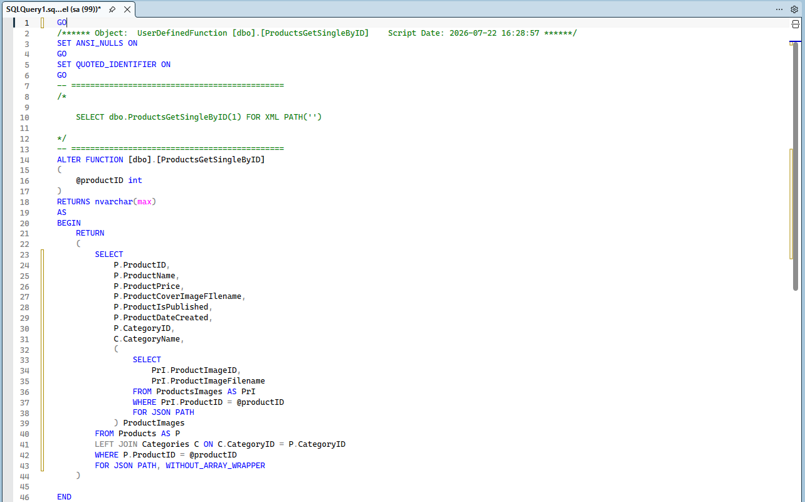

Ensure that all outlined rules for [Scalar Valued Functions](./02_Database_Development_Rules.md#getsingle-scalar-valued-function) are carefully considered.
