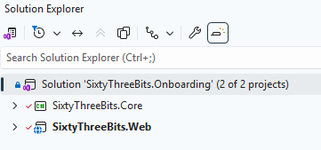
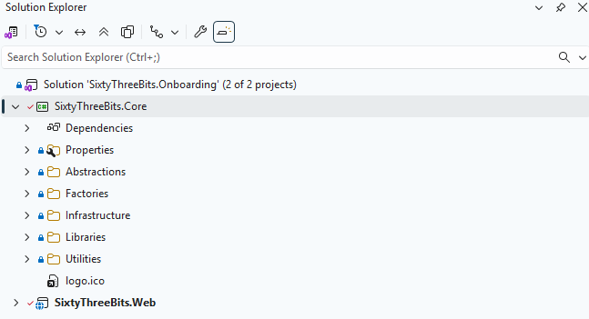
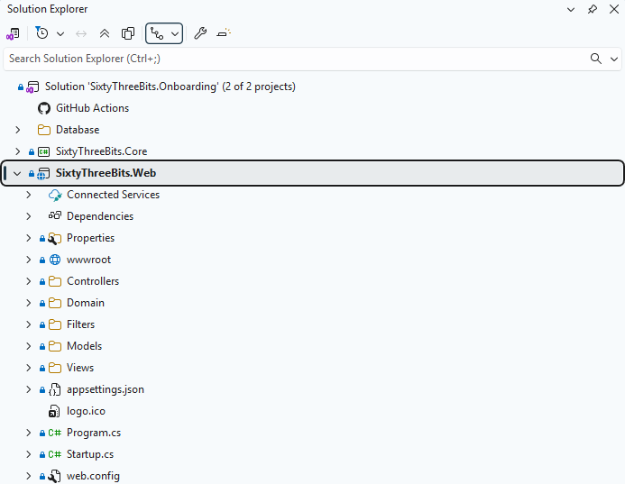
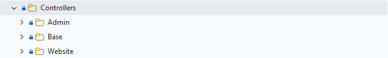
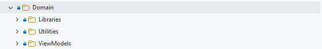
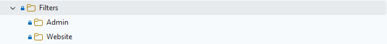
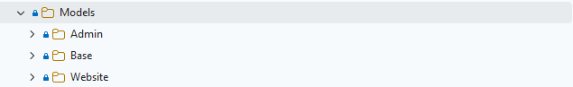
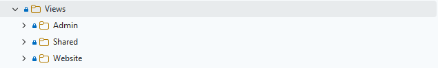

# 63BITS Solution Structure

This document describes how 63BITS applications are structured: the folder and file layout, and the rules, patterns, and guidelines we follow to achieve the best results.

 

## Terms Used

**Domain** — <https://en.wikipedia.org/wiki/Domain_(software_engineering)>

**Monolithic** — <https://www.educative.io/answers/what-is-a-monolithic-application>

**Module** — <https://www.educative.io/answers/what-are-code-modules>

**Deferred Execution** — <https://weblogs.asp.net/dixin/understanding-linq-to-sql-6-working-with-deferred-execution>

 

## Dev Stack

| Concern | Choice |
|---|---|
| Application structure | **Monolithic** |
| IDE | **Visual Studio** |
| Application Framework | **.NET CORE (latest version)** |
| Object Relational Mapping Database Tools | **Entity Framework Core** |
| Application Development Framework | **ASP.NET Core MVC** |
| Application Development Third Party Libraries | **DevExpress/DevExtreme** |
| Presentation Development Framework | **MVC Razor Pages** |
| Presentation Development Third Party Libraries | **Bootstrap**, **jQuery** |

 

## Solution Structure

The application uses a monolithic architecture and consists of two projects:

1. **SixtyThreeBits.Core** — Contains repositories, API services, business logic, utilities, abstractions and shared libraries.
2. **SixtyThreeBits.Web** — An ASP.NET Core web application that includes models, view-models, controllers, views, web-specific libraries and static assets (images, JavaScript, CSS).

 

## SixtyThreeBits.Core

This class library represents the core domain of the application. It handles database interactions via repositories, external web service API calls, business logic, libraries, entities, value objects, utilities, and abstractions.

Below is an overview of the **SixtyThreeBits.Core** folder structure.

 

### Abstractions

Contains domain-level interfaces shared across all application layers. Any interface required by multiple layers should be defined here.

 

### Factories

Includes factory classes responsible for creating instances of repositories, `DbContext`, services, libraries, and other objects essential to the application.

 

### Infrastructure

Houses data management components. This includes database access and external web service API communication.

 

### Libraries

Contains reusable libraries that are not directly related to database or API calls and perform specific or specialized functions.

 

### Utilities

Includes general-purpose utilities such as application settings, formatters, constants, enums, and helper functions used throughout the domain.

 

## SixtyThreeBits.Web

**SixtyThreeBits.Web** is an ASP.NET Core MVC web application that serves as the presentation and application layer of the system. It references the **SixtyThreeBits.Core** project to access repositories, services, libraries, domain abstractions, and utilities.

The project is organized into the following directories:

- **wwwroot** — Static assets and client resources
- **Controllers** — MVC controller classes
- **Domain** — Web-specific libraries, shared view-models and utilities
- **Filters** — Action filter attributes
- **Models** — Model and ViewModel classes
- **Views** — View templates and layouts

 

### wwwroot

Directory containing all static assets served to the client, including website images, stylesheets, JavaScript files, and third-party libraries used as plugins.

 

### Controllers

Contains all MVC controller classes, organized into three subfolders: **Admin** and **Website** representing distinct application areas, and **Base** containing base controller classes shared across all areas.

- **Admin** — Controllers for administrative functionality
- **Base** — Base controller class inherited by all other controllers
- **Website** — Controllers for public-facing website pages

 

### Domain

Contains classes and libraries providing web-application-specific functionality, organized into three subfolders:

- **Libraries** — Reusable library classes specific to the Web project
- **Utilities** — Helper and utility classes specific to the Web project
- **ViewModels** — ViewModel classes exclusively for partial views and layouts (not for regular views)

 

### Filters

Contains MVC action filter attribute classes, organized into two subfolders representing distinct application areas:

- **Admin** — Filter attributes for administrative controllers
- **Website** — Filter attributes for public-facing website controllers

Action filters are critical components that influence application behavior and are essential to system functionality. For detailed information on implementing custom filter attributes, refer to the following resources:

- <https://devblogs.microsoft.com/dotnet/attribute-routing-in-asp-net-mvc-5/>
- <https://www.tutorialspoint.com/asp.net_mvc/asp.net_mvc_filters.htm>

 

### Models

Contains all MVC model classes, organized into three subfolders: **Admin** and **Website** representing distinct application areas, and **Base** containing base model classes shared across all areas.

- **Admin** — Model classes for administrative functionality
- **Base** — Base model class inherited by all other models
- **Website** — Model classes for public-facing website pages

 

### Views

Contains all view templates and layouts, organized into three subfolders: **Admin** and **Website** representing distinct application areas, and **Shared** containing partial views and common components used across both areas.

- **Admin** — View templates and layouts for administrative pages
- **Website** — View templates and layouts for public-facing website pages
- **Shared** — Partial views and common components used across Admin and Website areas

