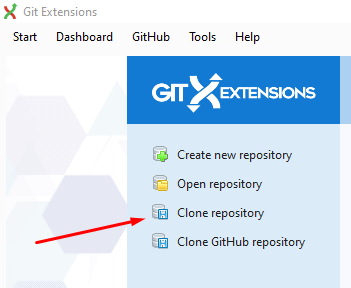
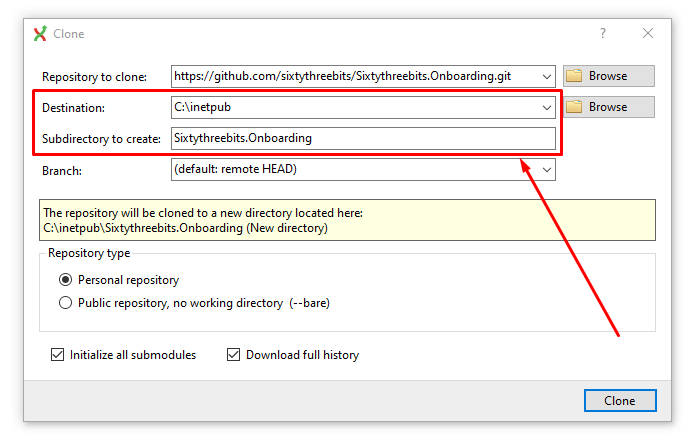
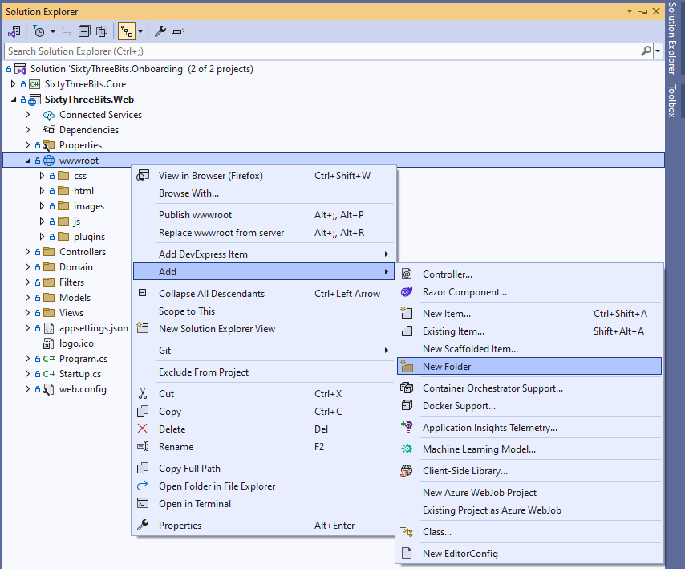
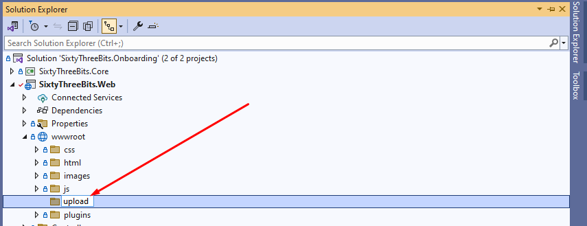
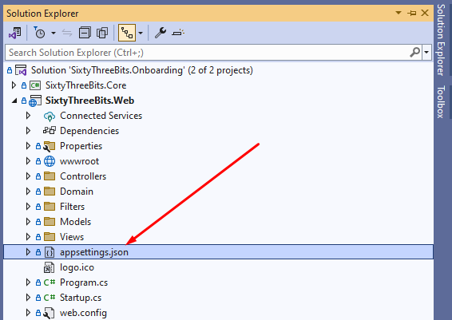
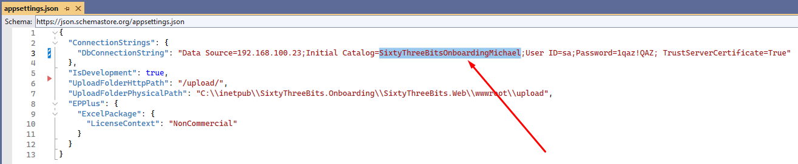
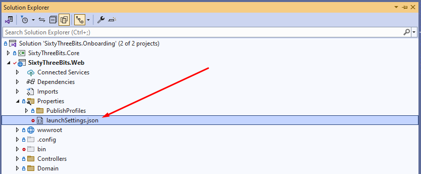
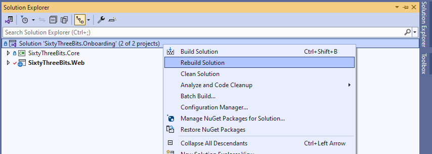
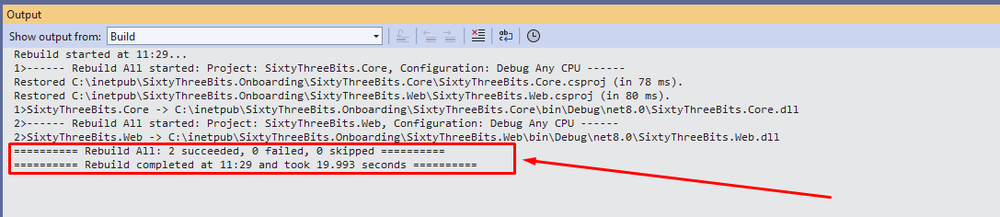
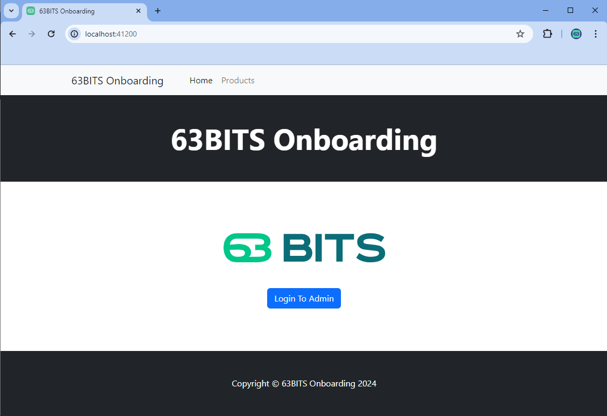

# Download Onboarding Project From Git

This document provides instructions on downloading the onboarding project from Git, placing it in the correct location on your computer, and building it.

1. Open **GitExtensions** (or any other Git client you're comfortable with) and click **Clone Repository**.

   

   If you don't have GitExtensions installed, you can download it from <http://gitextensions.github.io/>.

   

<br><br>

2. Fill in the fields in the Clone window with the following values:

   - Repository to clone: **https://github.com/sixtythreebits/Sixtythreebits.Onboarding.git**
   - Destination: **C:\inetpub**
   - Subdirectory to create: **SixtyThreeBits.Onboarding**

<br><br>

3. Open the **SixtyThreeBits.Onboarding.sln** solution file with Visual Studio.

<br><br>

4. In **Solution Explorer**, expand **SixtyThreeBits.Web -> wwwroot** and check whether an **upload** folder exists. If it doesn't, create a new folder and name it **upload**.

   

   

<br><br>

5. Open **Solution Explorer -> SixtyThreeBits.Web -> appsettings.json** and change the database name in the `DbConnectionString` to match your database name and connection string.

   

   

<br><br>

6. Open **Solution Explorer -> SixtyThreeBits.Web -> Properties -> launchSettings.json** and make sure it matches the JSON below. If it doesn't, overwrite its contents with the JSON below.

   

   ```json
   {
     "profiles": {
       "IIS Express": {
         "commandName": "IISExpress",
         "launchBrowser": true,
         "environmentVariables": {
           "ASPNETCORE_ENVIRONMENT": "Development"
         }
       },
       "SixtyThreeBits.Web": {
         "commandName": "Project",
         "launchBrowser": true,
         "environmentVariables": {
           "ASPNETCORE_ENVIRONMENT": "Development"
         },
         "applicationUrl": "http://localhost:5000"
       }
     },
     "iisSettings": {
       "windowsAuthentication": false,
       "anonymousAuthentication": true,
       "iisExpress": {
         "applicationUrl": "http://localhost:41200",
         "sslPort": 0
       }
     }
   }
   ```

<br><br>

7. In **Solution Explorer**, right-click the **SixtyThreeBits.Onboarding** solution and click **Rebuild Solution**.

   

   A success message should appear in the Output window once the build completes.

   

<br><br>

8. Press **CTRL + F5** to run the project. Visual Studio will launch the project and open it in your browser. You should see the following:

   
