# Products Repository Implementation Exercise

This exercise will demonstrate the full implementation of the Products repository class.

 

## ProductsRepository Class Implementation

Navigate to **SixtyThreeBits.Core → Infrastructure → Repositories** and create a new **Products** directory. Then create two items within the Products directory:

- A **DTO** subdirectory for data transfer objects
- A **ProductsRepository.cs** file for the repository class

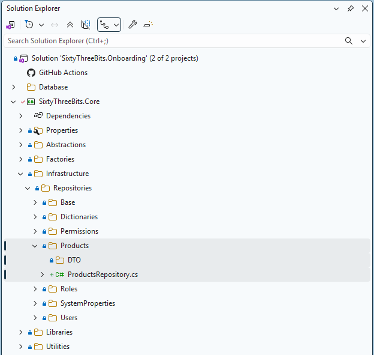

 

Open the **ProductsRepository.cs** file and configure the class according to the screenshot below.

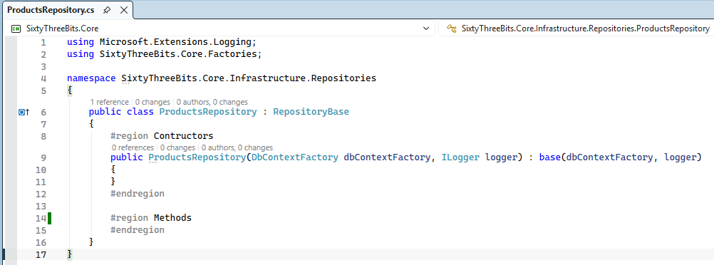

 

## ProductsIUD Method Implementation

Navigate to the **DTO** subdirectory and create a new file, **ProductsIudDTO.cs**, and implement it according to the screenshot below.

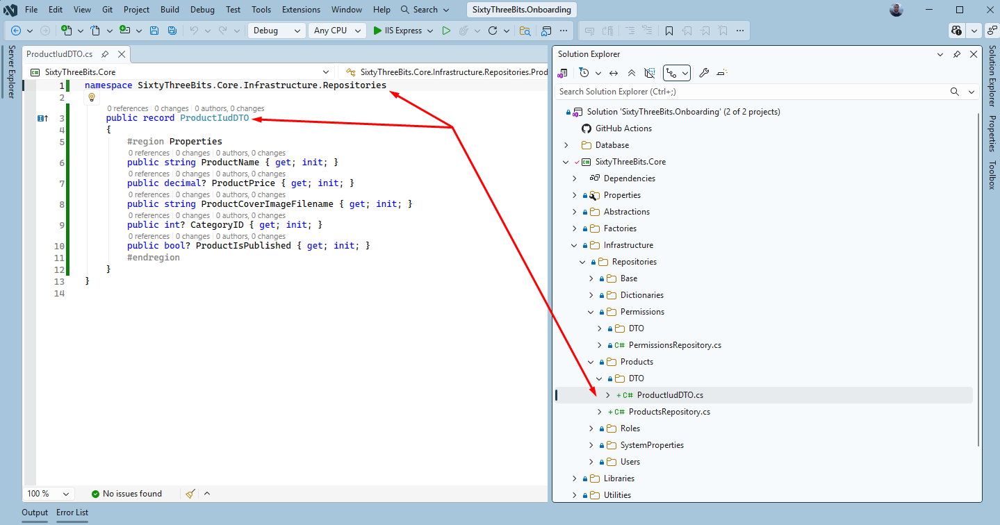

 

Below is a demonstration of how the ProductsIUD stored procedure's `@productJson` values match up to the ProductIudDTO properties.

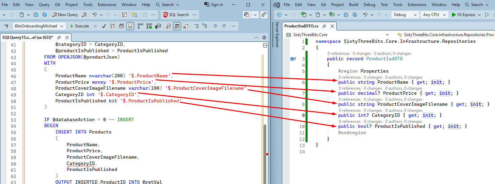

 

Go back to the **ProductsRepository.cs** file and implement the ProductsIUD method according to the screenshot below.

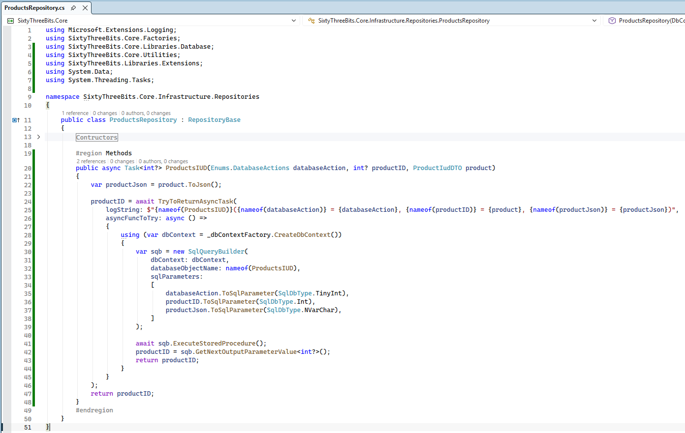

 

## ProductsList Method Implementation

Navigate to the **DTO** subdirectory and create a new file, **ProductsListDTO.cs**, and implement it according to the screenshot below.

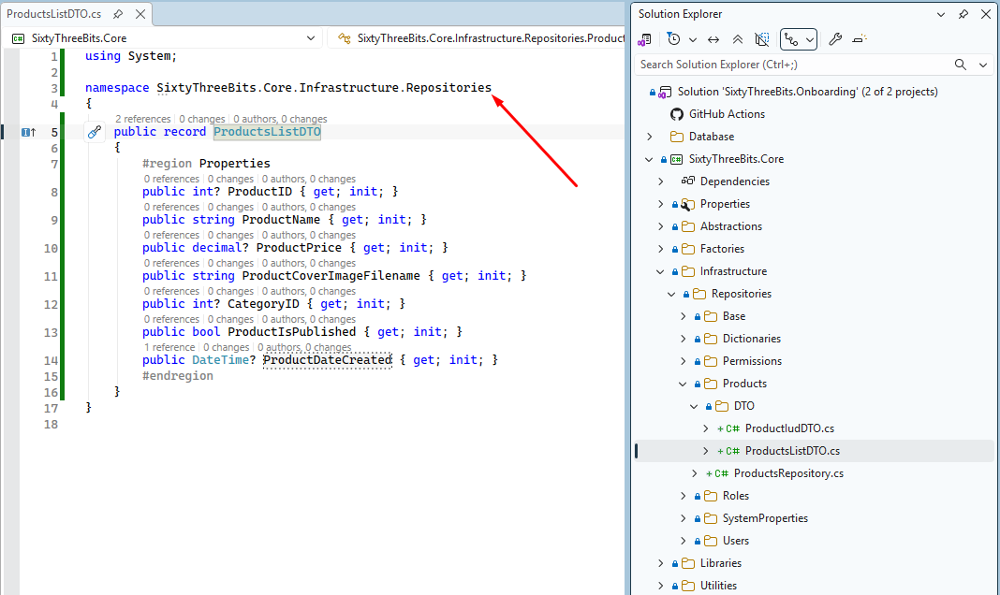

 

Below is a demonstration of how the ProductsList SQL function's columns match up with the ProductsListDTO properties.

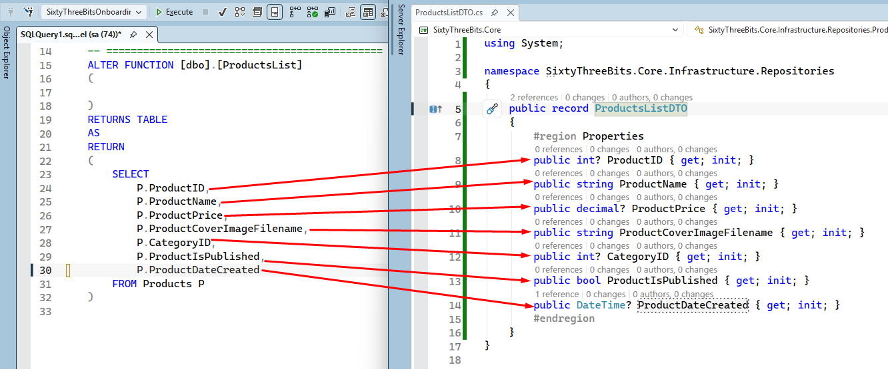

 

Go back to the **ProductsRepository.cs** file and implement the ProductsList method according to the screenshot below.

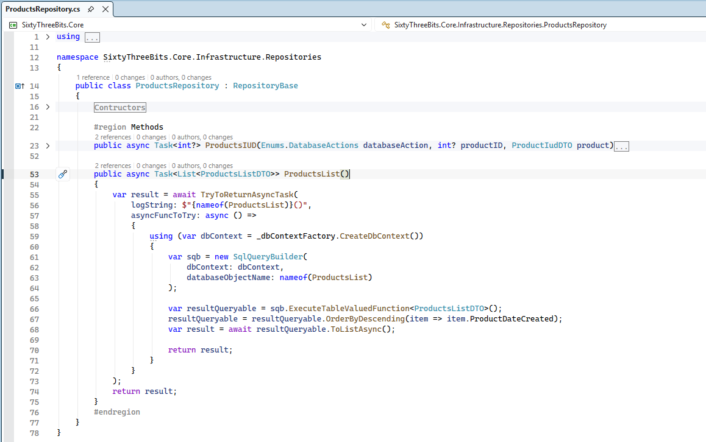

 

## ProductsGetSingleByID Method Implementation

Navigate to the **DTO** subdirectory and create a new file, **ProductDTO.cs**, and implement it according to the screenshot below.

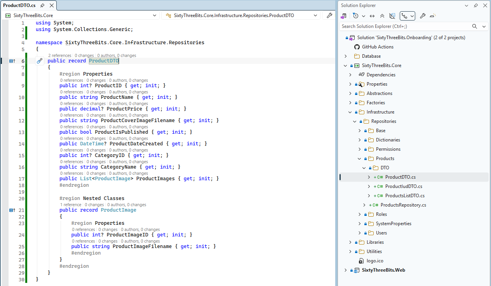

 

Go back to the **ProductsRepository.cs** file and implement the ProductsGetSingleByID method according to the screenshot below.

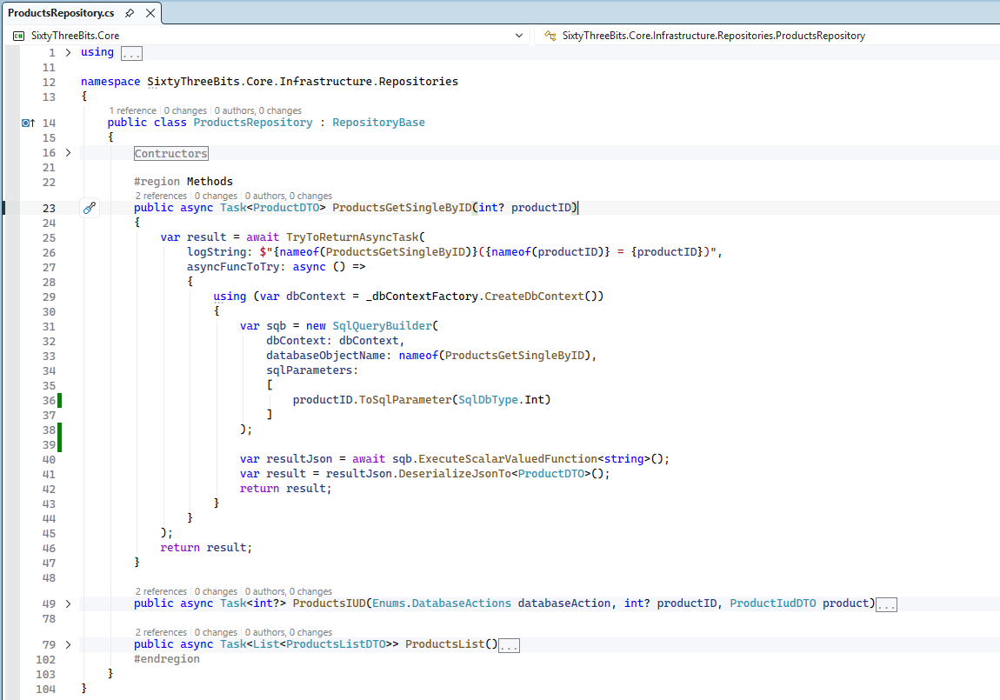

 

## Registering the Repository in the Factory

Navigate to **SixtyThreeBits.Core → Factories** and open **RepositoryFactory.cs**. Add a method according to the screenshot below.

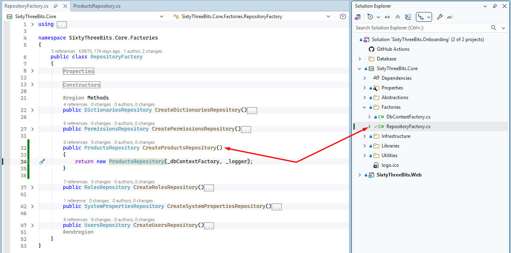
