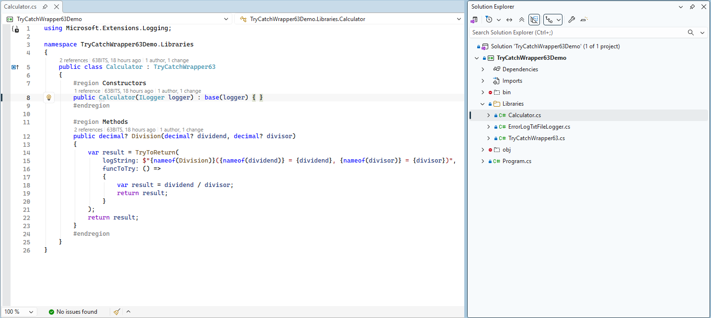
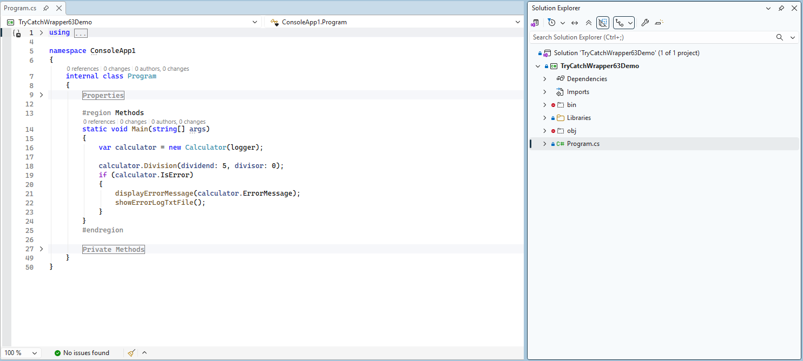
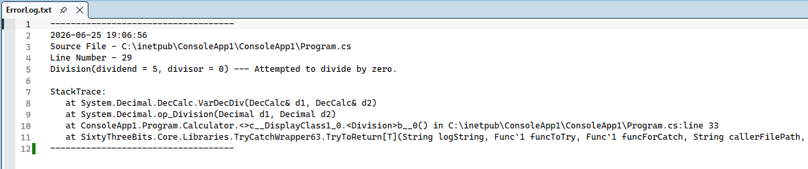
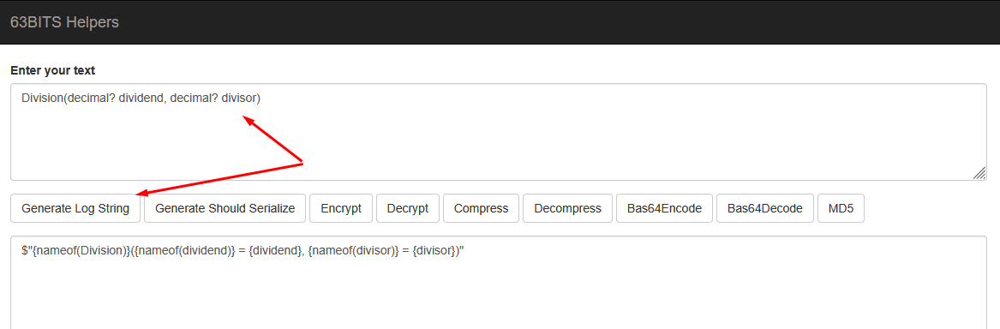

# TryCatchWrapper63

<br>

## Required Knowledge Prerequisites

**C# Generics**

- <https://learn.microsoft.com/en-us/dotnet/csharp/fundamentals/types/generics>
- <https://www.tutorialsteacher.com/csharp/csharp-generics>

**C# Action and Func Delegates**

- <https://learn.microsoft.com/en-us/dotnet/api/system.action>
- <https://learn.microsoft.com/en-us/dotnet/api/system.func>
- <https://www.bytehide.com/blog/action-in-csharp-tutorial>
- <https://www.bytehide.com/blog/func-keyword-csharp>

**C# operator default**

- <https://learn.microsoft.com/en-us/dotnet/csharp/language-reference/operators/default>

<br>

## Overview

TryCatchWrapper63 is a foundational class designed to standardize exception handling and logging behavior across methods that frequently require try/catch blocks. It centralizes repeated logic to improve maintainability, reduce duplicated error-handling code, and ensure consistent logging throughout data access layers.

This class is most commonly inherited by **repository** classes because repository methods execute Stored Procedures and Functions in SQL Server, where exceptions may occur due to external infrastructure, configuration conditions, or unexpected runtime failures.

Typical scenarios where this base class is beneficial:

- Exceptions cannot be prevented using validation or conditional checks.
- Error-handling logic is repeated across many methods.
- Exceptions must be logged consistently.

<br>

## Key Features

The class introduces four reusable wrapper methods:

| Method | Description |
|---|---|
| `TryExecute` | Executes code without returning a value. |
| `TryToReturn<T>` | Executes a delegate and returns a result of type `T`. |
| `TryExecuteAsyncTask` | Async version of `TryExecute`. |
| `TryToReturnAsyncTask<T>` | Async version of `TryToReturn<T>`. |

Additionally, the class exposes three status properties:

```csharp
public bool IsError { private set; get; }
public string ErrorMessage { private set; get; }
public Exception Exception { private set; get; }
```

A private logger, defined via constructor dependency injection, is used to record errors:

```csharp
public TryCatchWrapper63(ILogger logger)
{
    _logger = logger;
}
```

<br>

## Primary Use Case

The TryCatchWrapper63 class is most commonly used within **repository** classes. Repository methods interact directly with **SQL Stored Procedures** and **Functions**, where runtime exceptions are frequently encountered due to external dependencies, such as:

- Invalid database connection string
- Database unavailable or unreachable (network issues)
- Exceptions thrown within SQL code (Stored Procedure or Function)

To address these scenarios, the shared base class `RepositoryBase` inherits from TryCatchWrapper63, enabling all repository methods to:

- Wrap each SQL execution in a standardized try/catch block
- Capture and process exceptions consistently
- Execute common, reusable logic inside the catch block (logging, flag updates, etc.)

<br>

## TryToReturn Method Explained

The following explanation focuses specifically on the `TryToReturn` method. The other methods — `TryExecute`, `TryExecuteAsyncTask`, and `TryToReturnAsyncTask` — operate using the same underlying principles and execution flow.

```csharp
protected T TryToReturn<T>(
    string logString,
    Func<T> funcToTry,
    Func<T> funcForCatch = null,
    [CallerFilePath] string callerFilePath = "",
    [CallerLineNumber] int callerLineNumber = 0
)
```

<br>

### Parameter Details

| Parameter | Purpose |
|---|---|
| `logString` | A descriptive log message, typically containing the method name and parameters. |
| `funcToTry` | Delegate executed inside the try block. |
| `funcForCatch` *(optional)* | Custom recovery execution inside the catch block. Overrides default handling. |
| `callerFilePath` *(optional, autogenerated)* | Identifies the file from which the call originated. Populated automatically. |
| `callerLineNumber` *(optional, autogenerated)* | Identifies the line number where the call occurred. Populated automatically. |

<br>

### Execution Flow

1. Attempt execution of `funcToTry`.
2. If successful, return the function result.
3. If an exception occurs:
   - If `funcForCatch` is **not** provided:
     - Process the exception via the internal handler.
     - Return `default(T)`.
   - If `funcForCatch` **is** provided:
     - Assign internal properties.
     - Return the result of `funcForCatch()`.

By default, the system uses a custom logger implementation, `ErrorLogTxtFileLogger : ILogger`, which writes exception details to an **ErrorLog.txt** file located in:

**SixtyThreeBits.Web -> bin -> Debug -> net[version] -> App_Data -> ErrorLog.txt**

<br>

## The Usage Example

The example below does not represent a real-world scenario. It is used purely for demonstration purposes to illustrate how the `TryToReturn` method operates.

Download the **TryCatchWrapper63Demo** project from Git: <https://github.com/sixtythreebits/TryCatchWrapper63Demo.git>

This console application demonstrates how the `Calculator` class inherits from `TryCatchWrapper63` and wraps its `Division` method in `TryToReturn` to catch exceptions, which will automatically:

1. Set the `IsError` flag to `true`.
2. Set `ErrorMessage`.

Check the `Calculator` class methods to see how `Division` is wrapped in `TryToReturn`.



Check the `Main` method to see how `Division` is called and the error is handled. The `displayErrorMessage` and `showErrorLogTxtFile` methods are created purely for demonstration purposes, to display the error message in the console application.



Calling `calculator.Division(dividend: 5, divisor: 0)` gracefully catches the exception and produces a log record in the **ErrorLog.txt** file.



<br>

## Logging Helper Tool

A helper utility automatically builds formatted log strings from method signatures:

<http://helpers.63bits.com>

Copy and paste your method signature into the text field and click the **Generate Log String** button.


