# Building the Product Detail Page

The process of building the Product Detail page is similar to the steps used for the Product Listing page. We start by defining the expected page layout. The page should display essential product information, including:

- Page Title
- Product Name
- Product Image
- Product Price

For clarity, a visual layout example is provided below.

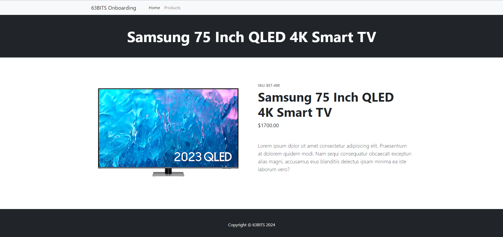

Note: The visual includes additional fields, such as SKU and Product Description. These can be ignored for now.

<br>

## Model

Navigate to **SixtyThreeBits.Web → Models → Website → Products** and create **ProductWebsiteModel.cs**.

The class name **ProductWebsiteModel** uses the singular form because this model handles a single product, unlike `ProductsWebsiteModel`, which handles multiple products.

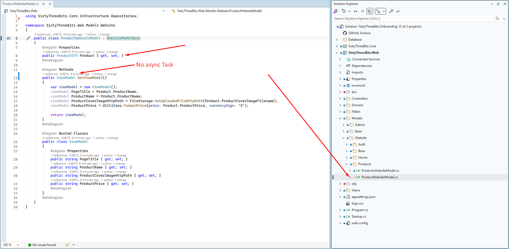

As you can notice, this model has a `ProductDTO Product` property. You may wonder, where is the database call retrieving the product from the database by its ID? This is exactly what comes next.

<br>

## Controller

Before creating the controller, navigate to **SixtyThreeBits.Web → Domain → Utilities** and open **RouteKeys63.cs**.

`RouteKeys63` is a static class containing only `const string` properties that represent key parameters used in **routing** throughout the application.

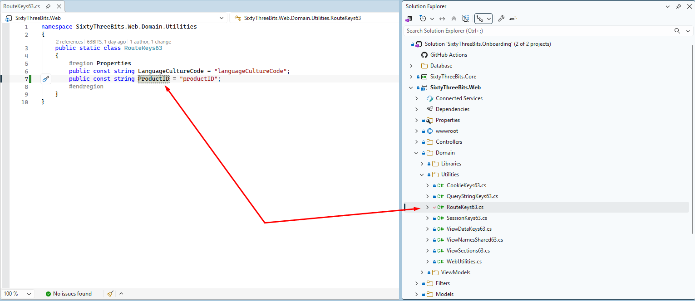

Now navigate to **SixtyThreeBits.Web → Controllers → Website → Products** and create **ProductWebsiteController.cs**.

The class name **ProductWebsiteController** uses the singular form because this controller handles a single product, unlike `ProductsWebsiteController`, which handles multiple products.

Create the controller class according to the screenshot below:

- Register `_viewName`.
- Create an empty action `Product()`.
- Add a route that uses our newly created `RouteKeys63.ProductID` to capture the ID of the product from the route.

![ProductWebsiteController.cs showing public class ProductWebsiteController : WebsiteControllerBase<ProductWebsiteModel> with a const string _viewName pointing to ProductWebsiteView.cshtml, and a [Route] attribute using RouteKeys63.ProductID above an empty Product() action](../images/05_63BITS_MVC_Application_Structure_02_Todo_Product_Details/image4.png)

As `RouteKeys63.ProductID` is registered as a const, the following expression:

```csharp
$"product/{{{RouteKeys63.ProductID}:int}}"
```

is translated into the `"product/{productID:int}"` string at compile time. This translation represents a regular route string that captures the ID of the product via the `productID` route key.

The reason for using `RouteKeys63.ProductID` is to avoid parameter hardcoding in routing.

<br>

## Action Filter

Now we need to capture the value of `ProductID` from the route and retrieve the product by its ID from the database. This is where we need to use a controller-level action filter.

The goal of the action filter is to execute a block of code before the process reaches the action method call.


`OnActionExecutionAsync` is a built-in method provided by the MVC `Controller`. It can be overridden to execute a custom block of code before the action method is executed.

We begin with `await base.OnActionExecutionAsync(...)`. This expression executes `OnActionExecutionAsync` for the `WebsiteControllerBase` class. The base class has its own logic which must be executed before the process reaches our code.

Next, we extract the ID of the product from the URL:

```csharp
var productID = Model.RouteData.Values[RouteKeys63.ProductID]?.ToString().ToInt();
```

This is where we use our previously registered `RouteKeys63.ProductID` and avoid hardcoding.

Next, we call the repository method to retrieve the product by its ID:

```csharp
var repository = Model.RepositoryFactory.CreateProductsRepository();
Model.Product = await repository.ProductsGetSingleByID(productID);
```

Finally, we make a check.

If we were able to retrieve the product by its ID:

- We set the product name as the browser tab title:
  ```csharp
  var pageTitle = Model.Product.ProductName;
  Model.PageTitle.Set(pageTitle);
  ```
- We pass the process to the action method:
  ```csharp
  return await next();
  ```

If the product does not exist:

- We set our custom-built **Not Found** result:
  ```csharp
  context.Result = Model.GetNotFoundWebsiteViewResult();
  ```
- We return our custom-built **Not Found** result:
  ```csharp
  return new ActionExecutedContext(...);
  ```
- The process will not continue to the action method.

<br>

## Action Method

Implement the action method according to the screenshot below.

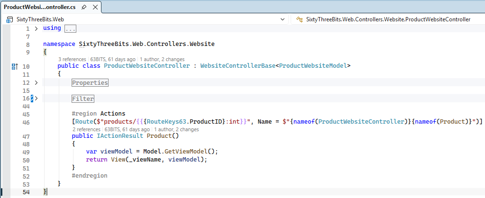

<br>

## View

Navigate to **SixtyThreeBits.Web → Views → Website → Products** and create **ProductWebsiteView.cshtml**.

Connect the model to your view according to the instructions below.

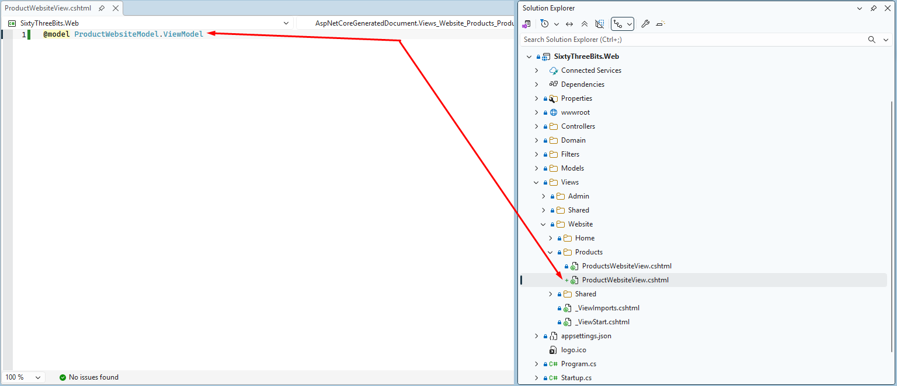

Navigate to **SixtyThreeBits.Web → wwwroot → html** and open **product.html**.

`product.html` is a static HTML file which we will use for building the dynamic `.cshtml` view.

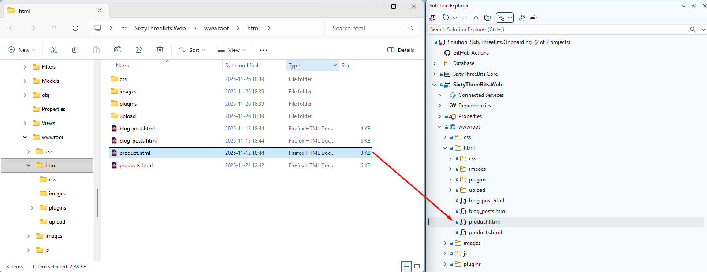

Open `product.html` using your web browser. This is how your final result must look.

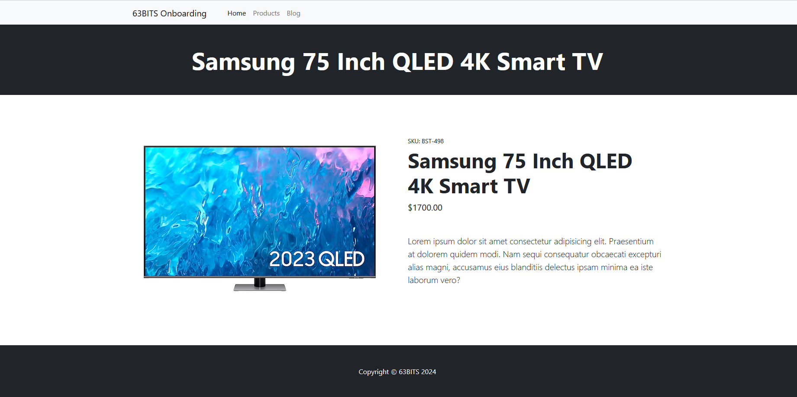

Navigate to **SixtyThreeBits.Web → wwwroot → html**, open **product.html**, and copy the static HTML.

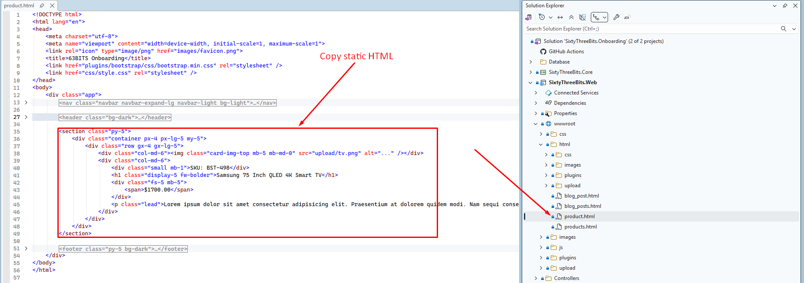

Paste it into your view and replace the static content with `ViewModel` properties.

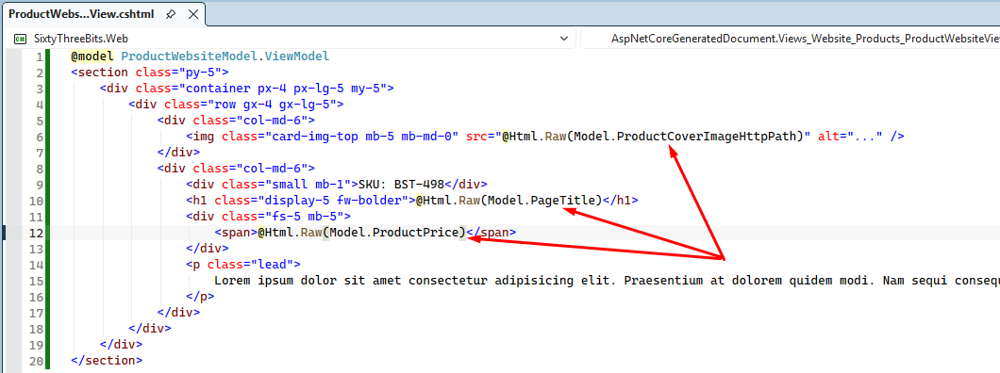

<br>

## Launch

To run the project, press **CTRL + F5**. The browser will open and the home page will load automatically.

To view the Product Detail page, enter **/products/1** in the browser's address bar.

In this example, a product with ID 1 exists in the database. In your environment, the ID may differ, so substitute the appropriate `ProductID` in the URL.

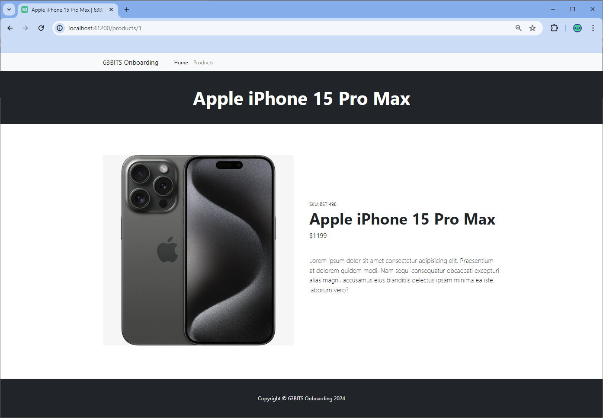

<br>

## Link Pages

To complete our application layer, we need to link the [Products Listing page](08_63BITS_MVC_Application_Structure_01_Todo.md) to the Product Detail page.

Open **ProductsWebsiteModel.cs** and implement the following changes:


`UrlFactory` is an instance of our custom-built class `UrlFactory63`, provided to the `ProductsWebsiteModel` by inheritance. Its job is to create URLs.

You provide:

- `controllerName` — via the `nameof` operator.
- `actionName` — via the `nameof` operator.
- `routeValues` — via a `Dictionary<string, object>` where:
  - **Key** is `RouteKeys63.ProductID` (hardcoding avoided again).
  - **Value** is `item.ProductID`.

And it returns the URL to the Product Detail page according to `ProductID`.

Launch the application again, navigate to the products page, and click on the **View Details** button.

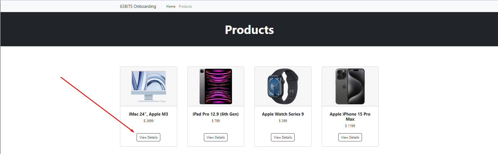

Upon click, the product detail page will be loaded.

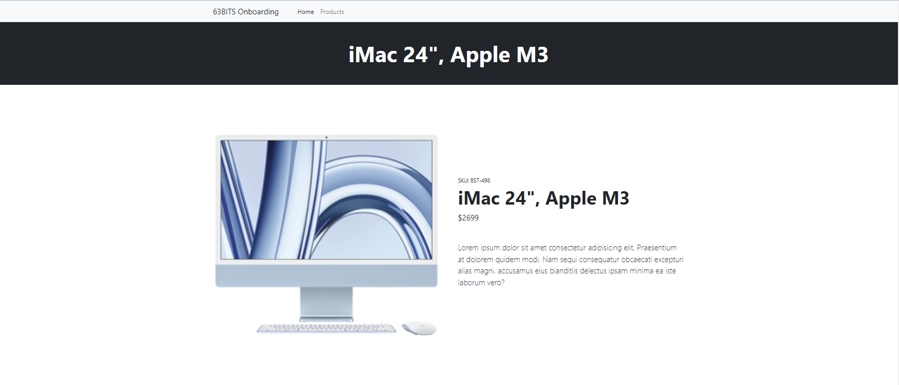
