# 63BITS Administration Side Part 1

The documents "**63BITS Administration Side — Part 1**" and "**63BITS Administration Side — Part 2**" define the process of completing the administration module for **Products** within the 63BITS platform.

The administration area includes two primary pages:

1. **Products Listing Page** — implemented using a DevExtreme DataGrid.
2. **Product Properties Page** — implemented using Bootstrap-based forms.

**Part 1** focuses on constructing the Products Listing Page, detailing its structure, functionality, and integration with the backend.

**Part 2** covers the implementation of the Product Properties Page, including form design and CRUD operations using Bootstrap forms.

<br>

## Prerequisites

Before starting the implementation, we must introduce an additional database function and corresponding method in the Product Repository: `CategoriesList()`. The purpose of this function is to retrieve product category data from the database and expose it to the application layer.

Go back to your database and create the `CategoriesList()` function.

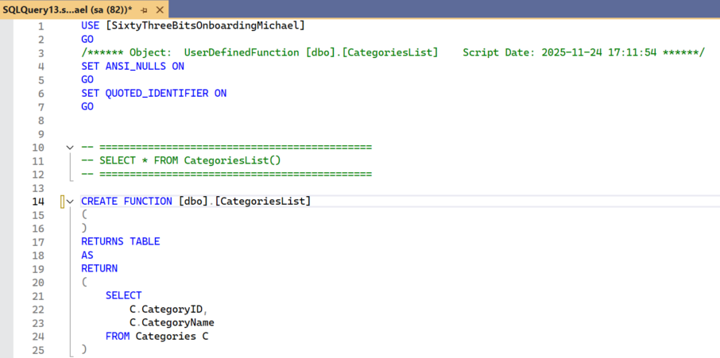

<br>

Next, go back to your application **SixtyThreeBits.Core**, add `CategoriesListDTO`, and add a `CategoriesList()` method to the `ProductsRepository` class.

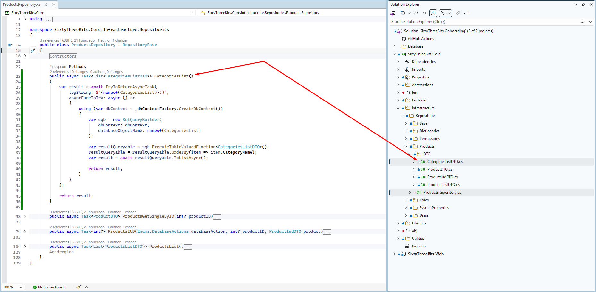

<br>

## Building the Model / View / Controller Structure

Implementation starts with reviewing the expected layout of the Products Listing Page and identifying the UI components required to build it.

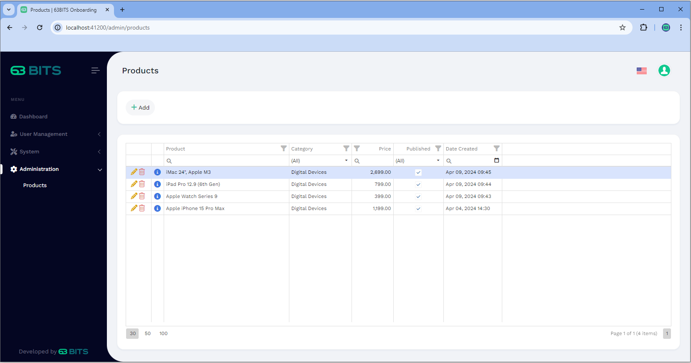

The page should include the following elements:

- **Add Button**
- **DevExtreme DataGrid**, composed of:
  - **Rows** with the following **Columns**:
    - Edit Button
    - Delete Button
    - Link to the Product Properties Page
    - Product attributes (Name, Category, Price, Published, Date Created)

This layout follows the standard structure used for all administration listing pages.

Let's focus on the DataGrid, specifically what columns we have:

- **Command Column** — Edit and Delete buttons.
- **Custom Column** — Navigation link to the Product Properties page.
- **Name Column** — Text field.
- **Category Column** — Lookup (drop-down) selector.
- **Price Column** — Numeric input field.
- **Published Column** — Checkbox.
- **Date Created Column** — Date picker (calendar input).

With the full breakdown of the page structure, we can now proceed to building the Model.

<br>

## Model

Navigate to **SixtyThreeBits.Web → Models → Admin** and create a directory named **Products**. Create a file named **ProductsAdminModel.cs** inside that directory.

Create the `ProductsAdminModel` class according to the screenshot below.

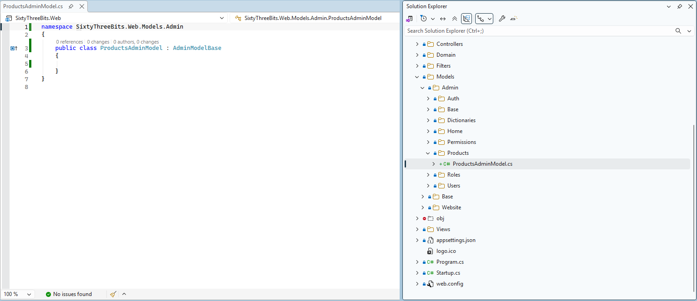

<br>

The ViewModel structure for pages that utilize a DevExtreme DataGrid is more complex than for standard pages, and is organized as follows:

- `ProductsAdminModel`
  - `ViewModel`
    - `GridModel`
      - `GridItem`

Implement this structure according to the screenshot below.

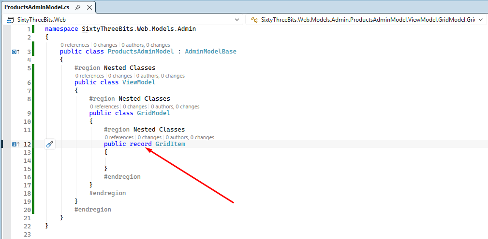

<br>

Class properties and methods will be built **from the innermost level outward** — starting with `GridItem`, the most deeply nested class, and finishing with `ProductsAdminModel`, the outermost class.

<br>

### GridItem

First, let's build `GridItem` according to the instructions below.

- `GridItem` must always be a record.
- Its properties must always be declared using `get; init;`.

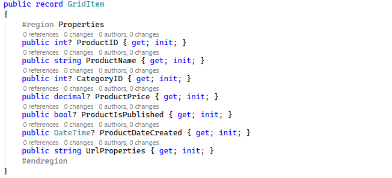

Each property of this class represents a column of the grid.

<br>

### GridModel

Next, let's add a `_categories` property to the `GridModel` and assign its value through the constructor.

`IReadOnlyList<KeyValueTuple<int?, string>> _categories` — this property represents the collection of categories used to populate the drop-down options for the **Category** lookup column in the DataGrid.

The `KeyValueTuple` class, provided by the `SixtyThreeBits.Libraries` namespace, represents a pair of **Key** and **Value**. This class is specifically designed to supply data to drop-down and lookup components throughout the system.

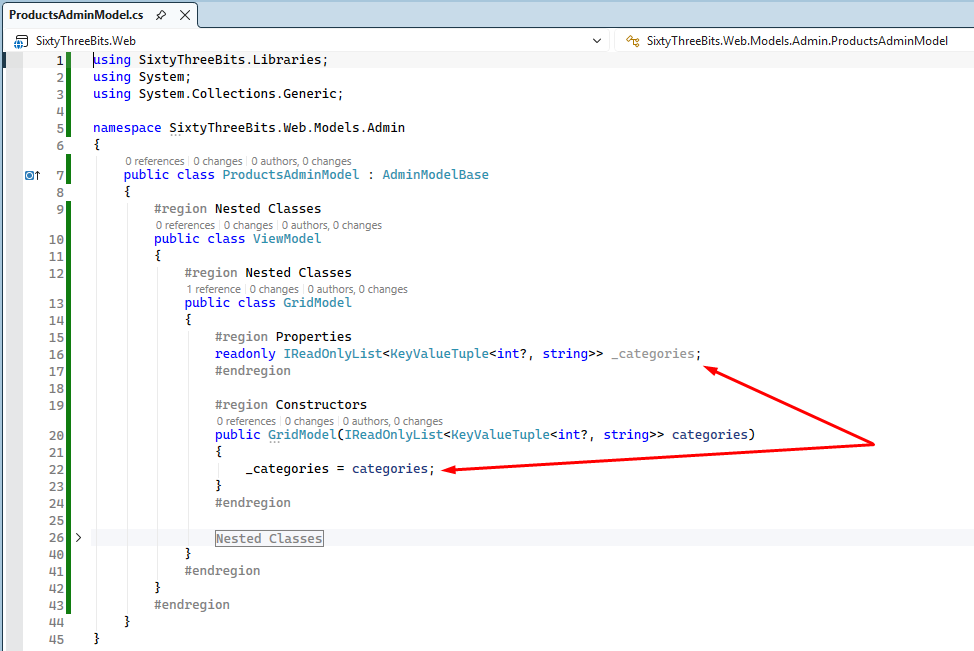

<br>

Next, let's add inheritance to the `GridModel` class: `GridModel : DevExtremeGridModelBase63<GridModel.GridItem>`.

The `DevExtremeGridModelBase63` class, provided by the `SixtyThreeBits.Web.Domain.Libraries` namespace, is located at **SixtyThreeBits.Web → Domain → Libraries → DevExtreme → DevExtremeGridModelBase63.cs**.

This is a base class for all `GridModel`s across the system. It provides common setup for **DevExtreme DataGrids** and a collection of helper functions for post-setup customizations.

`DevExtremeGridModelBase63<T>` is a generic class. The `GridItem` class must be provided as generic `T`.

Inheriting `GridModel` from `DevExtremeGridModelBase63` will require a `Render()` method implementation via `override`.

`Render` is a method used on the **View** for displaying the **DevExtreme DataGrid**.

Implement the `Render` method according to the screenshot below.

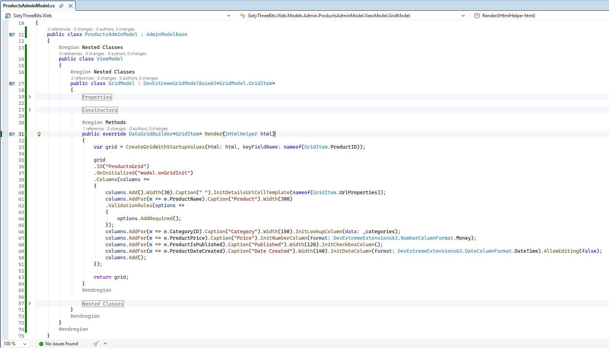

<br>

Let's break down the code:

`Render` has only one parameter, `IHtmlHelper html`. It is provided from the View, where the `Render()` method is called. `IHtmlHelper` is an abstraction from the `Microsoft.AspNetCore.Mvc.Rendering` namespace. This automatically makes `Html` accessible on all **Razor Views** by default.

```csharp
var grid = CreateGridWithStartupValues(html: html, keyFieldName: nameof(GridItem.ProductID))
```

`CreateGridWithStartupValues` creates an instance of the DevExtreme DataGrid and provides the common setup used across all grids in the system. The method is inherited from `DevExtremeGridModelBase`. An `IHtmlHelper html` and the name of the unique key (in our case "ProductID") must be provided as parameters to this method.

Grid setup begins with setting the DevExtreme DataGrid's unique name for the JavaScript:

```csharp
grid.ID("ProductsGrid")
```

Next, the grid's initialize JavaScript event is registered to execute our custom JavaScript code as soon as the DevExtreme DataGrid JavaScript object is created. The JavaScript code will be provided later in this document.

```csharp
.OnInitialized("model.onGridInit")
```

`model.onGridInit()` will be our custom-built JavaScript implementation.

Next, we add a column to create a link to the Product Properties page:

```csharp
columns.Add().InitDetailsUrlCellTemplate(nameof(GridItem.UrlProperties))
```

`.InitDetailsUrlCellTemplate` is our custom-built extension method that configures this column to display a blue icon and link to the product properties page. It uses the `UrlProperties` property of the `GridItem` class for building the proper URL.

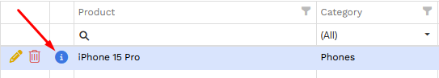

<br>

Next, we add the **Product Name** column. It is mapped to the `ProductName` property of the `GridItem` class:

```csharp
columns.AddFor(m => m.ProductName)
```

This is a regular text-based column.

```csharp
.ValidationRules(options =>
{
    options.AddRequired();
});
```

This method is provided by DevExtreme. It activates quick inline validation, which automatically makes the `ProductName` field required (when adding or updating), without us writing any additional line of code.

Next, we add the **Category** drop-down column. It is mapped to the `CategoryID` property of the `GridItem` class, and uses our recently added `_categories` property to display the list of available categories.

```csharp
columns.AddFor(m => m.CategoryID).InitLookupColumn(data: _categories)
```

`.InitLookupColumn(...)` is our custom-built extension method that does all necessary setup on the DevExtreme DataGrid to display a drop-down column, filled with the collection of `_categories`.

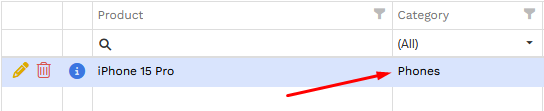

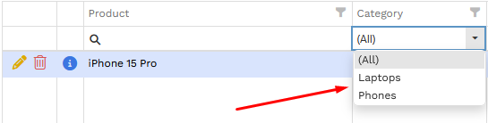

<br>

Next, we add the **Product Price** column. This is a numeric column, meaning it will only allow numeric values to be entered.

```csharp
columns.AddFor(m => m.ProductPrice).InitNumberColumn(format: DevExtremeExtensions63.NumberColumnFormat.Money);
```

`.InitNumberColumn(format: DevExtremeExtensions63.NumberColumnFormat.Money)` is our custom-built extension method that does all necessary setup on the DevExtreme DataGrid to display a column that allows only numeric input. It also accepts different formats for proper visualization.

Next, we add the **Publish Status** column. This is a checkbox column, indicating whether the product is published on the website or not.

```csharp
columns.AddFor(m => m.ProductIsPublished).InitCheckboxColumn();
```

`.InitCheckboxColumn()` is our custom-built extension method that does all necessary setup on the DevExtreme DataGrid to display a checkbox.

Next, we add the **Product Date Created** column. This is a date column, indicating when the database record was created.

```csharp
columns.AddFor(m => m.ProductDateCreated).InitDateColumn(format: DevExtremeExtensions63.DateColumnFormat.DateTime).AllowEditing(false)
```

`.InitDateColumn()` is our custom-built extension method that does all necessary setup on the DevExtreme DataGrid to display a calendar.

`.AllowEditing(false)` is provided by DevExtreme. It configures the grid to restrict editing of this column. The Product Date Created value is automatically generated and cannot be modified by users.

Finally, an empty column is used only for visual appearance, to fill up empty horizontal space:

```csharp
columns.Add()
```

<br>

### ViewModel

Now let's move to building a ViewModel.

Add `IsAddNewButtonVisible` and `Grid` properties to the `ViewModel`.

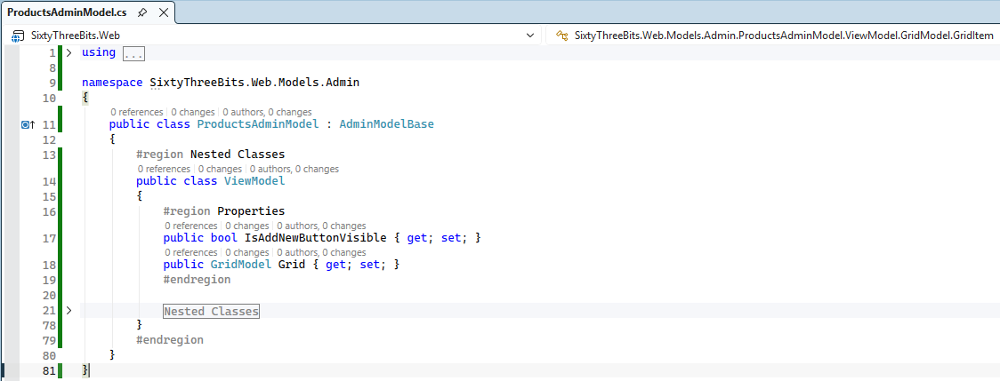

<br>

### Methods

Now we begin our model method implementation.

For models that support DevExtreme DataGrid List/Add/Update/Delete operations, five methods need to be implemented:

1. `GetViewModel` — To return the regular `ViewModel` and display the page via Razor View.
2. `Grid` — To provide a list of products to the DevExtreme DataGrid via AJAX call.
3. `GridAdd` — To add a new product from the DevExtreme DataGrid via AJAX call.
4. `GridUpdate` — To update a product from the DevExtreme DataGrid via AJAX call.
5. `GridDelete` — To delete a product from the DevExtreme DataGrid via AJAX call.

<br>

#### AjaxResponse Rule

All methods that work with an AJAX call MUST return an instance of `AjaxResponse` as the viewModel. The result of this class is sent to the JavaScript, where JS methods process it further.

The `AjaxResponse` class is provided from the `SixtyThreeBits.Libraries` namespace.

It has only two properties:

1. `bool IsSuccess` — Indicating whether the server-side operation succeeded or not.
2. `dynamic Data` — For collecting and passing any type of data from server-side to client-side.

<br>

#### Grid()

This method uses the repository to retrieve the list of products from the database, builds the proper `AjaxResponse` viewModel object, and handles errors if they occur.

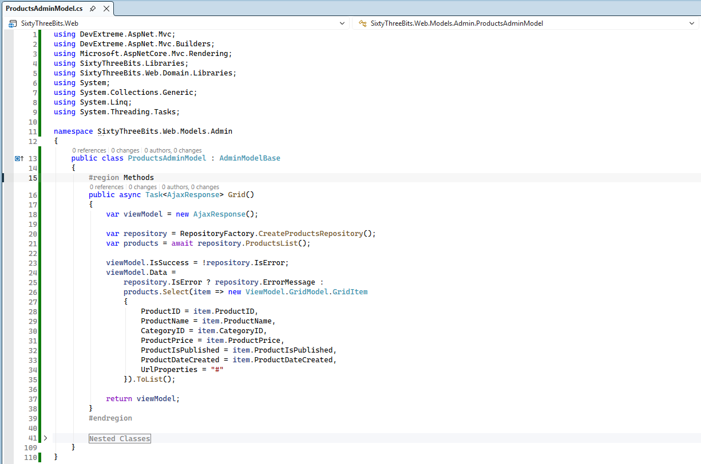

<br>

#### GridAdd()

This method uses the repository to add a new product to the database, builds the proper `AjaxResponse` viewModel object, and handles errors if they occur.


<br>

Let's break down the code:

`GridAdd` has only one parameter, `DevExtremeSubmitModelKeyValues63 submitModel`.

`DevExtremeSubmitModelKeyValues63` is our custom-designed record, specifically built for capturing values sent from client-side to server-side by the DevExtreme DataGrid.

This record has only two properties:

1. `string Key`
2. `string Values`

The DevExtreme DataGrid sends the **Key** parameter as the unique identifier (in our case, `ProductID`) and **Values** as a JSON object with properties exactly matching our previously created `GridItem` properties.

With this information in hand, we deserialize `submitModel.Values` into the `GridItem` object:

```csharp
var submitModelValues = submitModel.Values.DeserializeJsonTo<ViewModel.GridModel.GridItem>();
```

Having all values submitted by the DevExtreme DataGrid, we call `repository.ProductsIUD`, passing:

- `databaseAction: Enums.DatabaseActions.INSERT` — Where we indicate that we want to create a new product.
- `productID: null` — Because there is no `ProductID` yet.
- `product: new ProductIudDTO{ ... }` — Providing values for the insert operation.

Finally, we check whether the database operation succeeded or failed and set the corresponding viewModel values:

```csharp
viewModel.IsSuccess = !repository.IsError;
viewModel.Data = repository.ErrorMessage;
```

<br>

#### GridUpdate()

This method uses the repository to update a product record in the database, builds the proper `AjaxResponse` viewModel object, and handles errors if they occur.


`GridUpdate` code is very similar to `GridAdd`. It has only three minor differences:

1. We identify and capture `productID` via `submitModel.Key`, sent by the DevExtreme DataGrid.
2. `databaseAction` is `UPDATE`.
3. The `productID` parameter is not `null` here.

<br>

#### GridDelete()

This method uses the repository to delete a product record from the database, builds the proper `AjaxResponse` viewModel object, and handles errors if they occur.

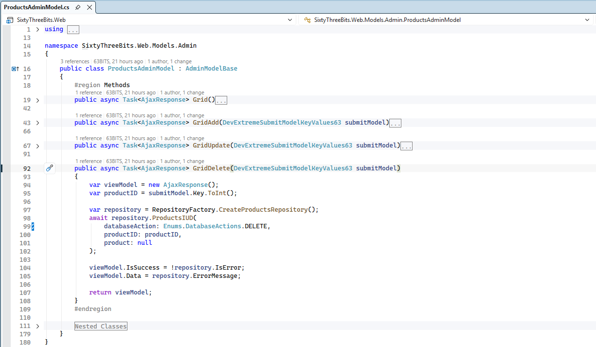

`GridDelete` code is a simplified version of `GridUpdate`:

1. We only need to capture `productID` via `submitModel.Key`, sent by the DevExtreme DataGrid.
2. `databaseAction` is `DELETE`.
3. `product` is `null`, because no additional properties are needed for the delete operation.

<br>

#### GetViewModel()

This method cannot be fully implemented at this stage, as it requires the controller class and its action methods to exist first. We'll finalize it once the controller is ready. For now, we create a blueprint and leave it incomplete.

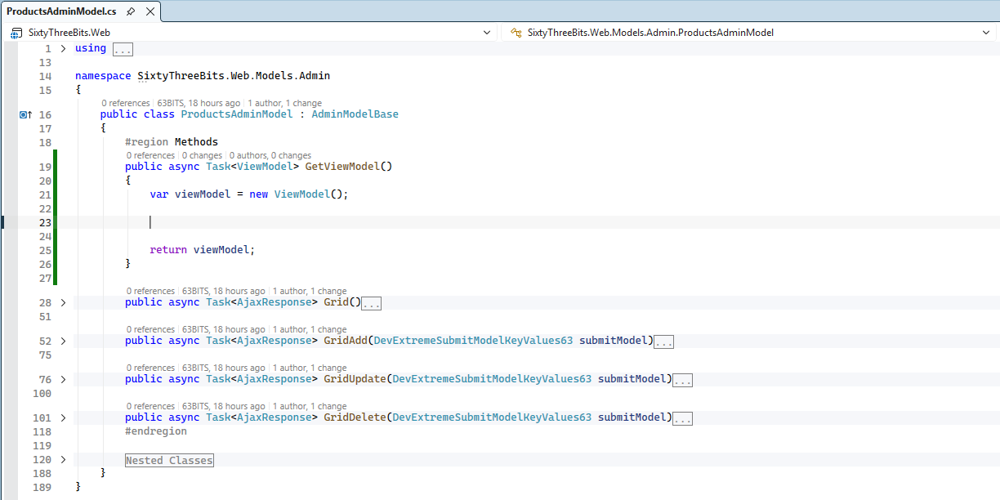

<br>

## Controller / Actions

Navigate to **SixtyThreeBits.Web → Controllers → Admin** and create a directory named **Products**. Create a file named **ProductsAdminController.cs** inside that directory.

<br>

### Admin Controller Inheritance Rule

All admin-level controllers must inherit from the `AdminControllerBase` class.

<br>

### Admin Controller Namespace Rule

All admin-level controllers must use the namespace `SixtyThreeBits.Web.Controllers.Admin`.

<br>

### Admin Routing Rule

All admin-level routes must follow the `"admin/module-name"` pattern.

Create the `ProductsAdminController` class, inherit it from the `AdminControllerBase` base class, and set the `ProductsAdminModel` generic type on it.

Once the class is created, declare the `_viewName` property and action methods according to the screenshot below.

![ProductsAdminController.cs showing the [Route("admin/products")] class attribute, const string _viewName, and the Products, Grid, GridAdd, GridUpdate, and GridDelete action methods each decorated with their own [Route] attribute](../images/06_63BITS_Administration_Side_Part_01_Todo_Products_Grid/image18.png)

<br>

### PluginsClient

```csharp
Model.PluginsClient.EnableDevextreme(true);
```

`PluginsClient` is a model property inherited from `ModelBase` through the inheritance chain. It manages the addition of client-side JavaScript and CSS files stored in the **wwwroot → plugins** directory. All client-side plugins in this directory are pre-registered in `PluginsClient` and can be selectively added to pages as needed.

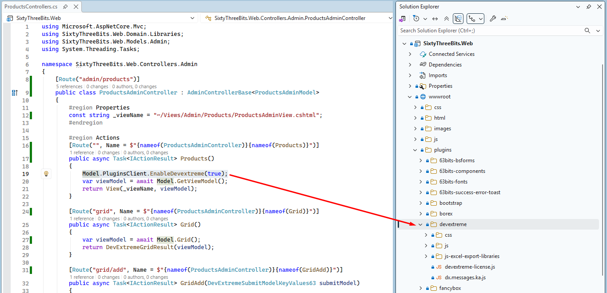

<br>

### DevExtremeSubmitModelKeyValues63

As explained above, the `GridAdd`, `GridUpdate`, and `GridDelete` action methods have this parameter to capture values sent by the DevExtreme DataGrid from client-side to server-side.

The screenshot below demonstrates how the data is sent.

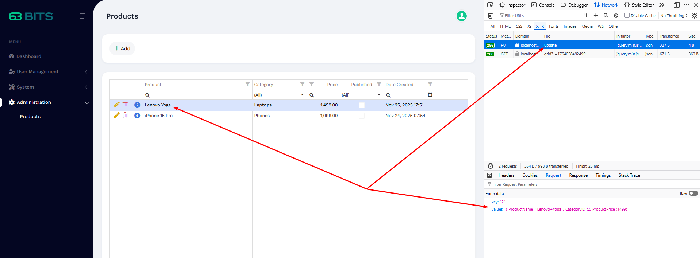

<br>

### DevExtremeGridResult and DevExtremeGridActionResult

```csharp
return DevExtremeGridResult(viewModel);
```

and

```csharp
return DevExtremeGridActionResult(viewModel);
```

DevExtreme DataGrids require JSON data in a specific format from the server. Our model methods return an `AjaxResponse` object, which follows our application standards. These two methods convert the `AjaxResponse` object into the JSON format that DevExtreme DataGrids expect and can process.

- `return DevExtremeGridResult(viewModel)` — Only when performing read operations that fetch items from the database.
- `return DevExtremeGridActionResult(viewModel)` — Only when performing Add, Update, or Delete.

<br>

## Back to Model

Now that all necessary components are in place, we can complete the `GetViewModel()` method. Implement it according to the screenshot below.

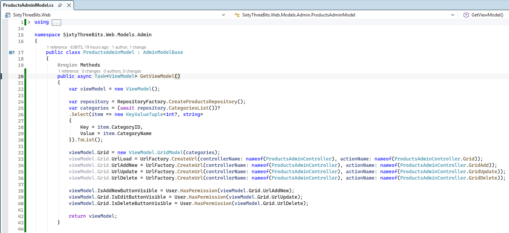

<br>

Let's break down the code:

First, we call the repository method to retrieve the list of categories, then pass this collection to the `GridModel` instance so the grid can populate the category drop-down column.

Next, we assign four URLs to the grid:

- **UrlLoad** — The AJAX endpoint the DevExtreme DataGrid uses to retrieve the product list from the database.
- **UrlAddNew** — The AJAX endpoint the DevExtreme DataGrid uses to add a new product.
- **UrlUpdate** — The AJAX endpoint the DevExtreme DataGrid uses to update a product.
- **UrlDelete** — The AJAX endpoint the DevExtreme DataGrid uses to delete a product.

Finally, we define action button visibility based on user permissions. Administration side actions work based on what permissions the logged-in user has.

The `User` property, inherited through `AdminModelBase → ModelBase`, represents the logged-in user.

`User.HasPermission` accepts a URL string as a parameter and checks whether the user has permission to access that endpoint.

For example, `User.HasPermission(viewModel.Grid.UrlAddNew)` checks whether the user is allowed to add new products by verifying access to `"admin/products/grid/add"`.

Based on these permission checks, the visibility of the Add, Update, and Delete buttons is determined.

<br>

## View

Navigate to **SixtyThreeBits.Web → Views → Admin** and create a directory named **Products**. Create a file named **ProductsAdminView.cshtml** inside that directory.

Implement this view according to the screenshot below.

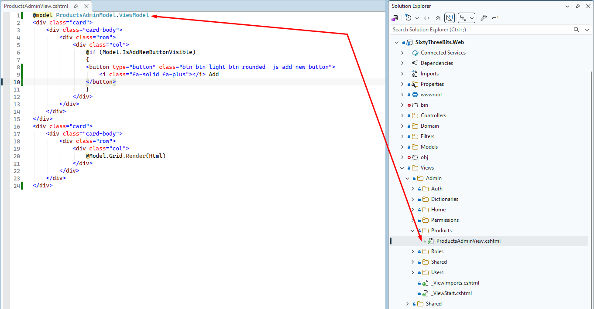

<br>

## Javascript

This JavaScript file, which we are going to create, is specifically designed and tightly coupled to this page, implementing only the page-specific logic required for it to function. No generic or reusable code should be included in this file.

**The Goal**
When users click the "Add" button, the JavaScript opens the DevExtreme DataGrid in add mode, allowing them to insert a new product record.

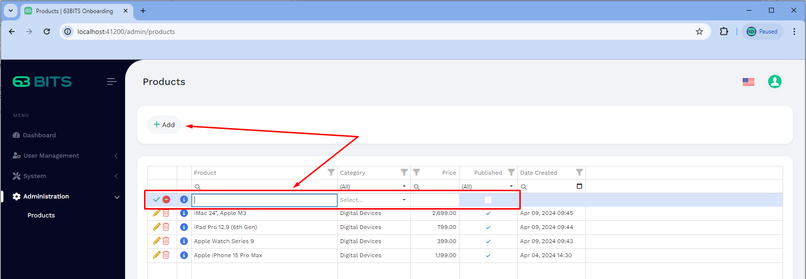

<br>

Navigate to **SixtyThreeBits.Web → wwwroot → js → admin** and create a directory named **products**. Create a file named **ProductsAdminView.js** inside that directory. The JavaScript file name and path must exactly replicate the Razor View file name and path.

Implement the JavaScript according to the screenshot below.

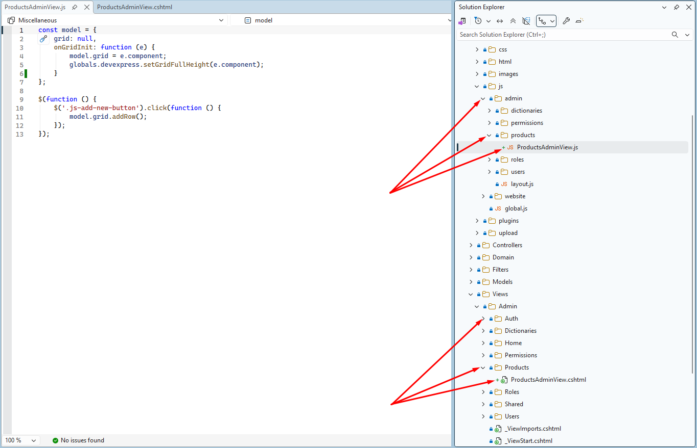

<br>

Let's break down the code:

`const model` — Every page-specific JavaScript file must begin by defining a **model** object. This object serves as a centralized location that contains all **properties** and **functions** required by the page.

By organizing code this way, we avoid polluting the global scope and keep page-specific logic isolated and organized.

`grid` property — Initialized as `null`, then assigned the actual grid instance during the grid initialization event.

`onGridInit(e)` method — Grid initialization event handler, triggered when the DevExtreme DataGrid finishes initialization.

`model.grid = e.component` — Extracts the DataGrid object from the initialization event and stores it in the `model.grid` property for later use.

`globals.devexpress.setGridFullHeight(e.component)` — Adjusts the grid height to fill the available page area.

The `globals` object is defined in **SixtyThreeBits.Web → wwwroot → js → global.js** and is included across all pages via `_Layout.cshtml`.

**Important:** We registered this callback via `OnInitialized("model.onGridInit")` when we built the `GridModel` `Render()` method. Take a moment to pause and review that section to refresh your understanding of how this callback was configured.

`$(function () { ... })` — **jQuery** is the foundation of our JavaScript stack throughout the application. This code registers a callback function to execute once the DOM is fully loaded and ready for interaction. Reference: <https://learn.jquery.com/using-jquery-core/document-ready/>

`$('.js-add-new-button').click({...})` — jQuery command that binds the click event handler to the Add button element.

`model.grid.addRow()` — Calls the DevExtreme DataGrid's `addRow` method using the grid instance stored in `model.grid`, which begins the process of inserting a new row into the grid.

**DevExtreme API Access:** Any DevExtreme DataGrid API method can be invoked through `model.grid` because it holds a reference to the actual DataGrid object instance. Reference: <https://js.devexpress.com/jQuery/Documentation/ApiReference/UI_Components/dxDataGrid/Methods/#addRow>

<br>

### Include Javascript on Page

This is how we include the JavaScript file on a page. It is important to note that the JavaScript file must be included at the end of the HTML code, just before the closing `</body>` tag. This ensures that the DOM is fully loaded before the script executes.

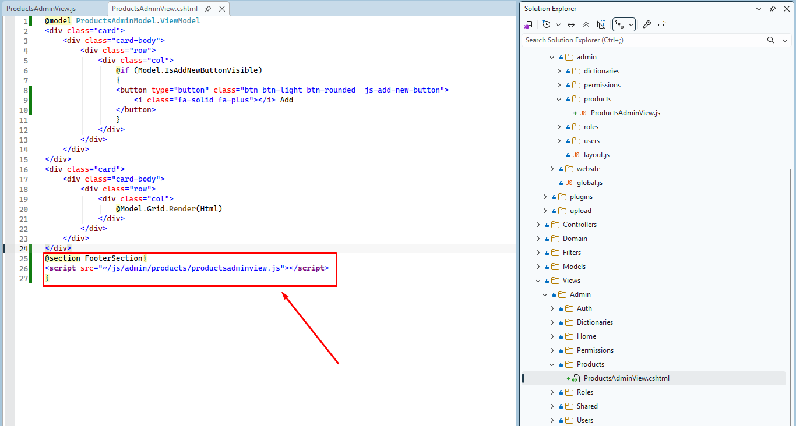

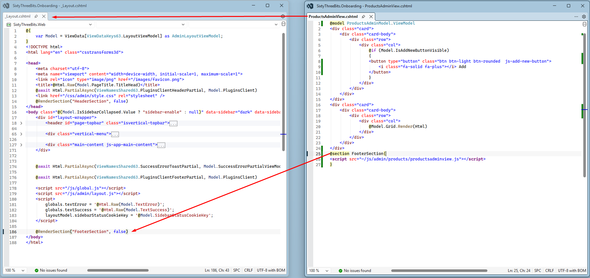

<br>

For more information about `@section`, please refer to the link below:
<https://learn.microsoft.com/en-us/aspnet/core/mvc/views/layout?view=aspnetcore-8.0#sections>

<br>

## Launch

### Permissions

On the Administration side, page visibility, menu items, grids, and buttons are all permission-based. Users must have the appropriate permissions assigned to access pages or interact with their components.

Before accessing the Products List page, complete the following steps:

1. Register the page in the permissions registry.
2. Grant the newly created permission to the appropriate user account.

Launch the application by pressing **CTRL + F5**. Once the application is running, navigate to the Administration login page by entering **/admin/login** in the browser address bar, and use the following credentials to log in:

Username: **administrator**
Password: **asdf**


<br>

Once logged in, the dashboard page will be loaded.

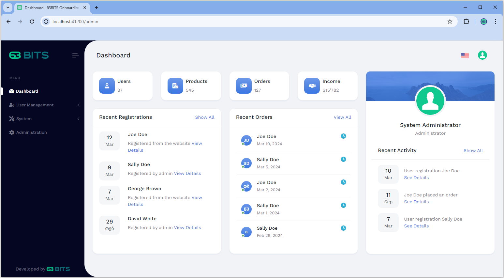

<br>

Expand **User Management** from the left menu and click the **Permissions** item.

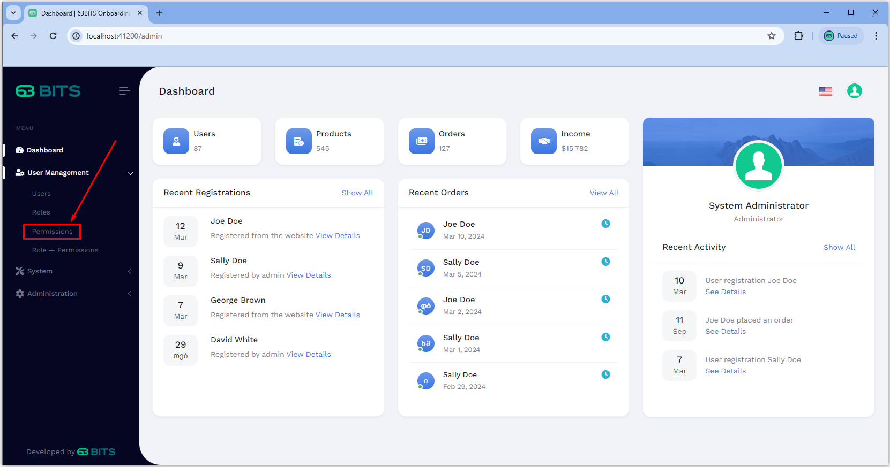

<br>

Once the permissions page is loaded, click the "Plus" button on the "Administration" row.

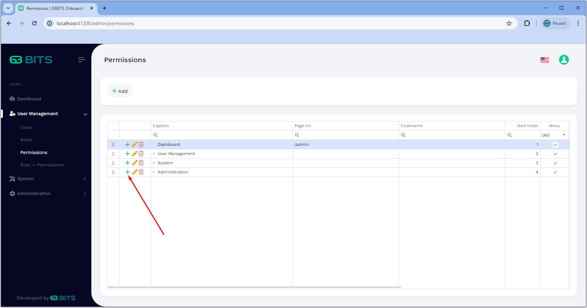

<br>

Inputs for adding a new row will be revealed. Type the following for each input field:

- **Caption**: **Products** — this will be the page title and menu item text (like "Permissions", which we just clicked).
- **Page Url**: **/admin/products** — the URL without domain must be provided here, so we can instruct the permissions engine what the URL is for the products listing page.
- **Sort Index**: Use the next sort index according to what sort indexes are provided before.
- **Menu Item**: **Checked** — check this box to instruct the system that the Products page must be part of the left menu.


<br>

Next, register permissions for the DevExtreme DataGrid CRUD actions, exactly as shown in the image below. Keep the hierarchy exactly as shown in the image.

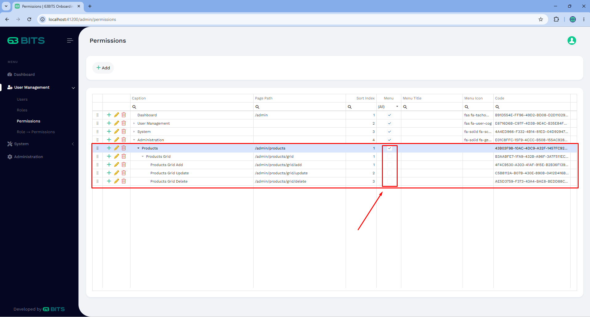

<br>

Navigate to the **Role → Permissions** page to assign the newly registered permissions to the logged-in user.

Scroll the permission tree down, check the boxes for the newly registered permissions, and click Save.

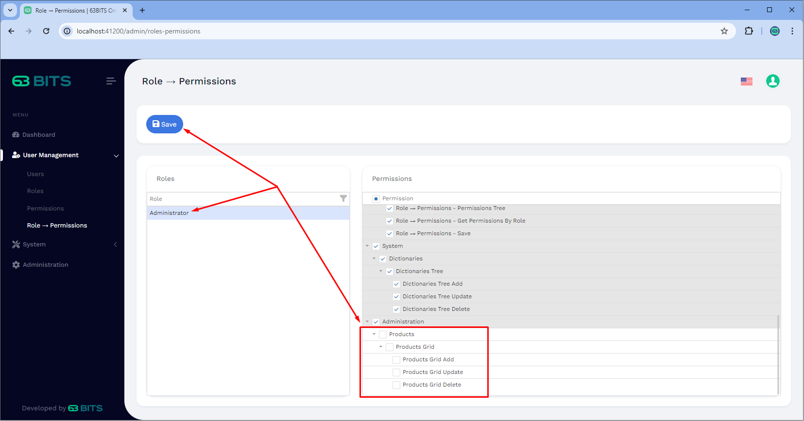

<br>

Once permissions are saved, click the "Relogin" button, and the "Products" page will be revealed from the left menu.

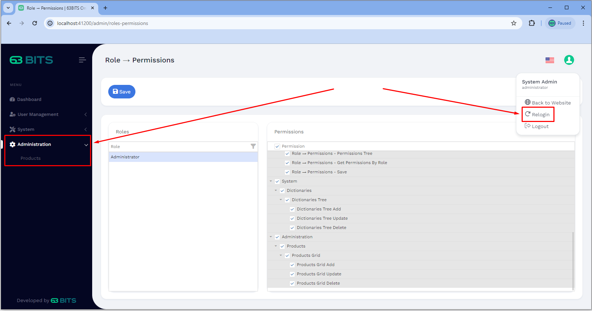

<br>

### Test

Navigate to the products page and test the product CRUD operations.

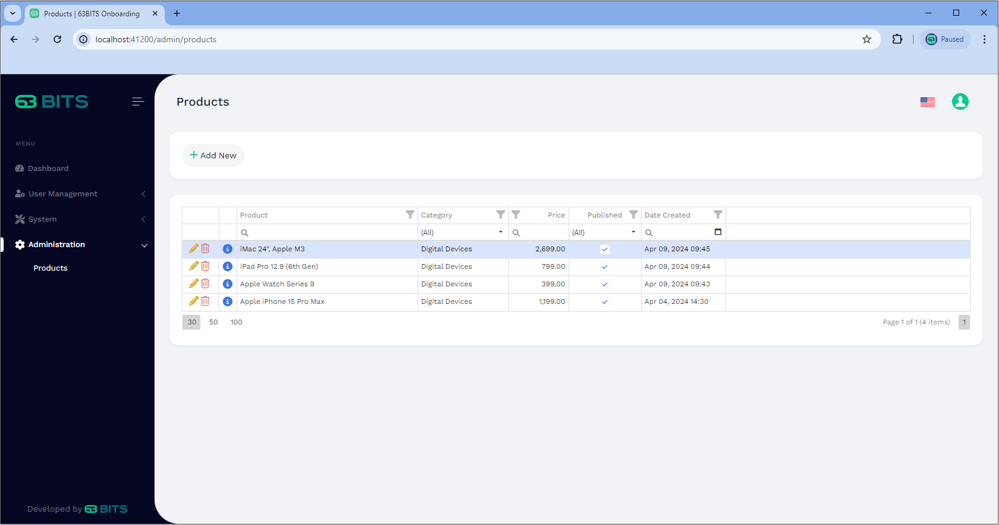
