# 63BITS Administration Side Part 2

The purpose of this document is to define standards and guidelines for building the **Product Properties page**. It specifies the required form structure, component usage, validation rules, and image upload procedures.

<br>

## Permission Setup

Process begins with setting up permissions.

Launch the application and navigate to **User Management → Permissions**. Create the following permission hierarchy according to the instructions below:

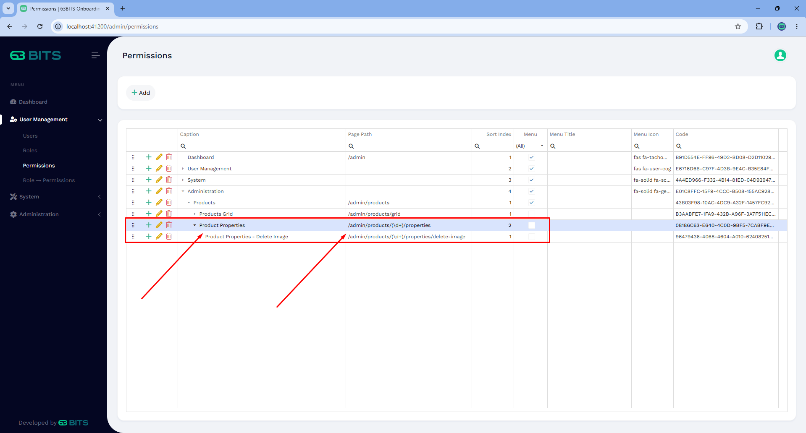

The Page Url field uses a regular expression (`\d+`) to match numeric values. This allows the permission engine to validate access for any `ProductID`. For example, the pattern matches URLs like `/admin/products/4/properties` regardless of the specific product ID.

After registering the permissions, navigate to **User Management → Role Permissions** and assign the newly created permissions to the Administrator role.

<br>

## Building Model / View / Controller Structure

The implementation begins by reviewing the expected layout of the Product Properties page and identifying the UI components required to build it.

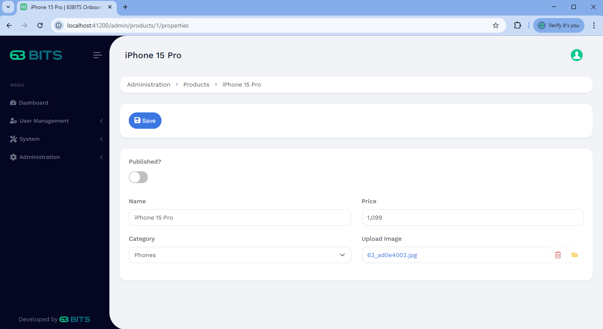

The page should include these elements:

- Save button
- Published checkbox
- Product name text input
- Price input (numbers only)
- Categories dropdown
- Cover image uploader

<br>

## Model

Navigate to **SixtyThreeBits.Web → Models → Admin → Products** and create a file named **ProductPropertiesAdminModel.cs**.

Start building `ProductPropertiesAdminModel` according to the screenshot below.

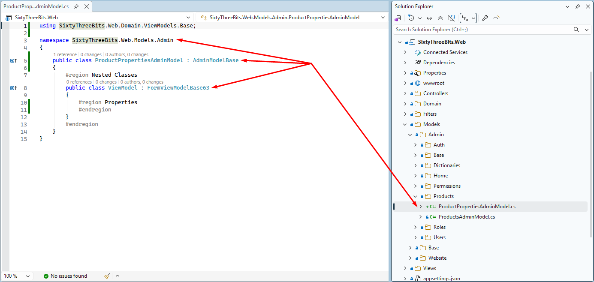

The ViewModel class inherits from `FormViewModelBase63`, which provides shared form validation helper components used across all forms in the application. `FormViewModelBase` is located at **SixtyThreeBits.Web → Domain → ViewModels → Base → FormViewModelBase.cs**.

<br>

### FormViewModelBase63 Inheritance Rule

All ViewModels for form-based pages must inherit from `FormViewModelBase63`.

Now let's add the following properties to our ViewModel class.

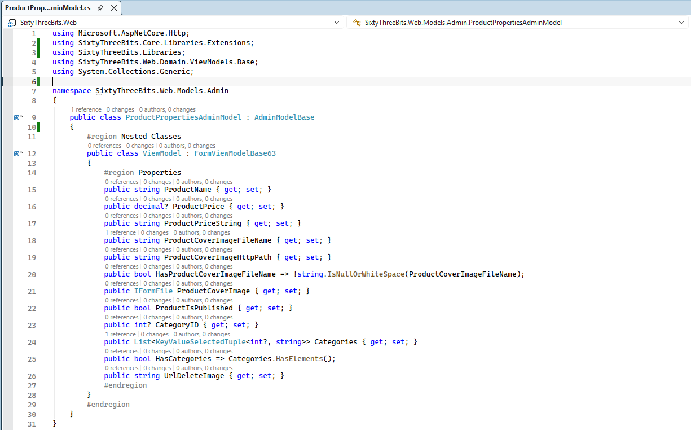

The ViewModel includes two notable properties:

1. `IFormFile ProductCoverImage` — handles uploaded files.
2. `List<KeyValueSelectedTuple<int?, string>> Categories` — stores the list of categories for the dropdown.

Unlike the DevExtreme DataGrid, we use `KeyValueSelectedTuple` instead of `KeyValueTuple`. The key difference is the `bool IsSelected` property, which indicates whether an item should be pre-selected in the dropdown when the page is initially loaded.

<br>

### GetViewModel

Add `public ProductDTO Product` to the `ProductAdminModel`, exactly as we did on the front-end, and implement the `GetViewModel()` method according to the screenshot below.

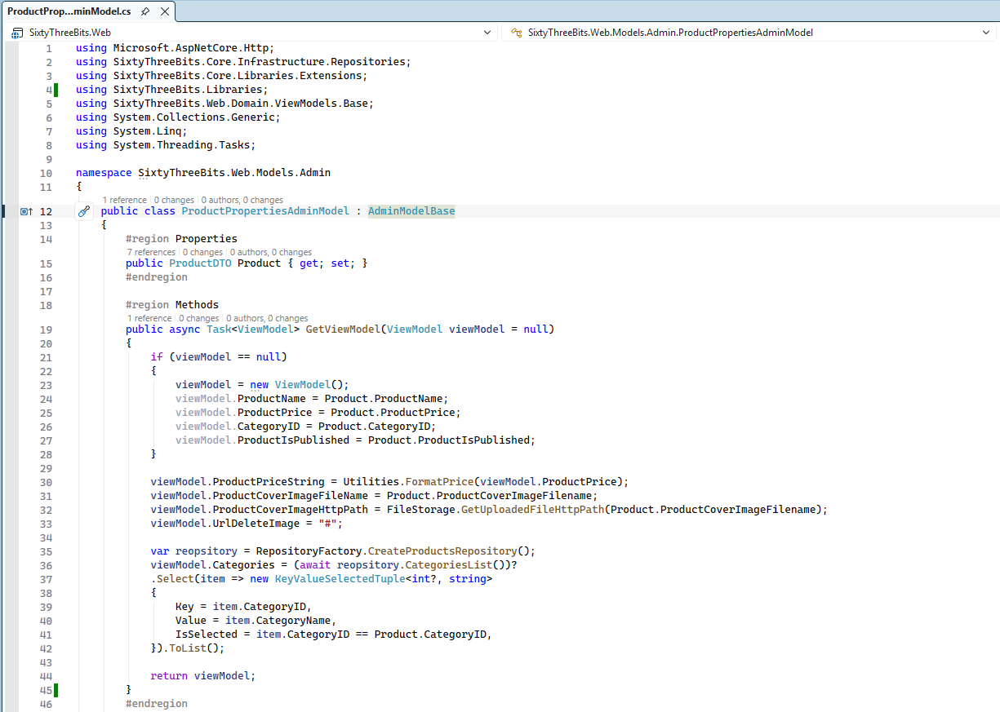

Let's break down the code:

Why does `GetViewModel(ViewModel viewModel = null)` receive a `viewModel` parameter, and why is its default value `null`?

This method signature and behavior is specifically designed for form-based pages where the form is submitted via a regular **HTTP POST** (**no AJAX**). In such scenarios, the ViewModel must support two distinct request flows:

**1. HTTP GET — Initial page load**

When the page is initially requested, the application must load product data from the database and populate the viewModel. Since no user data has been submitted yet, the `viewModel` parameter is `null` and the following block is executed:

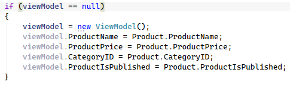

This initializes a new ViewModel instance and assigns values from the database.

**2. HTTP POST — Form submission**

When the user submits the form, the MVC Model Binding process automatically populates the ViewModel parameter with user-entered values. In this case, `viewModel` is not `null`, so the initialization block is **skipped**. This is critical because:

1. We must persist user input when saving to the database.
2. If validation fails, we must re-render the view with user-entered values rather than displaying initial database values. This allows the user to see exactly what needs correction.

**Shared assignment logic**

After the if block, the following code runs in both scenarios (initial page load and form submission):

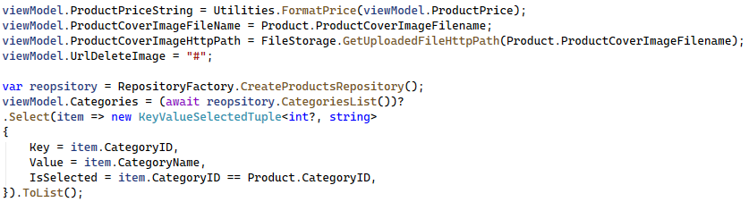

These properties must always come from the database, regardless of request type, because they depend on system context rather than user input.

<br>

### Validation

This section is dedicated to the validation logic that will be executed after the form is submitted.

`validateSubmitModel()` is a private method that will validate the submitted form and return a validation result.

Implement this method according to the instructions below:

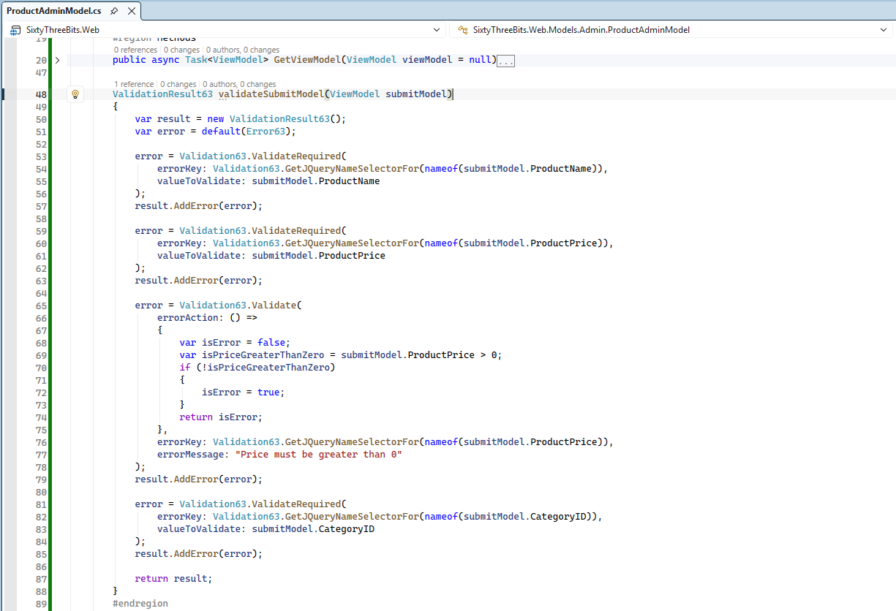

Let's break down the code:

Form validation is handled using validation classes located in **SixtyThreeBits.Core → Libraries → Validation**:

- `ValidationResult63`
- `Error63`
- `Validation63`

`ValidationResult63` is the class responsible for collecting validation errors and exposing properties, such as:

- `Errors` — `IReadOnlyList<Error63>` collection.
- `ErrorsJson` — JSON string.
- `ErrorMessage` — single concatenated string.
- `HasErrors` — boolean indicating whether any validation errors are present.

`Error63` class represents an error via two properties: **Key** and **Value**.

- Key — identifies what type of error or where exactly the error occurred.
- Value — identifies the error message.

`Validation63` class provides the most commonly used validation methods, such as:

- Required field validation
- Email validation
- Password validation
- Custom validation — method accepting a delegate for performing custom validation logic.

Each validation method returns:

- An `Error63` instance when validation fails.
- `null` when validation succeeds.

An instance of the `ValidationResult63` class collects `Error63` objects using the `AddError()` method. This method is designed to gracefully ignore `null` values, ensuring that only actual validation errors are added to the collection.

<br>

#### Validation Process Rules

All validation errors must be represented by instances of the `Error63` class.

All validation operations must be executed through the `Validation63` class, either by using its predefined validation methods or by providing a delegate to its custom validation method.

All validation results must be gathered and returned via an instance of `ValidationResult63`.

This unified approach ensures consistency, maintains the cooperative workflow between the three classes, and provides complete independence from the client-side implementation or error rendering mechanisms.

Summary:

- `Validation63` performs validation and returns an `Error63` when validation fails and `null` when it succeeds.
- `ValidationResult63` collects and manages errors, exposing them in multiple formats.
- `Error63` represents a single validation error instance.

Look back at the code and pay attention to `Validation63.GetJQueryNameSelectorFor`. This method call is designed to populate `errorKey`.

Since our client-side implementation is based on jQuery, the `Validation63` class includes helper methods:

- `GetJQueryClassSelectorFor(string key)`
- `GetJQueryIDSelectorFor(string key)`
- `GetJQueryNameSelectorFor(string key)`

for generating the appropriate error keys, that will be used on the client-side, by jQuery, to display and highlight error locations in red. These utilities significantly simplify the client-side rendering process.

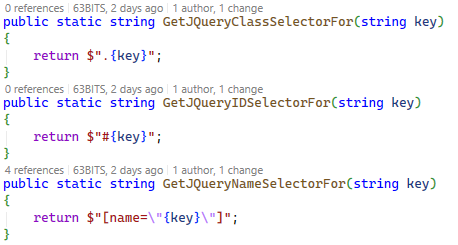

For additional understanding of how jQuery selectors work, refer to the documentation below:

<https://api.jquery.com/attribute-equals-selector/>

<br>

### Save

The next step for the model is to implement the `Save()` method, which will store data submitted from the form in the database.

Implement this method according to the instructions below:

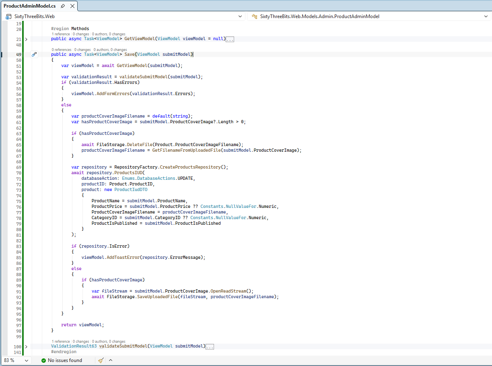

Let's break down the code:

`var viewModel = await GetViewModel(submitModel)`

This is the point where we utilize the `GetViewModel(ViewModel viewModel = null)` method signature designed specifically for form-based pages. In this scenario, the form submits data and `viewModel` is already created and populated through the MVC Model Binding process. The method is called with `submitModel`, ensuring that user-entered values are preserved rather than overwritten by database data.

`var validationResult = validateSubmitModel(submitModel)`

Next, we call our previously designed `validateSubmitModel` method to perform validation on the submitted form data. When errors are detected, we add them to the viewModel to deliver them on the view for rendering.
`viewModel.AddFormErrors()` — method is inherited from `FormViewModelBase63`.

The next section of the code is responsible for detecting whether an image was uploaded. When an uploaded image is present, the process begins by removing the existing image and then assigning the filename of the newly uploaded image. After the old image is removed, the data is saved to the database, and once the save operation is completed successfully, the new image is saved to the file system.

`FileStorage` model property, inherited from `ModelBase`, manages uploaded files across the platform.

Maintaining the following sequence is critical for ensuring data integrity between the database and the file system:

1. Delete the old image.
2. Save the form data to the database.
3. Save the newly uploaded image to disk.

This ordered approach guarantees consistency and prevents mismatches between file storage and database state.

`viewModel.AddToastError(repository.ErrorMessage)`

If an error is returned by the repository, it is treated as a non-validation error. In this case, the error message is added to the `viewModel` as a toast notification.

`AddToastError` — method is inherited from `FormViewModelBase63`.

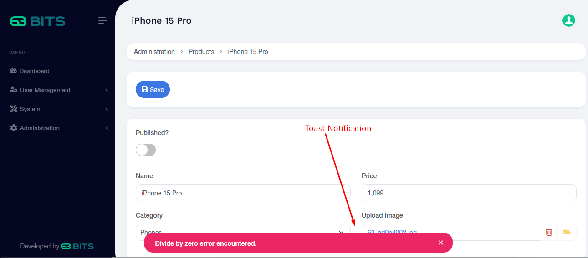

<br>

### DeleteImage

`DeleteImage()` is the final method for our model. This method is specifically dedicated to removing the product cover image only.

Implement this method according to the instructions below:

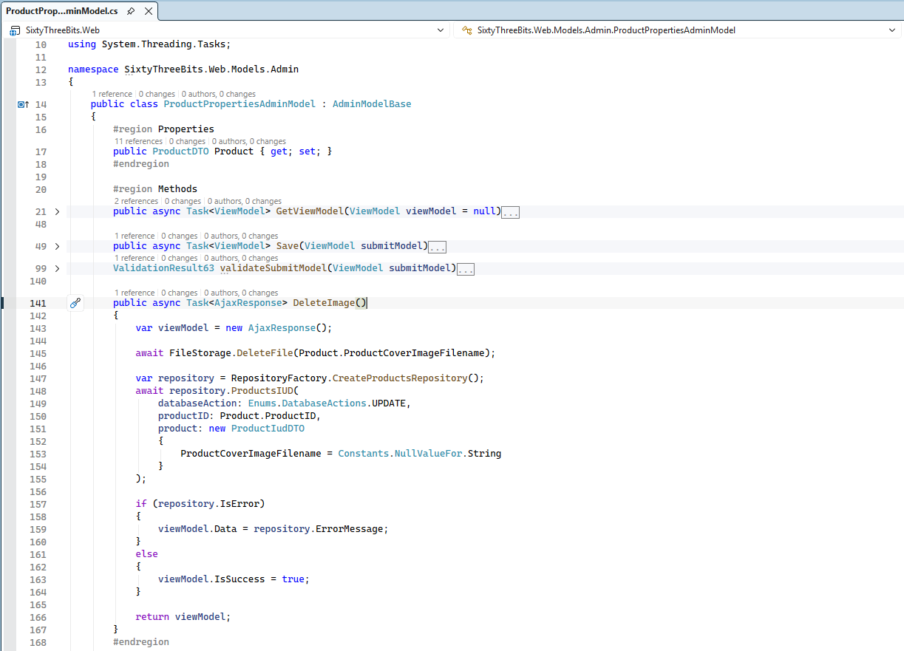

The system will use it to remove the product cover image via an AJAX call.

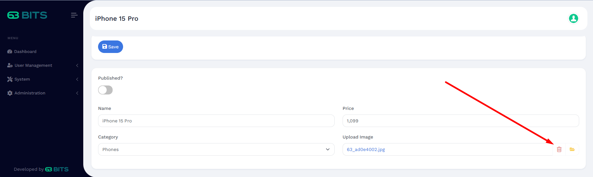

<br>

## Controller

Navigate to **SixtyThreeBits.Web → Controllers → Admin → Products** and create the **ProductPropertiesAdminController.cs** file.

Implement `_viewName` and `OnActionExecutionAsync` similar to `WebsiteController`. Follow the screenshot instructions and note the arrows indicating differences from the website implementation.

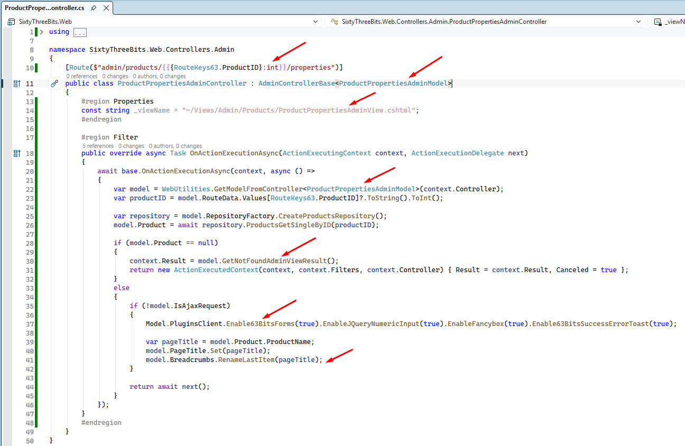

Next, implement the action methods according to the instructions below.

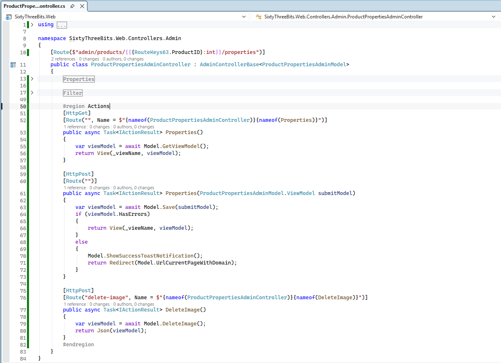

Once all controller actions are created, go back to **ProductPropertiesAdminModel** and set the proper URL for deleting the product image.

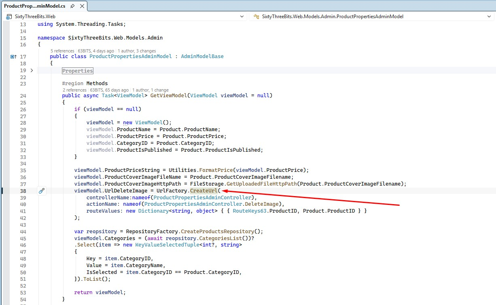

Also go back to **ProductsAdminModel** and set the proper URL for the product properties page.

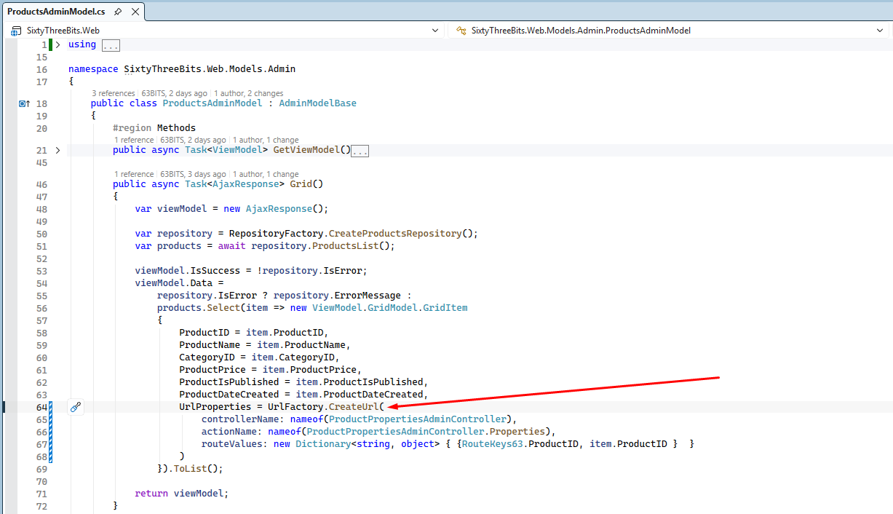

<br>

## View

Navigate to **SixtyThreeBits.Web → Views → Admin → Products** and create the **ProductPropertiesAdminView.cshtml** file.

This view will be more extensive than previous examples, so we will construct it incrementally by adding small, manageable blocks of HTML.

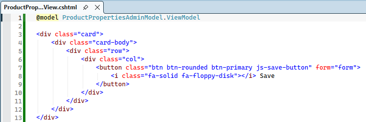

The code above associates the ViewModel with the view and renders a Bootstrap card containing the Save button. The button includes the attribute `form="form"`, which indicates that clicking the button must submit the form with `id="form"`.

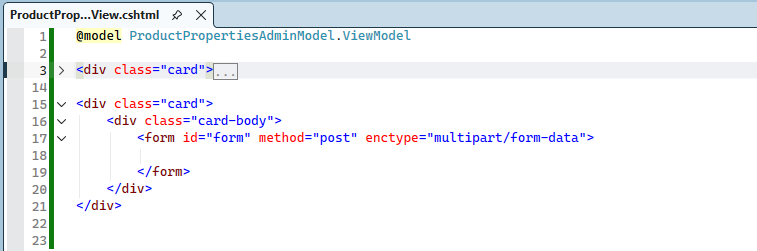

The next section creates another Bootstrap card that contains the form used to edit product properties:

`<form id="form" method="post" enctype="multipart/form-data">`

- `id="form"` — links the form to the Save button, enabling form submission when the button is clicked.
- `method="post"` — specifies that the form data should be submitted using an HTTP POST request.
- `enctype="multipart/form-data"` — required when the form includes file uploads, such as images.

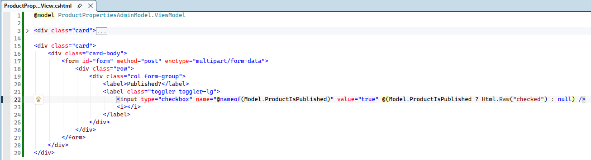

This block creates a row containing a checkbox element that represents whether the product is published. Below is a breakdown of the key attributes used in the checkbox:

- `name="@nameof(Model.ProductIsPublished)"` — the name attribute value must exactly match the `ProductIsPublished` property name in the ViewModel class. This enables the MVC model binding engine to correctly map the submitted value to the ViewModel properties. The `nameof` operator prevents hard-coding, ensuring that if the property name is ever changed, the attribute value updates automatically.
- `value="true"` — this value must always be explicitly provided for correct model binding. All checkbox inputs should follow this requirement.
- `(Model.ProductIsPublished ? Html.Raw("checked") : null)` — this logic determines whether the checkbox should be pre-selected. If the product is published, the `checked` attribute is rendered; otherwise, it is omitted.

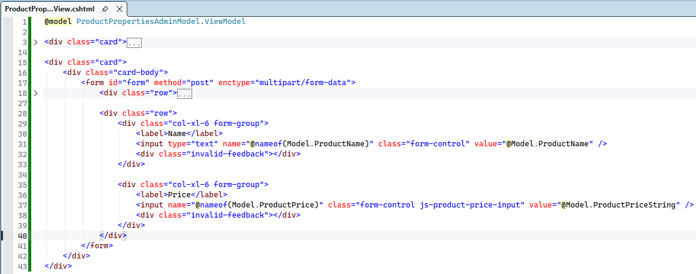

These lines create a row containing the **ProductName** and **ProductPrice** input elements. Similar to the checkbox example, the name attribute enables model binding.

The value attribute displays data from the ViewModel.

Let's break down the attributes for the **ProductPrice** element:

- `name="@nameof(Model.ProductPrice)"` — this attribute maps directly to the `ProductPrice` property in the ViewModel, enabling the MVC model binding process to correctly receive the submitted value.
- `value="@Model.ProductPriceString"` — this attribute is bound to `ProductPriceString` rather than `ProductPrice`. Since `ProductPrice` is a `decimal?` and may contain four decimal places (e.g., `85.9900`), `ProductPriceString` is used to display a user-friendly formatted value such as **85.99**.
- `class="... js-product-price-input"` — this CSS class is solely designed to be used by the JavaScript logic. It allows jQuery to:
  - Locate this input using the `.js-product-price-input` class.
  - Convert the input into a numeric-only field using the **jquery.numericInput** library, which is included via the `.EnableJQueryNumericInput(true)` call in the controller.

The result is the following: we display a formatted value (`ProductPriceString`) to the user, but when the form is submitted, the correctly formatted input is mapped back to the `ProductPrice` property, ensuring proper data persistence.

`<div class="invalid-feedback"></div>` — serves as the container where validation error messages will be displayed when validation fails.

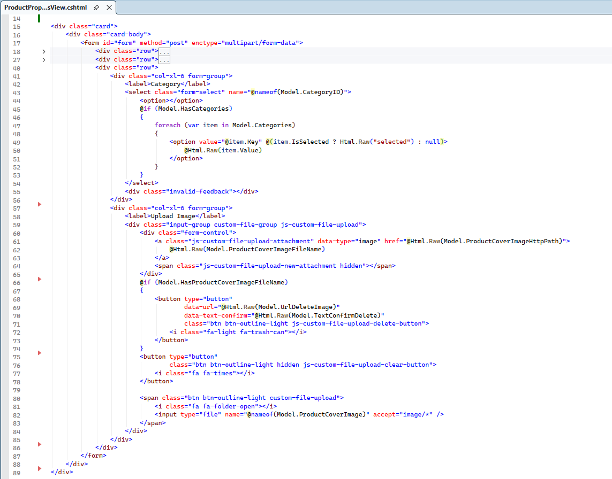

These lines create a row that contains the **Categories** drop-down list and the **Product Cover Image** upload component.

**Categories Drop-Down**

The `<select name="@nameof(Model.CategoryID)">` element generates the category selection list:

`name="@nameof(Model.CategoryID)"` — maps the selected value back to the `CategoryID` property in the ViewModel, enabling proper model binding.

`@if (Model.HasCategories)`

Before rendering the list items, the code checks whether the categories collection contains any elements. If so, it iterates through them and creates options.

**Product Cover Image**

The `<div class="input-group custom-file-group js-custom-file-upload">` represents the standard upload component structure used across the 63BITS system.

The `<a class="js-custom-file-upload-attachment">` tag includes:

- `data-type="image"`
- `href="@Html.Raw(Model.ProductCoverImageHttpPath)"`

These attributes enable full-screen image preview functionality handled by the client-side script.

`@if (Model.HasProductCoverImageFileName)`

`<button ... class="btn btn-outline-light js-custom-file-upload-delete-button">` — the Delete Image Button element is shown only when a product cover image has already been uploaded.

`data-url="@Html.Raw(Model.UrlDeleteImage)"` attribute instructs the JavaScript component which endpoint to call via AJAX to delete the image.

`<input type="file">` — the file uploader component uses the following attributes:

- `name="@nameof(Model.ProductCoverImage)"` — maps the file upload to the `IFormFile ProductCoverImage` property.
- `accept="image/*"` — filters the file selection dialog to display only image files.

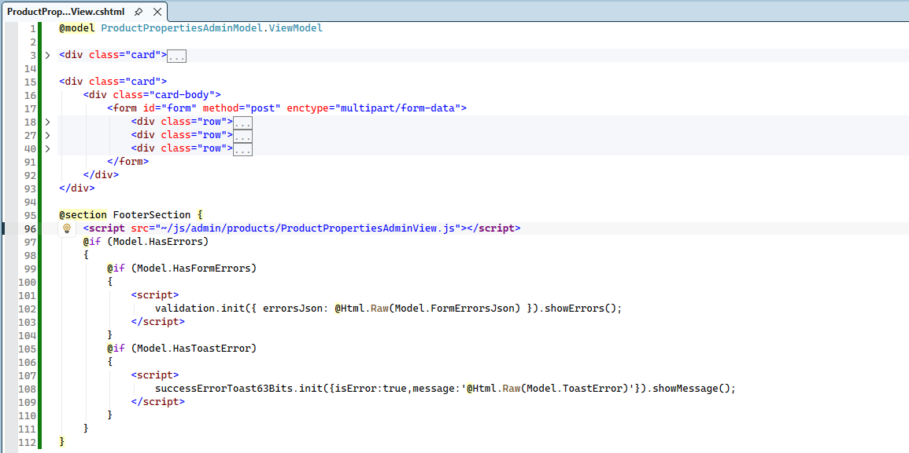

`@section FooterSection` — is the section where page-specific JavaScript code is included. This section loads the JavaScript file associated with the view and checks whether any errors were reported by the Model.

Properties:

- `Model.HasFormErrors`
- `Model.FormErrorsJson`
- `Model.HasToastError`
- `Model.ToastError`

Are available through `FormViewModelBase63` inheritance.

The `validation` JavaScript object becomes available on the page because the **/plugins/63bits-bsforms/63bits-bsforms.js** and **63bits-bsforms.css** files are included on the page via the `.Enable63BitsForms(true)` call.

```
<script>
validation.init({ errorsJson: @Html.Raw(Model.FormErrorsJson) }).showErrors();
</script>
```

The script above is responsible for displaying error messages collected at the model level.

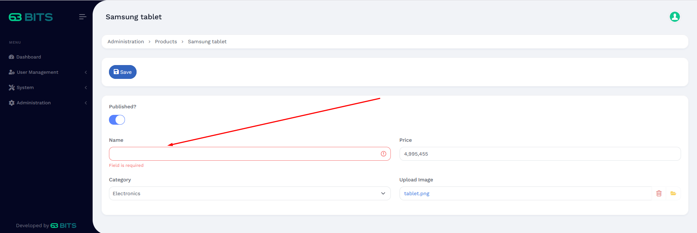

```
<script>
successErrorToast63Bits.init({isError:true,message:'@Html.Raw(Model.ToastError)'}).showMessage();
</script>
```

The script above is responsible for displaying the toast message, a generic error shown when a repository-level error occurs.

<br>

## Javascript

Navigate to **SixtyThreeBits.Web → wwwroot → js → admin → products** and create the **ProductPropertiesAdminView.js** file.

Implement the JavaScript according to the screenshot below.

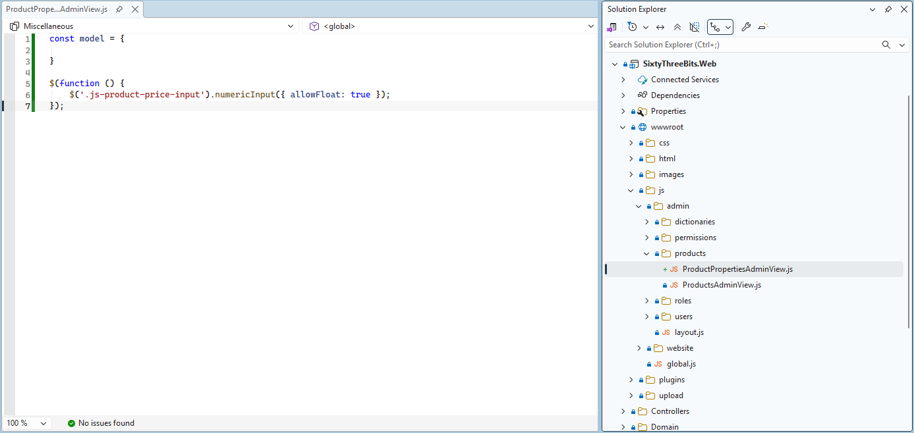

The JavaScript portion here is minimal. We define a `model` object, but no properties or functions are added at this time; they are not needed, but the structure is maintained solely for consistency across the project.

Inside the `$(function () { ... })` block, we register the `numericInput` function for the product price field, ensuring that only numeric characters can be entered. The `numericInput` method is provided by the JavaScript library that was included via the controller using `.EnableJQueryNumericInput(true)`.

This setup guarantees correct input formatting for product price values.

<br>

## Launch

Launch your application, navigate to the products page, and make sure that the link to the product properties page works.

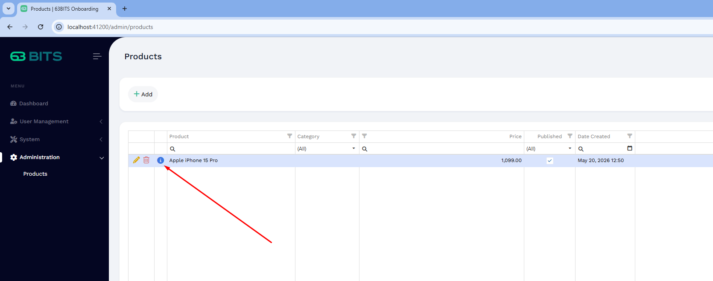

In case you see a 404 page, double check Role — Permissions. Login — Logout and try to click the product properties link again.

Once you are on the properties page:

- Test empty field validation.
- Test the price numeric field, making sure no characters are allowed.
- Test image upload/delete. Check the **wwwroot\upload** directory, and make sure that the file is uploaded and deleted from the hard drive.

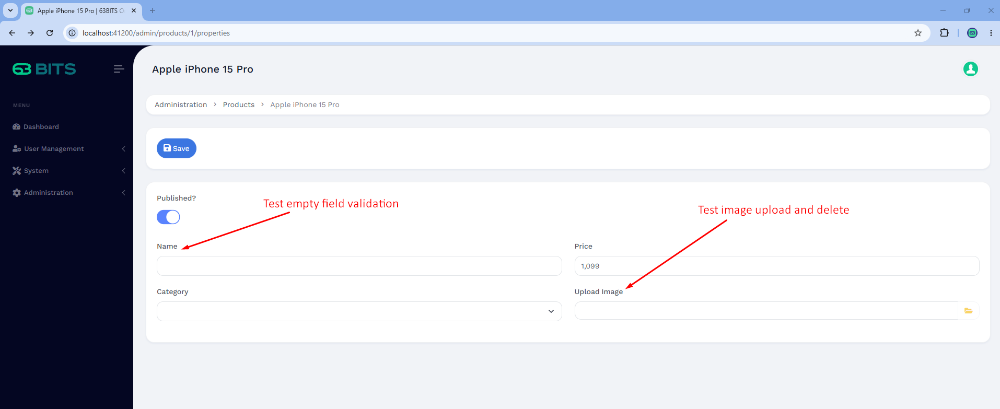
