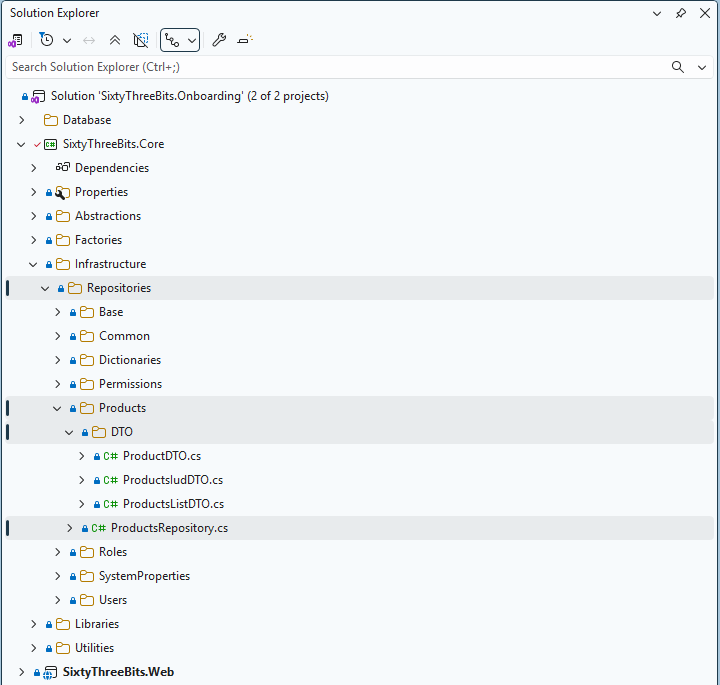

# Repositories

This document establishes a standardized approach for designing and implementing repositories within the 63BITS application ecosystem. It defines folder and file structure, outlines rules for repository creation, and explains how repositories are integrated and wired into the overall architecture.

The goal is to ensure consistency, maintainability, and scalability across the codebase, enabling development teams to follow a unified pattern when accessing and managing data.

Repositories, in 63BITS applications, are designed specifically for calling database functions and stored procedures using ORMs like EF Core, and return results via DTO C# records or simple values.

<br>

## Repository Directory/File Structure Rule

**Directory Location**

All repositories are implemented in `SixtyThreeBits.Core/Infrastructure/Repositories`.

**Base Repository**

The `Base` subdirectory houses `RepositoryBase`, the base class inherited by all repository classes.

**Repository Directory Naming Rule**

Each repository resides in its own subdirectory, named to logically match the repository's purpose — usually (but not always) matching the database table name.

**Repository File and Class Naming Rule**

The repository file name and class name must be the logical entity name — usually (but not always) matching the database table name — followed by "Repository".

Each repository class must reside in its own file: one class per file.

**Repository-Specific DTO File and C# Record Naming Rule**

All DTO classes specific to a repository are located in a `DTO` subdirectory within that repository's directory.

The DTO file name and C# record name must match the SQL stored procedure or function name, followed by `DTO`. The only exception is the C# record for `GetSingle`, which must match the table name in singular form, followed by `DTO`.

**Repository-Specific DTO Requirements**

All DTOs must:

- Be implemented as a public C# record
- Explicitly declare properties using `{ get; init; }` syntax
- Have namespace `SixtyThreeBits.Core.Infrastructure.Repositories`

**Example**

- Database table: `Products`
- Directory: `Products`
- Repository class: `ProductsRepository` (in file `ProductsRepository.cs`)
- DTO subdirectory: `DTO`
- Example DTOs: `ProductDTO`, `ProductsIudDTO`, `ProductsListDTO`

<br>

### Directory Structure

```
Repositories/
  Products/
    ProductsRepository.cs
    DTO/
      ProductDTO.cs
      ProductsIudDTO.cs
      ProductsListDTO.cs
```

<br>

### Path Reference

| Path | Type | Description |
|---|---|---|
| `Repositories/Products/` | Directory | Directory for repository class |
| `Repositories/Products/ProductsRepository.cs` | File | Repository class |
| `Repositories/Products/DTO/` | Directory | DTO subdirectory |
| `Repositories/Products/DTO/ProductDTO.cs` | File | Single-product DTO |
| `Repositories/Products/DTO/ProductsIudDTO.cs` | File | Insert/Update/Delete DTO |
| `Repositories/Products/DTO/ProductsListDTO.cs` | File | List-view DTO |



<br>

## Repository Class

All repository classes must inherit from the `RepositoryBase` class.

<br>

### Constructor

This inheritance requires two parameters to be passed through the constructor: `DbContextFactory dbContextFactory` and `ILogger logger`.

- `DbContextFactory` — A factory class developed by the 63BITS team, located in `SixtyThreeBits.Core → Factories → DbContextFactory.cs`. It is used to create an instance of `DbContext` within repository methods.
- `ILogger` — The standard interface from the `Microsoft.Extensions.Logging` namespace. It is used for logging exceptions thrown by the database.

**Repository class example:**

```csharp
namespace SixtyThreeBits.Core.Infrastructure.Repositories
{
    public class ProductsRepository : RepositoryBase
    {
        #region Constructors

        public ProductsRepository(DbContextFactory dbContextFactory, ILogger logger) :
            base(dbContextFactory, logger)
        {
        }

        #endregion
    }
}
```

<br>

### Method Calling IUD Stored Procedure

The example below demonstrates how to write a method that calls the **ProductsIUD** stored procedure.

First, the `ProductsIudDTO` C# record must be created:

```csharp
public record ProductsIudDTO
{
    #region Properties

    public string ProductName { get; init; }
    public decimal? ProductPrice { get; init; }
    public string ProductCoverImageFilename { get; init; }
    public int? CategoryID { get; init; }
    public bool? ProductIsPublished { get; init; }

    #endregion
}
```

Note that `bool? ProductIsPublished` is defined as a nullable Boolean to support three distinct operational states:

- `true` — Set the product as published
- `false` — Set the product as unpublished
- `null` — Leave the current database value unchanged

This design allows the stored procedure to distinguish between explicitly updating the published status and omitting the update entirely.

Once `ProductsIudDTO` is ready, the method can be implemented:

```csharp
public async Task<int?> ProductsIUD(DatabaseActions databaseAction, int? productID, ProductsIudDTO product)
{
    var productJson = product.ToJson();

    productID = await TryToReturnAsyncTask(
        logString: $"{nameof(ProductsIUD)}({nameof(databaseAction)} = {databaseAction}, {nameof(productID)} = {product}, {nameof(productJson)} = {productJson})",
        asyncFuncToTry: async () =>
        {
            using (var dbContext = _dbContextFactory.CreateDbContext())
            {
                var sqb = new SqlQueryBuilder(
                    dbContext: dbContext,
                    databaseObjectName: nameof(ProductsIUD),
                    sqlParameters:
                    [
                        databaseAction.ToSqlParameter(SqlDbType.TinyInt),
                        productID.ToSqlParameter(SqlDbType.Int),
                        productJson.ToSqlParameter(SqlDbType.NVarChar),
                    ]
                );

                await sqb.ExecuteStoredProcedure();

                productID = sqb.GetNextOutputParameterValue<int?>();

                return productID;
            }
        }
    );

    return productID;
}
```

**Code Breakdown**

The `databaseAction` parameter is an enum located at `SixtyThreeBits.Core → Infrastructure → Repositories → Common → DatabaseActions.cs`. It is designed to match the first parameter, `@databaseAction`, of all SQL IUD stored procedures:

```csharp
public enum DatabaseActions
{
    #region Properties
    INSERT = 0,
    UPDATE = 1,
    DELETE = 2,
    #endregion
}
```

| Code | Description |
|---|---|
| `var productJson = product.ToJson();` | Declares a variable that converts the DTO to JSON. Its name also matches the corresponding stored procedure parameter. |
| `productID = await TryToReturnAsyncTask(...)` | Calls `TryToReturnAsyncTask` to wrap the stored procedure call in a try/catch block and return the newly inserted (or already provided) `productID`. |
| `logString` | The first parameter of `TryToReturnAsyncTask`. Builds a string representing which method was called, what parameters were passed, and their values. If an exception occurs, this string is logged, which aids debugging by identifying the method, parameters, and values involved. |
| `asyncFuncToTry` | The second parameter of `TryToReturnAsyncTask`. An async delegate containing the code that must be wrapped in a try/catch block. |
| `using (var dbContext = _dbContextFactory.CreateDbContext())` | Creates a `dbContext` via the `_dbContextFactory` received through the constructor. |
| `var sqb = new SqlQueryBuilder(...)` | Creates an instance of the `SqlQueryBuilder` class, developed by the 63BITS team and located at `SixtyThreeBits.Core → Libraries → Database → SqlQueryBuilder.cs`. This class builds and executes a proper SQL query. The `dbContext`, `databaseObjectName` (the stored procedure or function name), and `sqlParameters` are passed to its constructor to build the query. |
| `await sqb.ExecuteStoredProcedure();` | Executes the stored procedure call against the database. |
| `productID = sqb.GetNextOutputParameterValue<int?>();` | Retrieves the newly inserted ID from the database. |

<br>

### Method Calling a List (Table-Valued Function)

The example below demonstrates how to write a method that calls the **ProductsList** table-valued function to retrieve a collection of records.

First, the `ProductsListDTO` C# record must be created:

```csharp
public record ProductsListDTO
{
    #region Properties
    public int? ProductID { get; init; }
    public string ProductName { get; init; }
    public decimal? ProductPrice { get; init; }
    public string ProductCoverImageFilename { get; init; }
    public int? CategoryID { get; init; }
    public bool ProductIsPublished { get; init; }
    public DateTime? ProductDateCreated { get; init; }
    #endregion
}
```

**Note:** `bool ProductIsPublished` is not defined as a nullable Boolean here, because a product is either published or not — there is no third state.

Once `ProductsListDTO` is ready, the method can be implemented:

```csharp
public async Task<List<ProductsListDTO>> ProductsList()
{
    var result = await TryToReturnAsyncTask(
        logString: $"{nameof(ProductsList)}()",
        asyncFuncToTry: async () =>
        {
            using (var dbContext = _dbContextFactory.CreateDbContext())
            {
                var sqb = new SqlQueryBuilder(
                    dbContext: dbContext,
                    databaseObjectName: nameof(ProductsList)
                );

                var resultQueryable = sqb.ExecuteTableValuedFunction<ProductsListDTO>();
                resultQueryable = resultQueryable.OrderByDescending(item => item.ProductDateCreated);

                var result = await resultQueryable.ToListAsync();

                return result;
            }
        }
    );

    return result;
}
```

**Code Breakdown**

The `TryToReturnAsyncTask`, `logString`, `asyncFuncToTry`, `dbContext`, and `SqlQueryBuilder` mechanics are identical to those described in [Method Calling IUD Stored Procedure](#method-calling-iud-stored-procedure). Only the differences specific to a list method are described below.

| Code | Description |
|---|---|
| `Task<List<ProductsListDTO>>` return type | A list method returns a `List<ProductsListDTO>` containing every record produced by the table-valued function, rather than a single `int?`. |
| `ProductsList()` — no parameters | This method takes no parameters, so no `DatabaseActions` enum or DTO is passed, and the `SqlQueryBuilder` constructor receives no `sqlParameters` argument. Consequently, `logString` records the method name with empty parentheses: `ProductsList()`. |
| `var resultQueryable = sqb.ExecuteTableValuedFunction<ProductsListDTO>();` | Calls `ExecuteTableValuedFunction` to execute the function and return an `IQueryable<ProductsListDTO>`. The variable is explicitly named `resultQueryable` to make clear that the result is still an `IQueryable` — not yet materialized — so sorting and filtering can be composed before the query reaches the database. **This naming is mandatory.** |
| `resultQueryable = resultQueryable.OrderByDescending(item => item.ProductDateCreated);` | Applies a descending sort by `ProductDateCreated`. As a deferred `IQueryable` operation, it is translated into SQL rather than executed in memory. |
| `var result = await resultQueryable.ToListAsync();` | Materializes the query against the database. The materialized variable is explicitly named `result` to distinguish it from the queryable — `result` holds the executed `List<ProductsListDTO>`. **This naming is mandatory.** |

<br>

### Method Calling a GetSingle (Scalar-Valued Function)

The example below demonstrates how to write a method that calls the **ProductsGetSingleByID** scalar-valued function to retrieve a single record by its ID.

First, the `ProductDTO` C# record must be created. Note that this DTO can contain nested records — here, `ProductImages` is a list of the nested `ProductImage` record — because the scalar-valued function returns a JSON string that can represent a full object graph:

```csharp
public record ProductDTO
{
    #region Properties
    public int? ProductID { get; init; }
    public string ProductName { get; init; }
    public decimal? ProductPrice { get; init; }
    public string ProductCoverImageFilename { get; init; }
    public bool ProductIsPublished { get; init; }
    public DateTime? ProductDateCreated { get; init; }
    public int? CategoryID { get; init; }
    public string CategoryName { get; init; }
    public List<ProductImage> ProductImages { get; init; }
    #endregion

    #region Nested Classes
    public record ProductImage
    {
        #region Properties
        public int? ProductImageID { get; init; }
        public string ProductImageFilename { get; init; }
        #endregion
    }
    #endregion
}
```

**Note:** `bool ProductIsPublished` is not defined as a nullable Boolean here, because a product is either published or not — there is no third state.

Once `ProductDTO` is ready, the method can be implemented:

```csharp
public async Task<ProductDTO> ProductsGetSingleByID(int? productID)
{
    var result = await TryToReturnAsyncTask(
        logString: $"{nameof(ProductsGetSingleByID)}({nameof(productID)} = {productID})",
        asyncFuncToTry: async () =>
        {
            using (var dbContext = _dbContextFactory.CreateDbContext())
            {
                var sqb = new SqlQueryBuilder(
                    dbContext: dbContext,
                    databaseObjectName: nameof(ProductsGetSingleByID),
                    sqlParameters:
                    [
                        productID.ToSqlParameter(SqlDbType.Int)
                    ]
                );

                var resultJson = await sqb.ExecuteScalarValuedFunction<string>();
                var result = resultJson.DeserializeJsonTo<ProductDTO>();

                return result;
            }
        }
    );

    return result;
}
```

**Code Breakdown**

The `TryToReturnAsyncTask`, `logString`, `asyncFuncToTry`, `dbContext`, and `SqlQueryBuilder` mechanics are identical to those described in [Method Calling IUD Stored Procedure](#method-calling-iud-stored-procedure). Only the differences specific to a get-single method are described below.

| Code | Description |
|---|---|
| `Task<ProductDTO>` return type | A get-single method returns a single `ProductDTO` object. |
| `ProductsGetSingleByID(int? productID)` | Takes `productID` as a parameter, which is passed to the `SqlQueryBuilder` as a single `sqlParameter`. |
| `var resultJson = await sqb.ExecuteScalarValuedFunction<string>();` | Calls `ExecuteScalarValuedFunction` to execute the scalar-valued function. The function returns a single scalar value — a JSON string representing the full object graph — which is captured in `resultJson`. The variable is explicitly named `resultJson` to make clear that the result is a JSON string. **This naming is mandatory.** |
| `var result = resultJson.DeserializeJsonTo<ProductDTO>();` | Deserializes the returned JSON string into a `ProductDTO` instance, including any nested records such as `ProductImages`. The deserialized variable is explicitly named `result` to distinguish it from the JSON string. **This naming is mandatory.** |

<br>

## Registering the Repository in the Factory

To wrap everything up, the `ProductsRepository` must be registered in the `RepositoryFactory`. This allows other layers to create repository instances as needed.

`RepositoryFactory` is a class developed by the 63BITS team, located at `SixtyThreeBits.Core → Factories → RepositoryFactory.cs`. It is responsible for creating repository instances.

A new method must be added to this class:

```csharp
public ProductsRepository CreateProductsRepository()
{
    return new ProductsRepository(_dbContextFactory, _logger);
}
```