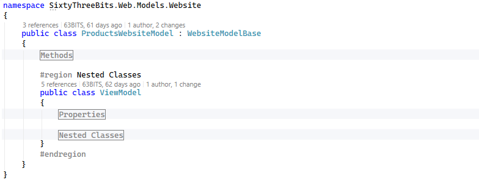
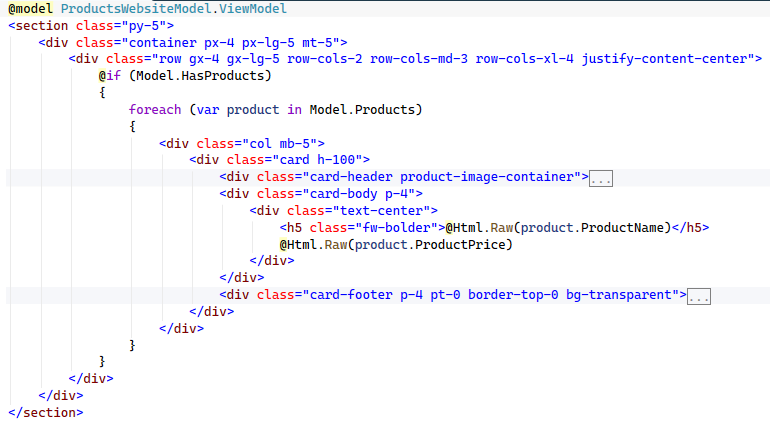

# 63BITS MVC Project Structure

This document establishes a standardized approach for designing and implementing Models, Views, and Controllers within the 63BITS application ecosystem. It defines folder and file structure, outlines rules for MVC creation, and explains how MVC is integrated and wired into the overall architecture.

The goal is to ensure consistency, maintainability, and scalability across the codebase, enabling development teams to follow a unified pattern when accessing and managing data.

The application implements an MVVM-inspired architecture where Models, Controllers, and Views follow a clear separation of concerns. Each component has a distinct role and responsibility.

<br>

## Component Responsibilities

- **Controller** — Acts as the request/response router with a single responsibility: receive HTTP requests, invoke Model methods to generate the ViewModel, and return it to the View or as JSON.

- **Model** — A C# class containing only methods and nested classes. It orchestrates the application logic:

  - Receives form submission via SubmitModel
  - Calls repository methods and external web services
  - Collects and processes data
  - Calls business logic to perform business-level calculations
  - Constructs and returns the populated ViewModel

- **ViewModel** — A C# class containing only properties. It holds all data required for rendering in the View.

- **SubmitModel** — A C# record containing properties submitted from the form. It holds all data required for rendering in the View.

- **View** — Renders dynamic HTML based on data provided by the ViewModel, displaying the final output in the browser.

The schema below is a step-by-step visual representation of the request lifecycle.


<br>

## MVC Directory/File Structure Rule

A standard 63BITS web application is organized into two Areas:

1. **Admin** — administrator-level pages used to manage website content.
2. **Website** — presentation pages served to website visitors.

To reflect this separation, the top-level **Controllers**, **Models**, and **Views** folders each contain **Admin** and **Website** subfolders.

**Base Class Folders**

- **Controllers/Base** and **Models/Base** house the primary base classes for controllers and models. These are inherited by the Admin and Website base classes.
- **Controllers/Admin/Base** and **Models/Admin/Base** house base classes specific to Admin controllers and models.
- **Controllers/Website/Base** and **Models/Website/Base** house base classes specific to Website controllers and models.

**Shared Views Folders**

- **Views/Shared** houses partial views used across both the Admin and Website areas.
- **Views/Admin/Shared** houses the primary layout and partial views specific to the Admin area.
- **Views/Website/Shared** houses the primary layout and partial views specific to the Website area.

**Directory Structure Example**

```
SixtyThreeBits.Web/
  Controllers/
    Base/
      ControllerBase63.cs
    Admin/
      Base/
        AdminControllerBase.cs
    Website/
      Base/
        WebsiteControllerBase.cs
  Models/
    Base/
      ModelBase63.cs
    Admin/
      Base/
        AdminModelBase.cs
    Website/
      Base/
        WebsiteModelBase.cs
  Views/
    Shared/
    Admin/
      Shared/
        LayoutAdmin.cshtml
        SuccessErrorToastPartial.cshtml
    Website/
      Shared/
        LayoutWebsite.cshtml
```

<br>

## Model/View/Controller Directory Naming Rule

Each model, view, and controller — or group of models, views, and controllers representing one Feature — resides in its own subdirectory, named to logically match the Feature's purpose. This name usually, but not always, matches the corresponding database table name.

Example, presenting a list of products and a single product:

```
Models/Website/Products/ProductsWebsiteModel.cs
Models/Website/Products/ProductWebsiteModel.cs
Views/Website/Products/ProductsWebsiteView.cshtml
Views/Website/Products/ProductWebsiteView.cshtml
Controllers/Website/Products/ProductsWebsiteController.cs
Controllers/Website/Products/ProductWebsiteController.cs
```

<br>

## Model Class Naming Rule

Model file name and class name must be a logical name that clearly represents the Feature, followed by **WebsiteModel** or **AdminModel**, based on the area the model serves. Model file name and class name must always match.

For example:

- Model representing a list of products on the website area must be `ProductsWebsiteModel.cs`, class name `ProductsWebsiteModel`.
- Model representing one product on the website area must be `ProductWebsiteModel.cs`, class name `ProductWebsiteModel`.
- Model representing a list of products on the admin area must be `ProductsAdminModel.cs`, class name `ProductsAdminModel`.
- Model representing one product for edit on the admin area must be `ProductPropertiesAdminModel.cs`, class name `ProductPropertiesAdminModel`.

<br>

## Controller Class Naming Rule

Controller file name and class name must be a logical name that clearly represents the Feature, followed by **WebsiteController** or **AdminController**, based on the area the controller serves. Controller file name and class name must always match.

For example:

- Controller representing a list of products on the website area must be `ProductsWebsiteController.cs`, class name `ProductsWebsiteController`.
- Controller representing one product on the website area must be `ProductWebsiteController.cs`, class name `ProductWebsiteController`.
- Controller representing a list of products on the admin area must be `ProductsAdminController.cs`, class name `ProductsAdminController`.
- Controller representing one product for edit on the admin area must be `ProductPropertiesAdminController.cs`, class name `ProductPropertiesAdminController`.

<br>

## View File Naming Rule

View file name must be a logical name that clearly represents the Feature, followed by **WebsiteView** or **AdminView**, based on the area the view serves.

For example:

- View representing a list of products on the website area must be `ProductsWebsiteView.cshtml`.
- View representing one product on the website area must be `ProductWebsiteView.cshtml`.
- View representing a list of products on the admin area must be `ProductsAdminView.cshtml`.
- View representing one product for edit on the admin area must be `ProductPropertiesAdminView.cshtml`.

<br>

## Namespace Rule

- All Admin models must reside under the `SixtyThreeBits.Web.Models.Admin` namespace.
- All Website models must reside under the `SixtyThreeBits.Web.Models.Website` namespace.
- All Admin controllers must reside under the `SixtyThreeBits.Web.Controllers.Admin` namespace.
- All Website controllers must reside under the `SixtyThreeBits.Web.Controllers.Website` namespace.

This applies regardless of how deeply the files are nested in the directory structure.

<br>

## Model Nested Class Rule (ViewModel / SubmitModel)

**ViewModel**

A model that builds data for its view must have a nested class named `ViewModel`. This naming is mandatory across all models, in all areas.

**Golden Rule:** `ViewModel` must contain only those properties that are actually used on the view. Properties not used on the view are not allowed.



<br>

**SubmitModel**

A model that captures form data submitted from its view must have an additional nested class named `SubmitModel`. `SubmitModel` must contain only those properties that are submitted from the form.

**Exception**

For extremely simple pages — for example, a page consisting of just a single form and nothing else — `ViewModel` may serve as `SubmitModel`, and no separate nested `SubmitModel` class needs to be declared.


<br>

## Model Class Inheritance Rule

- All Website model classes must inherit from `WebsiteModelBase`.
- All Admin model classes must inherit from `AdminModelBase`.
- Both `WebsiteModelBase` and `AdminModelBase` are inherited from `ModelBase63`.

Inheritance from `ModelBase63` gives every model access to properties that allow it to call repositories and libraries, and to manage the request, response, session, and other cross-cutting concerns.

| Property | Description |
|---|---|
| `ControllerName` | Name of the current controller. |
| `ActionName` | Name of the current action. |
| `UrlCurrentPageWithDomain` | Full URL of the current page, including domain. |
| `UrlCurrentPageWithoutDomain` | URL of the current page, excluding domain. |
| `UrlPreviousPage` | URL of the previous page. |
| `WebsiteHttpPath` | Website domain formatted as an HTTP path. |
| `IP` | IP address of the current request. |
| `IsHttps` | Indicates whether the current request is HTTPS. |
| `Protocol` | Current request protocol (https or http), derived from `IsHttps`. |
| `IsAjaxRequest` | Indicates whether the current request is an AJAX request. |
| `AppSettings` | Collection of application settings. |
| `RepositoryFactory` | Factory used to access repositories. |
| `Utilities` | Collection of utility helpers. |
| `Controller` | Reference to the underlying MVC controller. |
| `Request` | Current HTTP request. |
| `Response` | Current HTTP response. |
| `RouteData` | Route data for the current request. |
| `UrlFactory` | Library that helps create URLs. |
| `SessionAssistance` | Library that helps manage session data. |
| `CookieAssistance` | Library that helps manage cookies. |
| `ViewData` | View data dictionary. |
| `FileStorage` | File storage service. |
| `PluginsClient` | Library that allows including third-party JS/CSS plugins on the page, such as jQuery and Bootstrap. |
| `User` | Currently logged-in user. |
| `IsUserLoggedIn` | Indicates whether a user is currently logged in, derived from `User`. |
| `SystemProperties` | System-level properties (`SystemProperties` database table data). |
| `ToastNotificationManager` | Manager for toast notifications. |

<br>

## Controller Class Inheritance Rule

- All Website controller classes must inherit from `WebsiteControllerBase`.
- All Admin controller classes must inherit from `AdminControllerBase`.
- Both `WebsiteControllerBase` and `AdminControllerBase` are inherited from `ControllerBase63`.

<br>

## Controller-Model Generic Type Declaration

`ControllerBase63` inheritance forces all controllers to be generic classes. This generic requires the type of the model that serves the controller, so it becomes mandatory to define the model type when the controller class is created.

Example:

```csharp
public class ProductsWebsiteController : WebsiteControllerBase<ProductsWebsiteModel> {}

public class ProductsAdminController : AdminControllerBase<ProductsAdminModel> {}
```

<br>

## Controller View Name Declaration Rule

Each controller must declare the view it renders as a `const string _viewName` property. This string must represent the full path to the view.

Example:

```csharp
public class ProductsWebsiteController : WebsiteControllerBase<ProductsWebsiteModel>
{
    #region Properties
    const string _viewName = "~/Views/Website/Products/ProductsWebsiteView.cshtml";
    #endregion
}
```

<br>

## Controller Responsibility Rule

A controller must only call the model to receive a `ViewModel`, then return the view or perform a redirect. No additional library calls or calculations are allowed at the controller level.

All calculations, and all repository, API, library, or business logic calls, must happen within the model's method while building the `ViewModel`.


<br>

## Controller Actions #region Rule

All controller actions must be organized within a `#region Actions` code region.

<br>

## Controller Action Route Name Rule

The action route name is dynamically constructed by concatenating the controller class name and action method name using the `nameof` operator.

Example:

```csharp
[Route("products", Name = $"{nameof(ProductsWebsiteController)}{nameof(Products)}")]
```

**Dynamic Routes**

For dynamic routes — for example `/products/123/`, where `123` represents `productID` — the route Name follows the same rule. The route itself, which must be `products/{productID:int}`, uses a route key constant instead of a hardcoded string, to avoid hardcoding the parameter name: `$"products/{{{RouteKeys63.ProductID}:int}}"`.

**RouteKeys63**

`RouteKeys63` is a static class, designed by the 63BITS team, located at `SixtyThreeBits.Web → Domain → Utilities → RouteKeys63.cs`. It contains only const string route keys.

```csharp
public static class RouteKeys63
{
    #region Properties
    public const string ProductID = "productID";
    #endregion
}
```

All new route keys must be added to this class as const string values.

**Final Route Example**

```csharp
[Route($"products/{{{RouteKeys63.ProductID}:int}}", Name = $"{nameof(ProductWebsiteController)}{nameof(Product)}")]
```

<br>

## View Restriction Rule

**C# Operations Restriction**

No C# operations, additional variable declarations, or calculations are allowed on the view. Only three C# operations are allowed on the view: `if`, `else`, and `foreach`. Everything else is strongly restricted.

**Pure HTML Restriction**

Views must consist of pure HTML. MVC Helpers must not be used to build standard HTML on the view.

**Data Formatting Restriction**

Formatting data on the view is strongly prohibited. All formatting must happen in model methods; the view must receive already-formatted data and simply display it.



<br>

## One Model, One Controller, One View Rule

A controller must always serve exactly one view and must be served by exactly one model. Together, one model, one controller, and one view always represent exactly one page.

No sharing of models, views, or controllers across multiple pages is allowed.
