# Products Listing Page Implementation Exercise

This exercise demonstrates the full implementation of an MVC page based on a Products example. It implements two pages:

1. **Products Listing Page** — Displays a list of all products stored in the database.
2. **Product Detail Page** — Shows detailed information for a specific product.

<br>

## Create the Model

Navigate to **SixtyThreeBits.Web → Models → Website** and create a new directory named **Products**. This directory organizes all product-related models in one location.

Inside the **Products** directory, create a new file named **ProductsWebsiteModel.cs**.

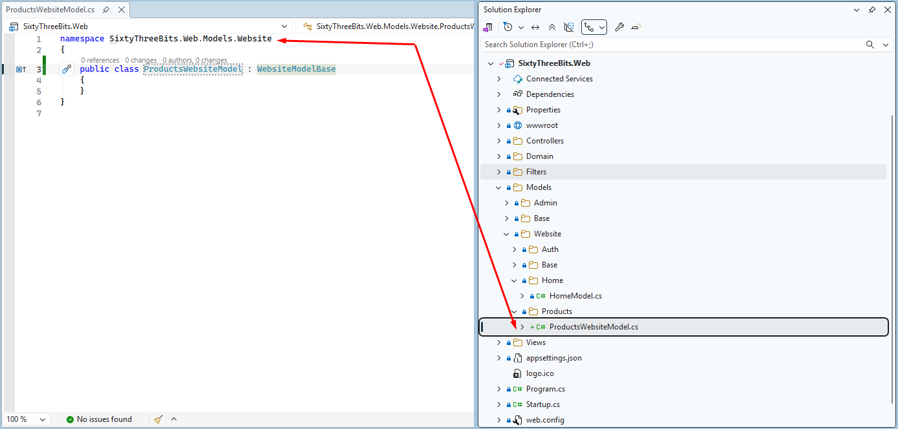

<br>

Note that the class name **ProductsWebsiteModel** uses the plural form, indicating that this model is responsible for handling and presenting multiple products.

<br>

## Design the ViewModel

To determine which properties are required in the `ViewModel`, we must first visualize the structure. In this example, we are creating a page that displays a **list of products**. The page should include a title and products as individual cards or boxes; each product card must have information such as *name*, *image*, *price*, and a *link* to the product details page.

From this concept, we can identify three primary page components:

1. **Page Title** component
2. **Product List** component
3. **Product List Item** component, containing the following fields:
   - Product Name
   - Product Cover Image
   - Product Price
   - URL to the product detail page

To support this structure visually, look at the sample page below:

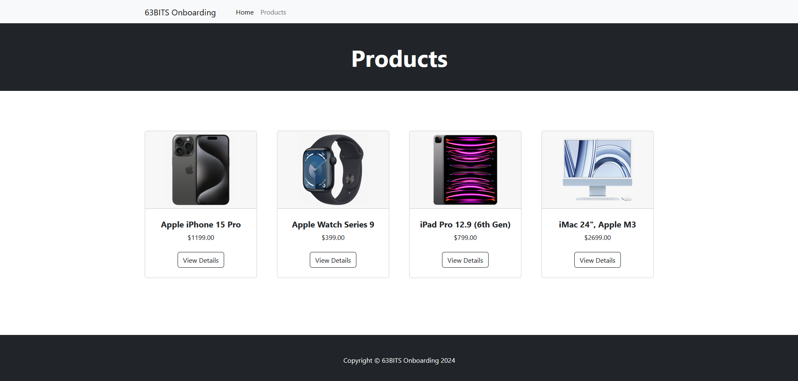

<br>

Implement the code according to the screenshot below.

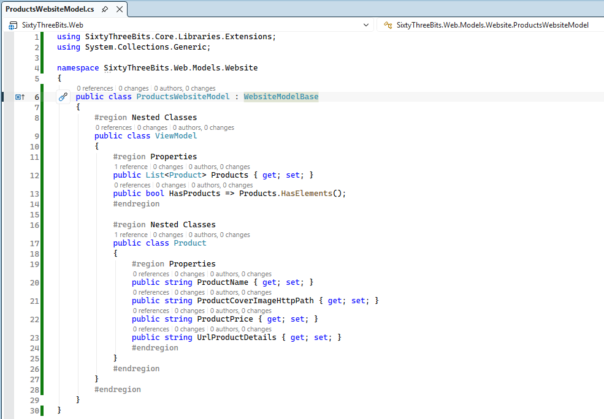

<br>

Examine the structure of the `ProductsWebsiteModel` class. It contains a nested `ViewModel` class, which itself contains a nested `Product` class. This two-level nesting structure represents the page data (`ViewModel`) and individual items within the product list (`Product`).

Create **second level** nested classes only when necessary to represent distinct data structures.

The `ViewModel` class defines two properties:

1. `Products` — A collection used to render each product on the page.
2. `HasProducts` — A boolean indicating whether the product list contains items, enabling a safe null check before performing a `foreach` iteration and preventing null reference exceptions.

The nested `Product` class contains four properties:

1. `ProductName` — The displayed name of the product.
2. `ProductCoverImageHttpPath` — The HTTP image path used to render the product image.
3. `ProductPrice` — The displayed product price.
4. `UrlProductDetails` — The navigation link directing users to the product detail page.

**Important Note:** The nested `Product` class does not include a `ProductID` property because the ID is not required for page display purposes.

<br>

## Implement the GetViewModel Method

Complete the `ProductsWebsiteModel` class by implementing the `GetViewModel()` method. This method retrieves data from repository methods and constructs a fully populated `ViewModel` instance.

Implement the code according to the screenshot below.


<br>

**Inherited Base Properties**

The following properties are inherited through the inheritance chain: `WebsiteModelBase` → `ModelBase`.

- **RepositoryFactory** — Provides access to the factory for creating repository instances.
- **Utilities** — Offers helper functions such as price formatting (for example, converting numeric values to display format like $99.95).
- **FileStorage** — Manages file uploads and generates HTTP-accessible paths for uploaded files, which can be used in HTML `` tags.
- **PageTitle** — Sets the browser tab title for the page.

**Null-Conditional Operator**

Pay close attention to the null-conditional operator (`?`) used in repository method calls:

```csharp
(await repository.ProductsList())?
```

The question mark prevents null reference exceptions by safely handling null values during execution.

<br>

## Create the Controller

Navigate to **SixtyThreeBits.Web → Controllers → Website** and create a new directory named **Products**. This directory organizes all product-related controllers in one location.

Inside the **Products** directory, create a new file named **ProductsWebsiteController.cs**.

Implement the code according to the screenshot below.

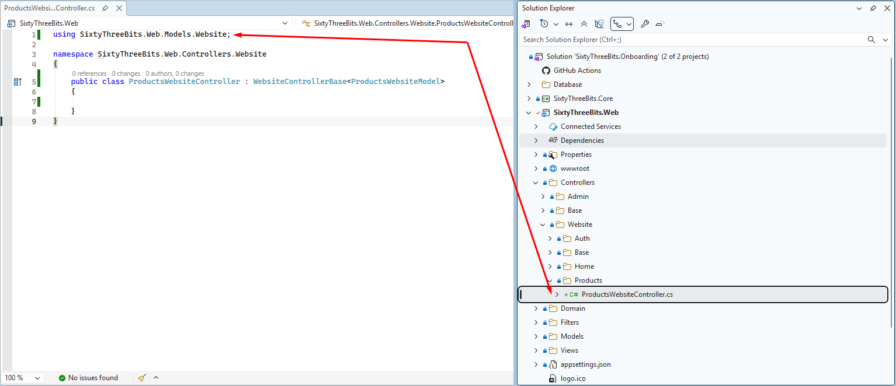

<br>

Note that the class name **ProductsWebsiteController** uses the plural form, indicating that this controller is responsible for handling and presenting multiple products.

<br>

## Implement Controller Actions

Declare a `const string` property `_viewName` in the controller class. This property represents the full path to the view that the controller uses.

Each controller is associated with exactly one view, and each view is associated with exactly one controller.

Implement the code according to the screenshot below.

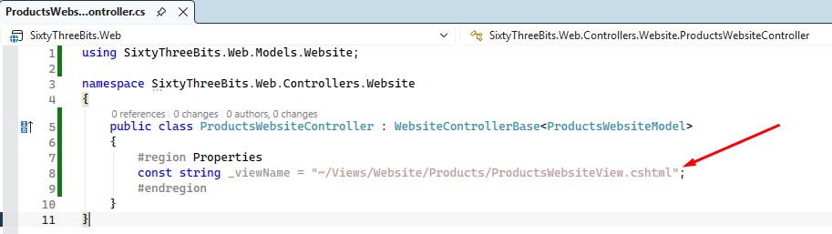

<br>

Before implementing actions, review the following resource to understand *Attribute Routing*, which is essential for proper controller implementation:

<https://devblogs.microsoft.com/dotnet/attribute-routing-in-asp-net-mvc-5/>

Implement the code according to the screenshot below.

![ProductsWebsiteController.cs with an Actions region containing the Products action, decorated with [Route("products", Name = $"{nameof(ProductsWebsiteController)}{nameof(Products)}")], which awaits Model.GetViewModel() and returns View(_viewName, viewModel)](../images/08_63BITS_MVC_Application_Structure_01_Todo/image7.png)

<br>

## Build the View

Navigate to **SixtyThreeBits.Web → Views → Website** and create a new directory named **Products**. This directory organizes all product-related views in one location. Inside the **Products** directory, create a new file named **ProductsWebsiteView.cshtml**.

Implement the code, connecting the model to the view according to the screenshot below.

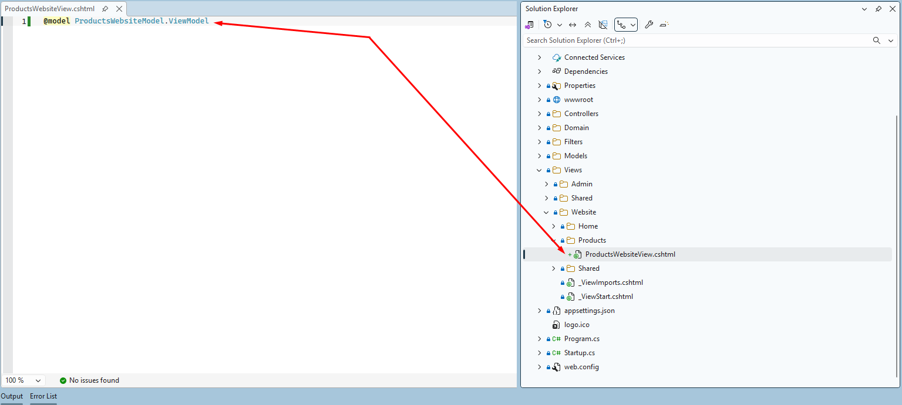

<br>

Navigate to **SixtyThreeBits.Web → wwwroot → html → products.html**.

`products.html` is a static HTML file which we will use to build the dynamic `.cshtml` view.

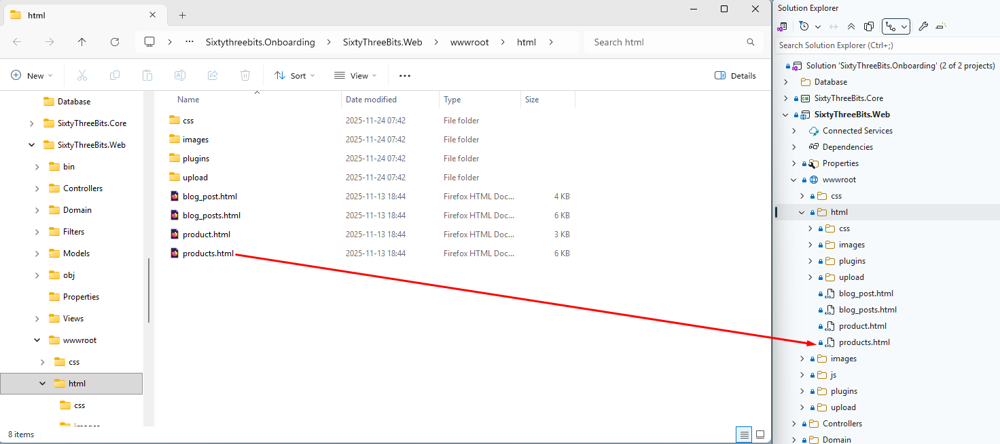

<br>

Open `products.html` using your **web browser**. This is how your final result must look.

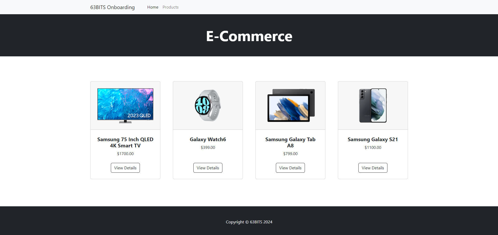

<br>

Open the **products.html** file in Visual Studio to see the HTML code.

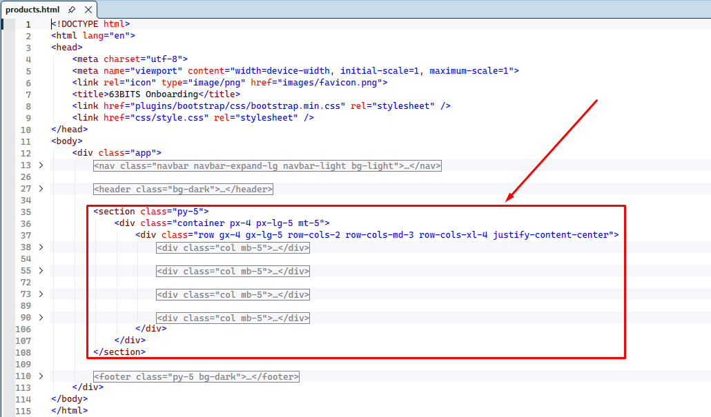

<br>

Copy the `<section>` HTML block and paste it into your **ProductsWebsiteView.cshtml** file.

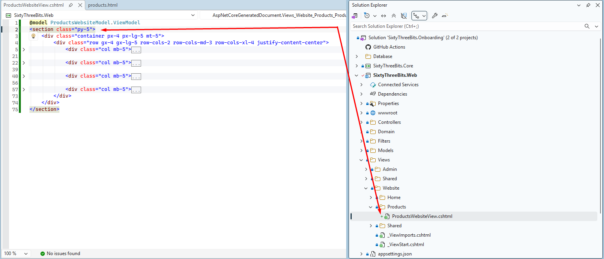

<br>

You don't need to copy the `<html>`, `<body>`, `<header>`, and `<footer>` elements above and below the `<section>` tag — they are already provided by **_Layout.cshtml**, which wraps all website-level views.

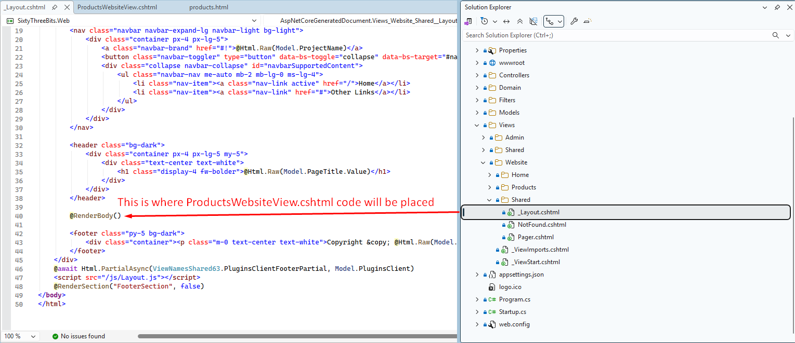

<br>

Replace the repeating static HTML `<div>` blocks with a `foreach` loop that iterates through the `Products` collection provided by the controller and model via `@model`.

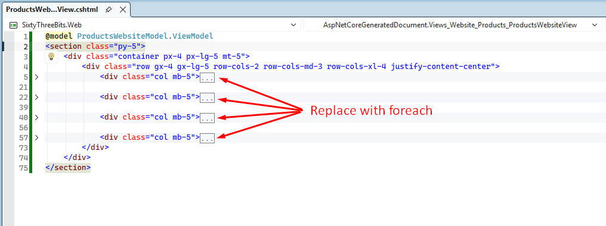

<br>


<br>

**Null Safety Check**

The `@if (Model.HasProducts)` block performs a safety check before executing the `foreach` loop:

```csharp
foreach (var product in Model.Products)
```

This prevents null reference exceptions by verifying the collection contains items before iteration.

**HTML Rendering**

The `@Html.Raw(...)` directive is used throughout the view to render HTML content from product properties without escaping.

For detailed information on HTML encoding and the Raw helper, review the following resources:

- <https://learn.microsoft.com/en-us/aspnet/core/mvc/views/razor?view=aspnetcore-8.0#expression-encoding>
- <https://learn.microsoft.com/en-us/dotnet/api/system.web.webpages.html.htmlhelper.raw?view=aspnet-webpages-3.2>

<br>

## Launch and Test

To verify the functionality built so far, first populate the database with sample data.

Use SQL Server Management Studio to manually insert records into the Products and Categories tables.

Next, download appropriate product images from the web and place them in the **wwwroot → upload** directory. Ensure that the image filenames match the values stored in the **ProductCoverImageFilename** column.

To run the project, press **CTRL + F5**. The browser will open automatically, and the home page will load. You should see a page similar to the example shown below.


<br>

To view the Products page, manually navigate to **/products** in the browser address bar. The Products page will then load and display the results.

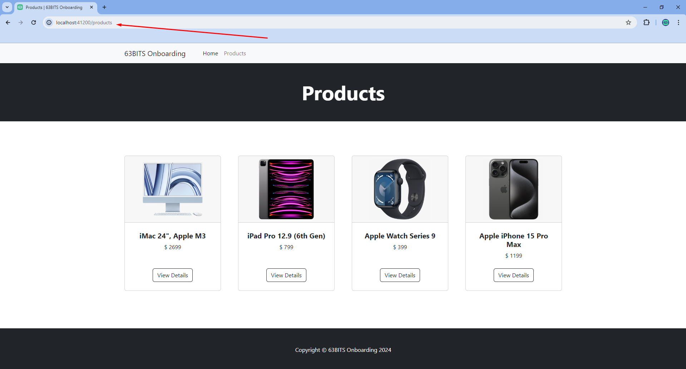
